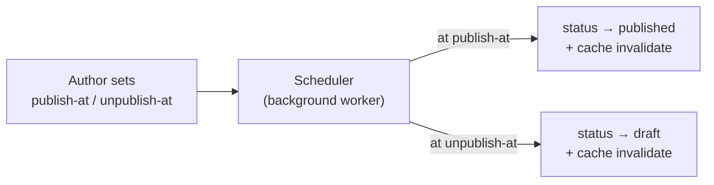

# Content scheduler

:::caution[Coming soon — not yet available]

The content scheduler is **planned and not yet shipped**. This page records the
intended behaviour so operators know what is coming. There is no scheduler
service, table or endpoint today — publishing is immediate and manual.

:::

## Scan box

- **Status: pending.** Content is published the moment an author sets a status to
  `published` in Directus; there is no time-based publish or unpublish yet.
- **The plan.** Schedule a chapter, FAQ, feed item or runbook to go live (or come
  down) at a future time, without anyone being online to flip the switch.
- **For now, publish manually.** Set the status in Directus when you want the
  change live. See the [User guide](../user/intro) for each content type.

## How publishing works today

There is no scheduling layer. An author opens the relevant Directus collection,
sets the status to `published`, and the cache-invalidation webhook makes it live
within seconds. To take something down, set the status back to `draft`. Timing is
entirely manual — someone has to make the change at the moment it should happen.

## What is planned

A scheduler that lets an author set a **publish-at** (and optionally an
**unpublish-at**) time on a content item, with a background worker flipping the
status at the scheduled moment and firing the same cache-invalidation seam.

Likely shape (subject to change):

- Schedule fields on the existing content collections, or a small `schedule`
  table referencing them.
- A periodic worker (a systemd timer or an in-app scheduler) that applies due
  transitions and reuses the existing `/api/cms/webhook` cache seam.
- An admin view of what is scheduled and when.

Because the publish path and cache invalidation already exist, the scheduler is
mostly a timing layer on top — which is why it is a natural next addition rather
than a re-architecture.

:::note[Agency Tip]

Until this ships, the simplest reliable approach for a timed launch (a webinar, a
campaign) is to keep the content as a **draft**, and have someone publish it at
the agreed time. For recurring timed publishing, raise it with your DEPT® lead so
it can be prioritised against the planned scheduler work.

:::
