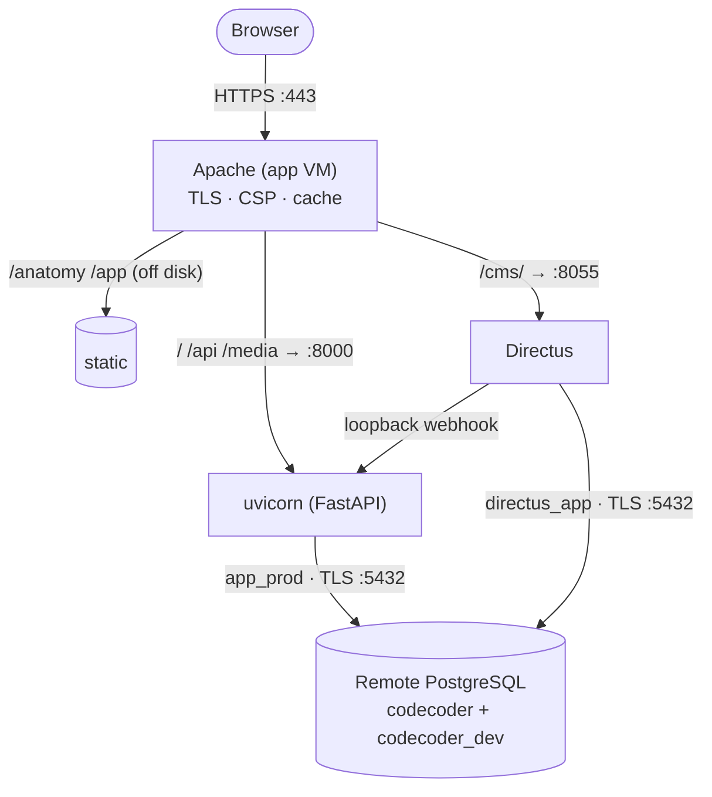

# Deployment

Tenet runs the application plane on one VM, with PostgreSQL as a separate remote
instance. `deploy.sh` is the single, idempotent installer; Apache is the whole
edge. This page is the operator's deployment reference.

## Scan box

- **One VM, one public listener.** Apache owns :80 (301 → :443) and :443;
  uvicorn (FastAPI) binds `127.0.0.1:8000` and Directus `127.0.0.1:8055`.
  PostgreSQL is remote, reached over TLS.
- **`deploy.sh` provisions everything, idempotently.** Service users, venv,
  `.env`, schema + ETL against the remote DB, the two systemd units, the Apache
  vhost, the firewall, and the large-object sweep. Re-running never wipes data.
- **Two modes.** `sudo ./deploy.sh` (full install) and `sudo ./deploy.sh
  --update` (re-sync code + restart, skips packages/firewall/SELinux).
- **Apache is the edge.** TLS 1.2/1.3, HSTS, three CSP profiles, gzip + HTTP/2,
  a per-location cache matrix, the `/cms/` proxy, and the loopback webhook guard.
- **Media is Postgres-only.** All bytes in `pg_largeobject`, streamed by FastAPI.
  No S3, no object store, no filesystem media store.

## Topology



The two application planes share the database but connect as **different roles** —
`app_prod` (DML) and `directus_app` (scoped by GRANTs so the CMS literally cannot
read `attempts`, `quiz_sessions` or `signing_keys`). The firewall opens only 80
and 443 inbound; 8000 and 8055 stay loopback-only; egress is scoped to
`REMOTE_DB_HOST:5432`.

### Disk layout

| Item | Path |
|---|---|
| App code + venv | `/opt/dept-anatomy/backend/` |
| App config | `/opt/dept-anatomy/backend/.env` |
| SPA front-end | `/opt/dept-anatomy/frontend/` |
| Frozen HTML | `/opt/dept-anatomy/content/frozen/` |
| Directus as-code | `/opt/dept-anatomy/cms/` |
| DB CA cert | `/etc/dept-anatomy/db-ca.pem` |
| App systemd unit | `/etc/systemd/system/cca-quiz.service` |
| Directus systemd unit | `/etc/systemd/system/cms-directus.service` |
| Apache site | `/etc/httpd/conf.d/cca-quiz.conf` (RHEL) · `/etc/apache2/sites-available/cca-quiz.conf` (Debian) |

The reference VM is 4 vCPU / 8 GB (Ubuntu 20.04/22.04 or RHEL/CentOS 8);
`deploy.sh` detects the OS family and adjusts package names, the Apache service
name and config paths.

## Running deploy.sh

```bash
# Full first-time install (dev-mode auth — email login)
sudo ./deploy.sh

# Production with OAuth wired in
sudo GOOGLE_CLIENT_ID='xxxx.apps.googleusercontent.com' \
     GOOGLE_CLIENT_SECRET='your-secret' ./deploy.sh

# Re-sync code and restart only (fast path for a new bundle)
sudo ./deploy.sh --update
```

Prefer collecting the knobs in a gitignored `deploy.env` next to the script:

```bash
cp deploy.env.example deploy.env && chmod 600 deploy.env
# edit: DB_MODE, DATABASE_URL (remote), DOMAIN, GOOGLE_*, CERT_FILE…
sudo ./deploy.sh
```

Common knobs: `DOMAIN`, `APP_ENV` (defaults to `production`), `DB_MODE`
(`external` for the remote DB), `DATABASE_URL`, `GOOGLE_*`, `CERT_FILE` /
`KEY_FILE` / `CHAIN_FILE`, `DEPLOY_DIRECTUS`, `CSP_ENFORCE`.

## What deploy.sh does, in order

```mermaid
flowchart LR
    P1["1 Pre-flight"] --> P2["2 Service user"] --> P3["3 Sync bundle"] --> P4["4 Virtualenv"]
    P4 --> P5["5 .env + secrets"] --> P6["6 Schema + ETL (remote)"] --> P7["7 systemd cca-quiz"]
    P7 --> P7b["7b Directus"] --> P8["8 SELinux (RHEL)"] --> P9["9 Apache vhost"]
    P9 --> P10["10 Firewall"] --> P11["11 LO sweep timer"]
```



Each step is existence-guarded: the service user is created only if absent;
Alembic skips already-applied revisions; the ETL skips rows that already exist;
the `.env` is generated once and never overwritten. The bundle sync
(`rsync -a --delete`) **excludes** runtime state that must survive a deploy:
`backend/.env`, `quiz_results/`, `certificates/`, `outbox/`, and every `.venv/`.

In `DB_MODE=external` there is no local Postgres: the schema and ETL run against
the remote instance over TLS using a privileged migration credential, while the
runtime `.env` carries the DML-only app role.

### The systemd unit it writes

`/etc/systemd/system/cca-quiz.service` runs uvicorn as the `cca` user, bound to
`127.0.0.1:8000` with `--proxy-headers --workers 1`, and `Environment=APP_ENV`
on the unit (so the mode is visible in `systemctl show`). It is hardened —
`NoNewPrivileges`, `ProtectSystem=full`, scoped `ReadWritePaths`,
`SystemCallFilter=@system-service` — but deliberately omits
`MemoryDenyWriteExecute`, because the media pipeline (Pillow, `ffprobe`) needs
W^X off. (`--workers 1` is the quiz-state contract — see
[Quiz administration](./quiz-administration).)

## The Apache vhost

Port 80 only redirects to 443. The 443 vhost serves `/anatomy/` and `/app/` off
disk and proxies everything else to uvicorn, with `/cms/` proxied to Directus
**before** the catch-all so it is not shadowed.

**TLS and HSTS** — restricted to 1.2 and 1.3; HSTS omits `preload` deliberately
(only after a 30-day soak). Apache owns exactly two security headers (HSTS and
CSP); the other six are set by the app's `SecurityHeadersMiddleware` and must not
be duplicated here.

**Three CSP profiles** — DEFAULT (app/api), COURSE (`/anatomy/`, drops `esm.sh`,
adds `media-src 'self'`), and CMS (`/cms/`, the only profile with
`script-src 'unsafe-eval'` for the Vue bundle). CSP ships **Report-Only** by
default (`CSP_ENFORCE=0`); watch the `/csp/report` sink, then re-deploy with
`CSP_ENFORCE=1`.

**Cache matrix** — per location, always `Header always set` so the rule rides
304s and errors:

| Path | Cache-Control |
|---|---|
| `/app/` | `public, max-age=0, must-revalidate` |
| `/anatomy/` | `public, max-age=86400, must-revalidate` |
| `/api/course/` | `public, max-age=0, must-revalidate` |
| `/api/feed` | `no-cache` |
| `/media/` | `public, max-age=86400, must-revalidate` |
| `/certificate/` | `private, max-age=86400, must-revalidate` + `Vary: Cookie` |

**Webhook guard** — `/api/cms/webhook` is restricted to
`Require ip 127.0.0.1 ::1` (after the catch-all proxy), so only the co-resident
Directus can invalidate the cache. The network reachability *is* the
authentication.

## Verifying a deploy

```bash
systemctl status cca-quiz                 # active (running)
psql "$DATABASE_URL" -c "\conninfo"       # reachable + SSL connection
curl -I http://127.0.0.1:8000/            # 200/307 (bypasses Apache)
curl http://127.0.0.1:8000/api/course/framework | head -c 200   # JSON
sudo httpd -t                             # Syntax OK
curl -I https://<DOMAIN>/                 # 200 over TLS, no warning
curl -I https://<DOMAIN>/app/             # 200
```

For a content-only change, you do not need a full deploy — re-run the ETL and
restart:

```bash
cd /opt/dept-anatomy/backend
sudo -u cca .venv/bin/python -m scripts.migrate_to_postgres
sudo systemctl restart cca-quiz
```

:::caution[Common Pitfall]

A `404` on `/api/course/framework` straight after a first deploy almost always
means the tables exist but are **empty** — the ETL did not run or `content/source/`
did not sync. It is not a routing bug: confirm
`/opt/dept-anatomy/content/source/course/framework.json` exists and re-run the
ETL. On RHEL, a `403` on `/anatomy/` is a missing SELinux label — fix with
`sudo restorecon -Rv /opt/dept-anatomy/content/frozen /opt/dept-anatomy/frontend`.

:::

:::caution[Common Pitfall]

TLS is provisioned from cert files, not auto-renewed by the script. On expiry the
operator must re-supply the cert. If the box is publicly resolvable, prefer
`certbot --apache -d <DOMAIN>` plus `systemctl enable --now certbot.timer` so
renewal is automatic.

:::

:::note[Why This Matters]

The split is the contract: edge headers (HSTS, CSP) live in Apache, application
headers in the middleware; static is served off disk, dynamic is proxied; the
webhook is guarded by topology, not a secret. Each boundary is owned in exactly
one place, which is what makes a one-VM deployment safe to reason about.

:::

Related: [Configuration & credentials](./configuration-and-credentials) for the
secrets `deploy.sh` writes, [Managing the CMS](./managing-the-cms) for the
Directus stand-up, and [Database operations](./database-operations) for backup
and the large-object sweep.
