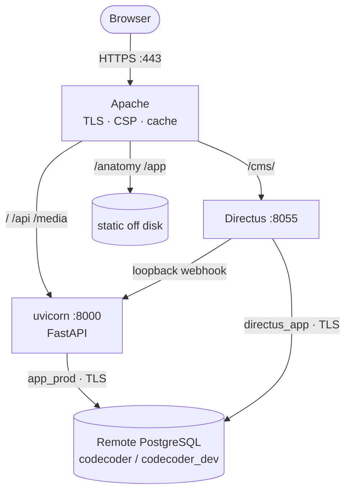

# Admin guide

This is the operator's half of the Tenet documentation — for the people who
deploy the platform, hold its secrets, manage its users, run its database and
keep it healthy. If you author content rather than operate the platform, you
want the [User guide](../user/intro) instead.

## Scan box

- **One VM, one remote database.** Apache is the only public listener; uvicorn
  (FastAPI) and Directus sit behind it on loopback; PostgreSQL is a separate
  remote instance both connect out to over TLS.
- **`deploy.sh` is the single installer.** Idempotent, runs as root, provisions
  everything and never wipes data, `.env` or rows. Re-run it freely.
- **Fail-closed by default.** In production the app refuses to boot on
  dev-default secrets or an empty `ALLOWED_DOMAIN`. That is the posture, not a
  bug.
- **Authorisation is one matrix.** Every protected route is gated by
  `require_permission(...)` reading one `PERMISSION_GRANTS` dictionary; roles
  are assigned in Directus and synced to the app.
- **Two operational invariants to remember.** Back up **with large objects**
  (`pg_dump --large-objects`) or you lose all media; and run the app with
  `QUIZ_WORKERS=1` until the quiz-session rewire ships.

## What's in here

| Page | What it covers |
|---|---|
| [Users & roles](./users-and-roles) | The role taxonomy, the permission matrix, how roles are assigned and synced, the two auth planes. |
| [Configuration & credentials](./configuration-and-credentials) | `APP_ENV`, the secret tiers, the `.env` templates, fail-closed validation, TLS to the database. |
| [Managing the CMS](./managing-the-cms) | Standing up and operating Directus: systemd vs Docker, the bootstrap order, Google SSO, the cache webhook. |
| [Database operations](./database-operations) | Backup and restore, the large-object sweep, signing-key and password rotation, the cache backend, connection pooling. |
| [Monitoring](./monitoring) | Health probes, structured logs and request correlation, audit trails, the slow-query log, what to alert on. |
| [Quiz administration](./quiz-administration) | The question bank, moderation, certificates and verification, the cooldown and the single-worker pin. |
| [Content scheduler](./content-scheduler) | *Planned.* Scheduled publish/unpublish of content — not yet shipped. |
| [Deployment](./deployment) | The single-VM topology, `deploy.sh`, the Apache vhost (TLS / CSP / cache), and the systemd units. |

## The shape of the system

:::tip[Why This Matters]

The operating model is deliberately small — no Redis at launch, no object store,
no second VM. That keeps the surface you must secure and reason about tiny: three
processes on one box, one remote database, one installer. Most of this guide is
about protecting that simplicity: the fail-closed boot, the scoped database role,
the loopback-only webhook, the backup that includes media. Hold those and the
platform is hard to break.

:::

For the architecture behind these operations — *why* the planes are split, how
the cache works, the security baseline — see the
[Developer guide](../developer/intro).
