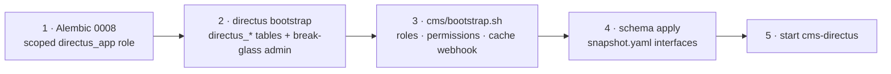

# Managing the CMS

Directus is the editorial write plane — a separate Node service over the same
Postgres, reverse-proxied under `/cms/`. This page is how you stand it up, sign
staff in, and keep the cache seam working.

## Scan box

- **Directus is additive and gated.** Pinned to **11.17.4**, run by systemd
  (`cms-directus`) or Docker Compose — pick exactly one. `DEPLOY_DIRECTUS=false`
  gives a pure application box.
- **Bootstrap order is strict.** Alembic `0008` → `directus bootstrap` →
  `cms/bootstrap.sh` → `directus schema apply`. Steps 2–4 are idempotent.
- **Node 22 LTS.** Directus 11 needs Node ≥ 22; a local Node 25 box fails the
  native `isolated-vm` build. Use the Node 22 toolchain or the Docker image.
- **Staff sign in with Google SSO**, a separate OAuth client from the learner
  one, public registration **off**, with a break-glass local admin always
  present.
- **The cache seam is one loopback webhook.** On publish, Directus POSTs
  `/api/cms/webhook`; FastAPI invalidates the changed key. No secret —
  reachability on `127.0.0.1` is the authentication.

## Directus introspects; it does not own

Directus does not create the content tables — they already exist, built by the
app's Alembic migrations. Directus *introspects* them: each becomes a collection
with an editor rendered over the existing columns. The nine registered
collections:

| Collection | Editable by | Notes |
|---|---|---|
| `course_chapters` | Content Author | Full DML |
| `frameworks` | Content Author | Two rows (spine + explainer), no delete |
| `questions` | Quiz Admin | Authoring + UGC review |
| `feed_items` | Feed Moderator | Status only |
| `app_config` | Platform Admin | Config UI |
| `media_assets` | — | Read-only metadata; bytes are FastAPI's |
| `users` / `roles` / `user_roles` | — | Read-only reference |

Crucially, **there is no service-to-service call on the read path** — if Directus
is down, reading content is unaffected. The app reads Postgres, not the CMS.

## systemd vs Docker

systemd is canonical on the reference VM (hardened unit, one `journalctl`
stream, mirrors `cca-quiz`). The Docker Compose route runs the official
`directus/directus:11.17.4` image against the same remote Postgres with the same
`cms/.env`. **Never run both at once** — they contend for port 8055 and the same
tables.

The systemd unit (`cms-directus`) runs as the `directus` user,
`ExecStart=.../node_modules/.bin/directus start`, with `ReadWritePaths` scoped to
`cms/uploads` and `cms/.directus`. It deliberately omits
`MemoryDenyWriteExecute` — V8's JIT needs W^X off.

## Bootstrap order



1. **Alembic `0008`** creates the scoped `directus_app` role (per env:
   `directus_app` / `directus_app_dev`). If standing up by hand:
   ```bash
   cd /opt/dept-anatomy/backend && DATABASE_URL="$PGURL_ADMIN" \
     DIRECTUS_DB_ROLE=directus_app .venv/bin/alembic upgrade head
   ```
2. **`npx directus bootstrap`** creates the `directus_*` system tables and the
   break-glass admin from `ADMIN_EMAIL` / `ADMIN_PASSWORD` in `cms/.env`.
3. **`cms/bootstrap.sh`** wires the four staff roles, the per-collection
   permissions and the cache-invalidation Flow. It prints the four role ids —
   capture the `content_author` id and paste it into `AUTH_GOOGLE_DEFAULT_ROLE_ID`.
4. **`npx directus schema apply ./snapshot.yaml`** applies the field interfaces
   and validations over the existing tables. Regenerate after a deliberate change
   with `npx directus schema snapshot ./snapshot.yaml`.

`--update` re-applies the snapshot and `bootstrap.sh` without re-bootstrapping.

## Google SSO for staff

A **separate** OAuth client from the learner one. In Google Cloud Console,
authorise the redirect URI `https://<DOMAIN>/cms/auth/login/google/callback`
(it routes through Apache's `/cms/` proxy). In `cms/.env`:

- `PUBLIC_URL=https://<DOMAIN>/cms`
- `AUTH_GOOGLE_CLIENT_ID` / `AUTH_GOOGLE_CLIENT_SECRET`
- `AUTH_GOOGLE_ALLOW_PUBLIC_REGISTRATION=false` — admins pre-create each staff
  user; SSO logs in an existing user, never self-provisions.
- `AUTH_GOOGLE_ALLOW_LIST=deptagency.com` — defence in depth.
- `AUTH_GOOGLE_DEFAULT_ROLE_ID=<content_author id>` — least-privilege landing
  role, inert while registration is off.

A break-glass local admin is generated on first deploy and printed once in the
deploy summary — keep it, so a misconfigured SSO cannot lock everyone out. After
changing any Google value: `sudo systemctl restart cms-directus`.

## The cache-invalidation webhook

On `items.create` / `update` / `delete` for `course_chapters`, `frameworks`,
`questions`, `feed_items` and `app_config`, Directus's "cache-invalidation" Flow
POSTs to the FastAPI loopback receiver:

```
POST http://127.0.0.1:8000/api/cms/webhook
{ "collection": "{{$trigger.collection}}", "keys": "{{$trigger.keys}}" }
```

FastAPI invalidates `<collection>:<id>` per key (or the whole collection prefix
on a keyless bulk event). There is no HMAC and no shared secret — uvicorn binds
`127.0.0.1`, Apache restricts `/api/cms/webhook` to `Require ip 127.0.0.1`, and
the handler rejects non-loopback callers. The short cache TTL is the safety net
if a webhook is ever missed.

## Operating commands

```bash
sudo systemctl status cms-directus
sudo systemctl restart cms-directus
sudo journalctl -u cms-directus -f
curl http://127.0.0.1:8055/server/health      # -> {"status":"ok"}
```

To disable the CMS entirely, set `DEPLOY_DIRECTUS=false` in `deploy.env`; the
`/cms/` proxy is dropped from the vhost and nothing else changes.

:::caution[Common Pitfall]

The webhook silently dropping. Directus's egress guard defaults to
`IMPORT_IP_DENY_LIST=0.0.0.0,169.254.169.254`; the `0.0.0.0` entry blocks
`127.0.0.1`, killing the webhook with no error. `cms/.env` must set
`IMPORT_IP_DENY_LIST=169.254.169.254` — keeping the cloud-metadata block but
dropping `0.0.0.0` — for the loopback POST to be allowed. **This setting is
required for the seam to work.**

:::

:::caution[Common Pitfall]

Configuring `STORAGE_S3_*` or expecting app media in Directus Files. There is no
S3 in this architecture — all media bytes live in Postgres large objects and
stream from FastAPI. In Directus, `media_assets` is read-only metadata; the
`cms/uploads/` directory holds only incidental Directus files (avatars).

:::

:::note[Agency Tip]

Pin the Directus version (`11.17.4`) and treat the CMS as code: `bootstrap.sh`,
`register-collections.mjs` and `snapshot.yaml` are the source of truth for roles,
permissions and the data model. Standing up a new environment is re-running the
bootstrap, not clicking through the admin UI.

:::

For the editorial-plane architecture and the source-of-truth direction
(Postgres → git), see
[the Directus write plane](../developer/data-model/directus-write-plane).
