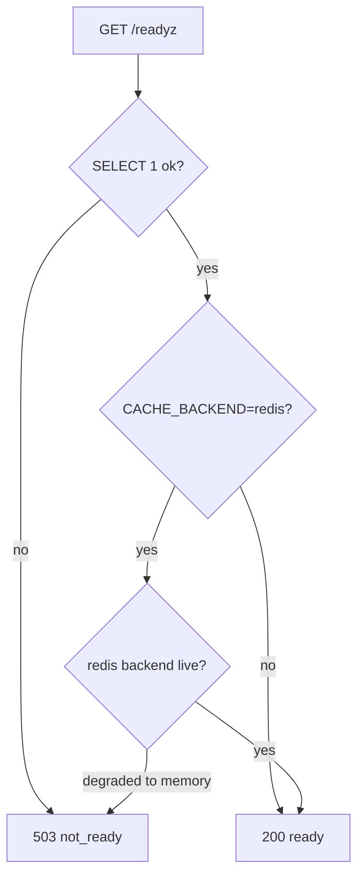

# Monitoring

How you tell whether Tenet is healthy, trace a single request through the logs,
and read the signals that mean something is wrong.

## Scan box

- **Two probes.** `GET /healthz` is liveness (process up, no dependency checks);
  `GET /readyz` is readiness (DB reachable, and Redis if selected). Both are
  unauthenticated and never redirect.
- **Every request carries a correlation ID.** `X-Request-ID` (uuid4 fallback) is
  bound by the outermost middleware, threaded through every log line, and echoed
  on the response.
- **Logs are logfmt, one line per record.** `ts=… level=… logger=… request_id=…
  msg=…` — greppable, with `request_id` joining all lines for one request.
- **Two audit trails.** Directus logs editorial changes; the app writes
  sign-ins, logouts and role grants/revokes to `auth_audit`.
- **Watch four things:** `/readyz` flipping to `503`, the cache degrading to
  memory, `level=ERROR` lines, and Postgres slow-query entries.

## Health probes

```bash
curl -s https://internal.in.deptagency.com/healthz   # {status, version, env}
curl -s https://internal.in.deptagency.com/readyz    # 200 ready / 503 not_ready
```

- `/healthz` — liveness. Process-only, no I/O. Wire your uptime check and
  systemd liveness here.
- `/readyz` — readiness. Runs `SELECT 1`; if `CACHE_BACKEND=redis` but the cache
  has degraded to memory, it returns `503 not_ready`. Wire your load-balancer /
  readiness gate here.



## Request correlation and logs

The outermost `RequestIdMiddleware` binds a UUID (or validates an inbound
`X-Request-ID`, preventing log-forging), stashes it in a contextvar, and echoes
it on the response. `configure_logging()` installs the logfmt formatter and a
filter that injects `request_id` on every record (`-` outside a request).

```
ts=2026-06-06T09:14:02 level=INFO logger=app.modules.quiz request_id=3f9a… msg="quiz graded"
```

To debug one failed request, grab its `X-Request-ID` from the response (or the
browser's network tab) and grep the journal for it — every line for that request
shares the id.

```bash
journalctl -u cca-quiz -f
journalctl -u cca-quiz | grep 3f9a
```

## Audit trails

- **Editorial** — Directus's native activity/revisions log covers content
  changes.
- **Identity** — the `auth_audit` table records `auth.login.dev`,
  `auth.login.google`, `auth.logout`, and `role.grant` / `role.revoke` (naming
  both actor and target). The `directus_app` role is denied all access to this
  table.

## The slow-query log

Postgres is remote, so the slow-query log lives on the DB host or the managed
service's log stream, not the app VM. The threshold is
`log_min_duration_statement` (target `500ms`):

```bash
psql "$PGURL" -c "SHOW log_min_duration_statement;"
```

Log locations: `/var/lib/pgsql/*/data/log/` (RHEL),
`/var/log/postgresql/` (Debian), or the provider's log export (e.g. Azure
Database for PostgreSQL → Logs). Each `duration: NNNN ms` line names the
statement; re-run it under `EXPLAIN (ANALYZE, BUFFERS)` and diff against the hot
baselines in `tests/baseline/explain/`. Large temp-file lines mean `work_mem` is
too low for that query.

## Routine commands

```bash
# App
journalctl -u cca-quiz -f
systemctl restart cca-quiz

# Apache
sudo tail -f /var/log/httpd/cca-quiz_error.log
sudo httpd -t && sudo systemctl reload httpd

# Directus
systemctl status cms-directus
journalctl -u cms-directus -f
```

## What to alert on

| Signal | Likely meaning |
|---|---|
| `/readyz` → `503` | DB unreachable, or Redis requested but degraded |
| Cache degraded to memory | `REDIS_URL` set but Redis down at boot |
| `level=ERROR` in logs | Unhandled path — grep the `request_id` to trace it |
| Slow-query entries | A query crossed `log_min_duration_statement` |

:::caution[Common Pitfall]

Do not wire `/healthz` to dependency checks. Liveness must be process-only —
adding DB or cache I/O to it causes false restarts when a dependency blips, when
the right response is to keep the process up and let readiness drain it. Liveness
is about the process; readiness is about the dependencies.

:::

:::note[Agency Tip]

When a user reports a single broken action, ask them for the `X-Request-ID` from
the response (or read it off the network tab). One grep then gives you every log
line for that exact request — no guessing which lines belong together across a
busy journal.

:::

For the observability architecture (the middleware stack, the seam in
`core/observability.py`), see
[observability](../developer/architecture/observability). For backup, restore and
key rotation, see [Database operations](./database-operations).
