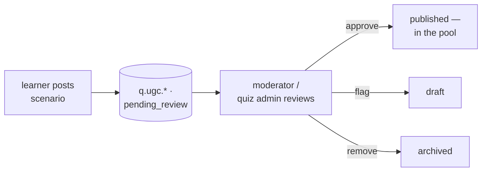

# Quiz administration

Running the certification quiz: the question bank, moderating user-submitted
questions, the certificates it issues, and the two operational invariants that
keep it correct.

## Scan box

- **One table, status-gated.** `questions` holds everything; only
  `status='published'` is sampled into a live quiz.
- **Quiz admins author; learners propose.** `quiz_admin` writes via
  `POST /api/admin/questions` (`question.write`). A feed scenario lands as a
  `pending_review` question that a moderator must approve.
- **Certificates are HMAC-sealed facts, not files.** The PDF is rendered on
  demand from the attempt; the seal is an HMAC in `attempts.signature`, keyed
  per environment.
- **Verification is public and read-only.** `GET /verify/{cert_id}` recomputes
  the HMAC and returns a structured verdict with a machine-readable reason.
- **Two invariants:** run with `QUIZ_WORKERS=1` (in-memory quiz state) and a
  failed attempt opens a 7-day cooldown (`COOLDOWN_DAYS`).

## The admin surfaces

All gated by the permission matrix (see [Users & roles](./users-and-roles)):

| Action | Endpoint | Permission |
|---|---|---|
| Author / edit a question | `POST /api/admin/questions` | `question.write` (quiz_admin) |
| View every attempt | `GET /admin/attempts` | `attempts.view_all` (quiz_admin) |
| View the moderation queue | `GET /api/moderate/queue` | `moderate.view` (feed_moderator) |
| Approve / flag / remove | `POST /api/moderate/action` | `moderate.action` (feed_moderator, quiz_admin) |

## The question bank

The `questions` table is the whole bank; the `status` column is the single switch
deciding what a quiz can sample:

| `status` | Meaning |
|---|---|
| `published` | In the live pool — can be sampled |
| `pending_review` | Proposed (e.g. from a feed scenario), awaiting approval |
| `draft` | Held back for rework |
| `archived` | Retired; never sampled |

Other columns worth knowing: `difficulty` (`beginner`/`intermediate`/`advanced`,
a sampling axis), `options` (JSONB), `correct_index`, `version`, `author_id`,
`is_user_submitted`.

Authoring through `POST /api/admin/questions` stamps `author_id` to the caller
and forces `is_user_submitted=False`. A new id inserts at `version=1,
status=published`; an existing id updates in place and bumps `version`.

**Editing live questions is safe.** Each attempt snapshots the full question into
its own payload at grading time, so fixing a typo or correcting `correct_index`
never rewrites a past result. Treat the bank as editable.

## Moderating user-submitted questions

A feed `scenario` post fans out into a `q.ugc.<feedid>` question with
`status='pending_review'`, `is_user_submitted=True`. It cannot reach the exam
until a human approves it.

`POST /api/moderate/action` flips the status — `approve` → `published`, `flag` →
`draft`, `remove` → `archived` — and invalidates the `questions:` cache prefix
for immediate effect.

## Certificates

A certificate is a fact stored on the `attempts` row, not an archived file:

- The PDF is rendered on demand by `certificate.generate(...)` and can be rebuilt
  any time (`GET /certificate/{cert_id}` rebuilds it for the owner).
- The seal is `HMAC-SHA256` over `cert_id | email_lower | score:.6f |
  submitted_at`, stored in `attempts.signature`, verified with constant-time
  comparison.
- Keys are **per environment** and live in env vars (`CERT_HMAC_PROD` /
  `_STG` / `_DEV`, plus `CERT_HMAC_LEGACY`); `signing_keys` holds only metadata.
- Non-production certs carry a `DEV-` / `STG-` cert-id prefix and a diagonal
  watermark; production certs are unmarked and byte-stable.

A real production certificate, `CCA-F-20260605-E79E74AB`, is the no-loss canary —
the smoke suite asserts it still verifies on every run.

## Verification

`GET /verify/{cert_id}` (and the `?cert_id=` form) is public and needs no login.
It recomputes the HMAC and returns a structured verdict whose `reason` drives the
exact badge:

| Reason | What the visitor is told |
|---|---|
| *(valid)* | Genuine credential — holder, score, date |
| `no_signature` | Genuine but legacy (pre-dates signing) |
| `key_retired` / `key_expired` | Treat with caution / out of date |
| `signature_mismatch` | **Tampered** |
| `no_attempt` | Not one of ours |

Rotation is honoured: a rotated-out key still verifies while `can_verify=true`
and `verify_until` has not passed. Dev certificates resolve to the dev key and
are badged as dev artefacts — they cannot validate against the production key. Key
rotation is a database + env-var operation, not a code deploy (see
[Database operations → rotating certificate signing keys](./database-operations#rotating-certificate-signing-keys)).

## The two operational invariants

- **Single-worker pin.** Active-quiz state lives in an in-process dict
  (`_active_quizzes`) keyed by `quiz_id`. With more than one worker, a start on
  worker 1 and a submit on worker 2 yields a 404. Run with `QUIZ_WORKERS=1`. The
  fix is not a knob — it is moving the state to the provisioned `quiz_sessions`
  table (migration `0003`), which is not yet wired into the routes.
- **Cooldown.** A failed attempt opens a 7-day cooldown (`COOLDOWN_DAYS` in
  `core/config.py`); `POST /quiz/start` returns `429` with the days remaining
  until it clears. A pass clears it immediately. There is no override endpoint —
  it is configuration.

:::caution[Common Pitfall]

Raising the worker count to "scale the quiz". `QUIZ_WORKERS=1` is a correctness
contract, not a performance setting — in-memory quiz state is not shared between
workers. Do not change it until the `quiz_sessions` rewire ships.

:::

:::caution[Common Pitfall]

Before a production cutover, `CERT_HMAC_LEGACY` must be set to the exact current
`SECRET_KEY` value and the service reloaded. If it is unset, *no* production
certificate verifies and the canary goes red immediately. It is a one-line
`.env` step — do not skip it.

:::

:::note[Agency Tip]

The whole behavioural surface — pass mark, question count, duration, cooldown —
is configuration, and the authorisation surface is one matrix. Tuning exam rules
or onboarding a new quiz admin (grant the `quiz_admin` role) never touches
handler logic.

:::

For the request-level lifecycle and the internals behind these surfaces, see the
developer reference:
[quiz lifecycle](../developer/quiz-internals/quiz-lifecycle),
[the question bank](../developer/quiz-internals/question-bank),
[certificates](../developer/quiz-internals/certificates) and
[verification](../developer/quiz-internals/verification).
