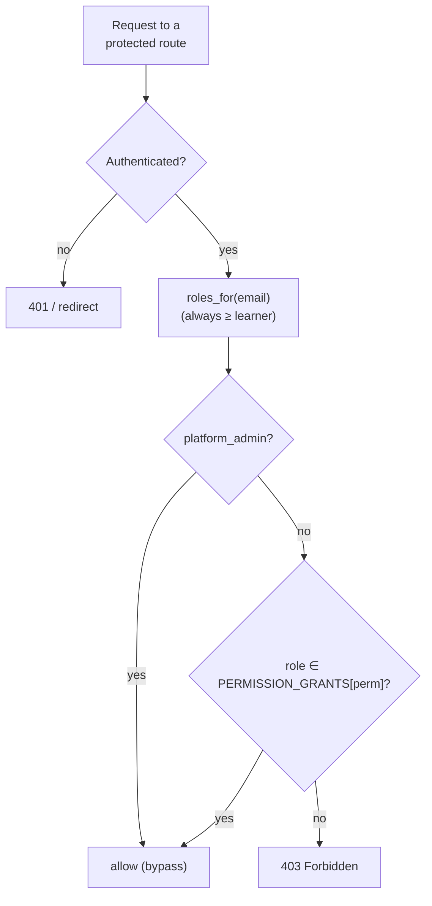

# Users & roles

Who can do what on Tenet is decided by one permission matrix and enforced by one
runtime gate. This page is the operator's view: the roles, what each can do, and
how you grant and revoke them.

## Scan box

- **Two authentication planes, one authorisation model.** Learners sign in with
  Google SSO; staff sign in to Directus. Both resolve to roles in the shared
  `user_roles` table.
- **Six roles.** `learner` (the floor, everyone has it), `feed_contributor`,
  `content_author`, `quiz_admin`, `feed_moderator`, and `platform_admin` (global
  bypass).
- **One enforcement primitive.** Every protected route depends on
  `require_permission("some.perm")`, which reads `users.roles_for(email)`,
  honours the `platform_admin` bypass, then checks the `PERMISSION_GRANTS`
  matrix in `backend/app/core/deps.py`.
- **Roles are additive and multi-valued.** A person can hold several; permissions
  are the union. *Persona* (pm / ba / architect) is a profile attribute only — it
  never grants anything.
- **Assignment is a staff action.** Grant roles in Directus; `platform_admin`
  holds `role.assign`. The SPA mirrors enforcement via `GET /auth/me`.

## The role taxonomy

| Role | Plane | What it is for |
|---|---|---|
| `learner` | learner | The floor. Every authenticated user holds it. Read, take the quiz, flag feed items. |
| `feed_contributor` | learner | Can post to the feed and upload media. |
| `content_author` | staff | Authors course content, FAQs and runbooks via Directus. |
| `quiz_admin` | staff | Owns the question bank, moderation of UGC questions, and viewing all attempts. |
| `feed_moderator` | staff | Works the feed moderation queue. |
| `platform_admin` | staff | Global bypass. Assigns roles, edits platform config. |

Staff roles are seeded in migration `0005`. An ordinary learner holds no staff
roles.

## The permission matrix

This is the single source of truth (`PERMISSION_GRANTS`, `core/deps.py`):

| Permission | Roles that hold it |
|---|---|
| `feed.create` | `feed_contributor` |
| `feed.flag` | `learner`, `feed_contributor`, `content_author`, `quiz_admin`, `feed_moderator` |
| `media.upload` | `feed_contributor`, `content_author` |
| `content.write` | `content_author` |
| `question.write` | `quiz_admin` |
| `attempts.view_all` | `quiz_admin` |
| `moderate.view` | `feed_moderator` |
| `moderate.action` | `feed_moderator`, `quiz_admin` |
| `config.read` / `config.write` / `role.assign` | `platform_admin` only |

## How a request is authorised



## Granting and revoking roles

1. Sign in to Directus as a `platform_admin`.
2. Assign the role to the staff user (matched to their `@deptagency.com`
   identity). The grant lands in `user_roles`; a roles-sync brings the app's view
   into line.
3. Verify from the app side:

   ```bash
   curl -s --cookie "session=..." https://internal.in.deptagency.com/auth/me
   # → { email, persona, roles, permissions }
   ```

Onboarding a new quiz admin or content author is exactly this: grant the role.
No code change, no deploy.

## The two auth planes

- **Learners** authenticate with Google SSO using PKCE + nonce; the short-lived
  pre-auth state rides in a separate signed `aoc_preauth` cookie, and the domain
  (`@deptagency.com`) is checked on the ID token. Every sign-in writes an
  `auth_audit` row. The session cookie (`aoc_session`) is `HttpOnly`,
  `SameSite=Lax`, `Secure` in production, 8-hour max age.
- **Staff** authenticate to Directus (also Google SSO, separate OAuth client).
  See [Managing the CMS](./managing-the-cms) for that side.

:::caution[Common Pitfall]

In v1, dev logins were auto-elevated to a manager role, which hid the real
permission path. v2 dev logins grant only the `learner` floor — identical to
production. Elevate deliberately via the seed script and `ADMIN_EMAILS`; do not
expect a dev login to carry admin powers.

:::

:::note[Agency Tip]

To add a new protected operation, add the permission to `PERMISSION_GRANTS`
first, then gate the route with `Depends(require_permission("your.perm"))`. An
unknown permission raises at request time, so a typo fails fast and loud rather
than silently allowing access.

:::

For the architecture of the two planes and the full OAuth flow, see
[auth planes](../developer/architecture/auth-planes) and the
[security baseline](../developer/architecture/security-baseline) in the developer
reference. For the database-level enforcement behind the matrix, see
[role isolation](../developer/data-model/role-isolation).
