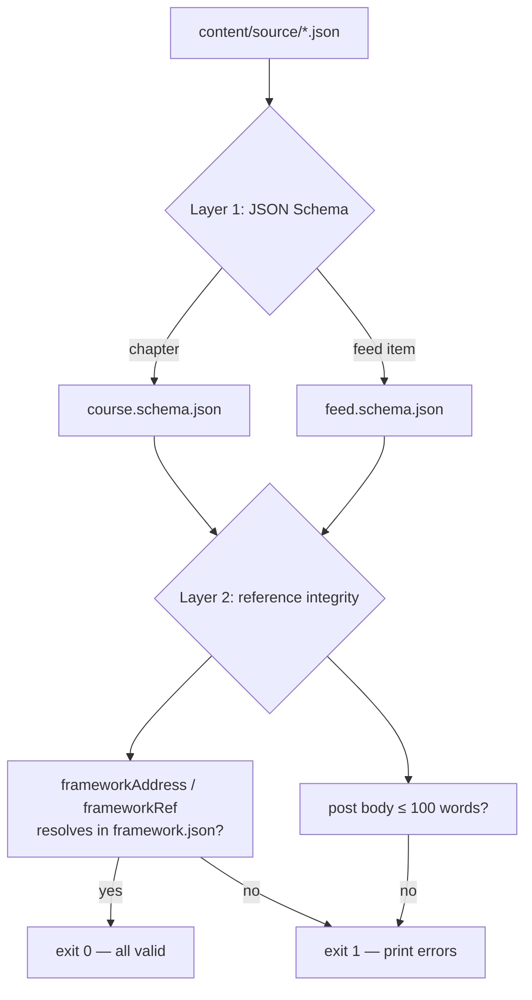

# The content tree and JSON schemas

## Scan box

- `content/source/` is the **git seed and export record** — the version-controlled
  JSON that seeds Postgres and that Postgres exports back to. It is not the runtime
  read path.
- `content/source/schemas/` holds two JSON Schemas — `course.schema.json` and
  `feed.schema.json` — that pin the shape of every chapter file and every feed item.
- `content/source/validate.py` runs two checks JSON Schema alone cannot: schema
  conformance **and** reference integrity — every `frameworkAddress` and
  `frameworkRef` must resolve to a real address in `framework.json`.
- `content/frozen/` is a different thing entirely: a frozen, rendered HTML
  reference for visual parity. It is served, not authored, and never read by the
  runtime as data.

## The `content/` tree

The `content/` directory is the version-controlled home of the seed data and the
schemas that govern it. It has two top-level halves with very different jobs.

```
content/
├── source/                         # the git seed + export record (JSON, authored shape)
│   ├── course/
│   │   ├── framework.json           # the spine: rings, letters, order, nesting
│   │   ├── framework-explainer.json # the explainer payload (frameworks row 'explainer')
│   │   └── sections/*.json          # 31 chapter files, one per framework letter
│   ├── feed/
│   │   └── feed.json                # illustrative feed shape (production feed is the DB)
│   ├── schemas/
│   │   ├── course.schema.json       # JSON Schema for a chapter file
│   │   └── feed.schema.json         # JSON Schema for a feed item
│   ├── docs/adr/                    # architecture decision records (e.g. 0001-storage)
│   ├── templates/                   # runbook / outline templates
│   ├── validate.py                  # schema + reference-integrity checker (CI)
│   ├── SCHEMA.md                    # the authored block-model contract (human-readable)
│   └── MIGRATION-GAP.md             # known gaps between JSON seed and the frozen monolith
└── frozen/
    ├── anatomy-of-code-course.html  # frozen rendered course (visual-parity reference)
    ├── architect-runbook.html       # frozen runbook
    ├── code-coder-checklist.html    # frozen checklist
    └── faqs/                         # frozen FAQ pages
```

The export targets named in the design — `content/source/config/app_config.json`
and `content/source/quiz/question_bank.json` — are produced by the export script
when it runs; they are not committed ahead of the first export. Treat the tree
above as the authored-and-seeded set, and those two as derived.

### `source/` is a seed, not the read path

This is the load-bearing distinction. The runtime never reads `content/source/`.
FastAPI reads Postgres (through its cache). The JSON files exist for three reasons:

1. **Seeding** — the one-time ETL load and any disaster-recovery re-seed.
2. **Diff and review** — a human-readable, git-tracked snapshot you can review in a
   pull request.
3. **Export** — Postgres dumps back to JSON on a schedule or a publish event, so the
   "content in git" property survives even though the DB is authoritative.

The [Directus write plane](./directus-write-plane) page covers the export direction.
The short version: truth flows Postgres → git, not git → Postgres, except for the
initial seed.

### `frozen/` is a reference, not data

`content/frozen/anatomy-of-code-course.html` is the rendered course as a single
HTML file. Apache serves it at `/anatomy/`. It exists to prove that a re-render of
the JSON has not visually drifted — it is the *before* picture in a visual-parity
check. It is never parsed as data and never edited as a source.

:::caution[Common Pitfall]

Editing the frozen HTML to fix a typo. The frozen file is downstream of the JSON,
which is downstream of Postgres. A fix made in the HTML is a fix in the wrong place
— it will be silently overwritten the next time the file is regenerated, and it
never reaches the runtime. Fix content in Directus (Postgres); the frozen reference
is regenerated, not hand-edited.

:::

## The JSON schemas

Two schemas, in `content/source/schemas/`, both written to JSON Schema draft
2020-12.

### `course.schema.json` — a chapter file

A chapter file is required to carry a `frameworkAddress`, a `title`, and a
non-empty `sections` array. Each section has an `id` and an ordered `blocks` array.
Each block has a `type`, and the schema uses conditional `if/then` rules so that —
for example — a `callout` block must carry a `variant` (one of `why`, `tip`,
`pitfall`, `before-after`) and `html`, while a `code` block must carry `code`. The
[course block model](./course-block-model) page walks the full block vocabulary.

### `feed.schema.json` — a feed item

A feed item is required to carry an `id` (pattern `post.<hex>`), a `type` (one of
six), an `author`, a `status`, `topics`, timestamps, and an `engagement` object.
Like the course schema, it uses conditional rules per `type` — a `scenario` must
carry `prompt`, `options`, `correct`, `verdict`, and `reveal`; a `vocab` must carry
`term` and `definition`. A shared `media` array hangs on the envelope so any type
can attach an image or a diagram.

The schema notes one limit it cannot express: the ≤100-word cap on a `post` body is
a word count, not a character count, so JSON Schema cannot encode it. It is enforced
instead by `validate.py` and by the composer UI.

## `validate.py` — two checks, not one

JSON Schema validates *shape*. It cannot validate *references* — whether a
`frameworkAddress` actually points at a real framework letter. `validate.py`
(`content/source/validate.py`) runs both layers:



Concretely, the checker:

1. Loads every address from `framework.json` (rings, letters, modules) into a set.
2. Validates each chapter file against `course.schema.json`, and each feed item
   against `feed.schema.json`.
3. Asserts every `frameworkAddress` and `frameworkRef` resolves to a known address,
   and that each section `id` shares its chapter's ring prefix.
4. Counts the words in every `post` body and fails any over 100.

It exits `0` when everything passes and `1` with a printed error list otherwise —
designed to run in CI as a gate before content is seeded.

:::tip[Agency Tip]

Reference integrity is the check teams forget. A schema-valid chapter that points
at a framework address which does not exist will pass every JSON Schema validator
and still break navigation. The cheap insurance is a second pass that resolves
every cross-reference against the spine — exactly what `validate.py`'s layer 2 does.
Run it in CI, not by hand.

:::
