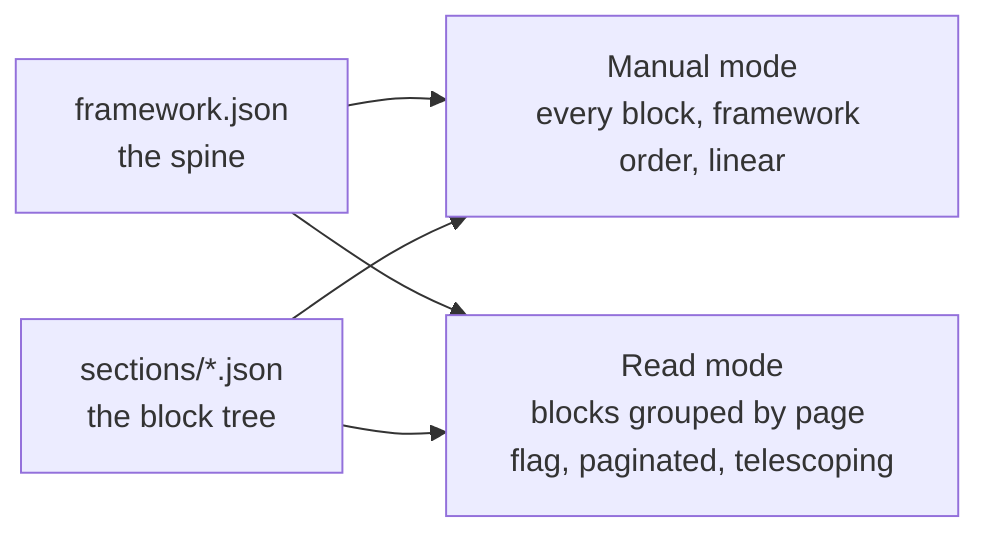

# The course block model

## Scan box

- Course content is a **three-level tree**: a chapter holds ordered sections, a
  section holds ordered typed blocks. One chapter file per framework letter, 31 in
  all.
- A **block** is the atom of authored content — a `type` plus its payload. The
  renderers dispatch on `type`, so adding a layout is adding a `type` to the
  registry; nothing else changes.
- The same block tree feeds **two renderers**: Manual mode reads every block
  linearly in framework order; Read mode groups blocks into turnable pages by their
  `page` flag. Write a chapter once, render it two ways.
- The **framework spine** (`framework.json`) is the navigation source of truth —
  rings, letters, order, nesting, and the telescope transitions. Every chapter's
  `frameworkAddress` keys it into the spine.

The course domain is built as *data*, not as documents. That is the decision that
lets one authored content set drive two different reading experiences. This page
describes the data shape: the spine that navigates it, and the block tree that
holds the prose.

## The framework spine

`content/source/course/framework.json` defines the CODE-CODER framework: five
rings — **CODE**, **CODER**, **Anatomy**, **Adobe Stack**, and **AI-Native** —
each with its letters, their order, how they nest (`nestedUnder`), and how one ring
telescopes into the next (`opensInto`). A chapter declares which letter it is via a
mandatory `frameworkAddress` such as `coder.d`; that address *is* the navigation.

```
CODE  ──── C · Content                          (code.c)
      ──── O · Operations & Martech             (code.o)
      ──── D · Design & Data                    (code.d)
      ──── E · Engineering ───opensInto──┐      (code.e)
                                         │
CODER (nestedUnder code.e) ─── C · Code ─┘      (coder.c) ──opensInto── Anatomy
                           ─── O · Optimization & Quality
                           ─── D · Deployment            (coder.d)
                           ─── E · External Integrations
                           ─── R · Release Management
```

The spine is read by three surfaces: the Manual table of contents, the Read-mode
chapter list, and the Compass map. `validate.py` checks that every chapter's
`frameworkAddress` resolves to a real address here, and that each section `id`
shares its ring prefix — so a `coder.d` chapter cannot contain a section whose id
begins `anatomy.`.

## The block tree

A chapter file is shaped like this (abbreviated from
`content/source/course/sections/coder-d.json`):

```jsonc
{
  "frameworkAddress": "coder.d",        // mandatory — keys into the spine
  "title": "Deployment",
  "tag": "D · Infrastructure 101 for Architects & PMs",
  "status": "published",                // draft | review | published | archived
  "scan": [ "…30-second scan bullets…" ],
  "sections": [
    {
      "id": "coder.d.web-server",        // must share the ring prefix
      "title": "Layer 1 · The web server",
      "order": 1,
      "blocks": [
        { "type": "heading", "page": 2, "html": "Layer 1 · The web server" },
        { "type": "prose",   "page": 2, "html": "The <strong>web server</strong> answers HTTP requests…" },
        { "type": "code",    "page": 2, "lang": "nginx", "code": "server { … }" }
      ]
    }
  ]
}
```

Three levels:

1. **Chapter** — the file. Carries the `frameworkAddress`, `title`, an optional
   `scan` array (the LAYER-pattern scan box), a `status`, and the `sections`.
2. **Section** — an ordered slice of the chapter. Carries an `id` (under the ring
   prefix), an optional `title`, an `order`, and its `blocks`.
3. **Block** — the atom. A `type` plus the payload that type requires.

### The block types

The block vocabulary is fixed by `course.schema.json` and documented in
`content/source/SCHEMA.md`. Each type carries its own required payload, enforced by
the schema's conditional rules:

| Block type | Renders as | Key payload |
|---|---|---|
| `chapter-open` | drop-cap chapter opener (page 1) | `drop` (1 char), `html` |
| `lead` | a lead paragraph | `html` |
| `prose` | body prose | `html` |
| `heading` | a section heading | `html` |
| `quote` | a pull quote | `html` |
| `code` | a code listing | `lang`, `code` |
| `callout` | a callout block | `variant` (`why` / `tip` / `pitfall` / `before-after`), `html` |
| `tierlist` | a ranked list | `items[]` of `{ n?, label, note? }` |
| `architects-review` | an architect's-review panel | `label?`, `items[]` |
| `chips` | a row of tag chips | `items[]` |
| `notes` | a notes panel | `items[]` |
| `map` | a question/concept map | `rows[]` of `{ q, c }` |
| `diagram` | a diagram | `render` (`ascii` / `mermaid` / `table` / `versus` / `nodes` / `flow`), `title?` |
| `cardgrid` | an N-column card layout | `columns?`, `cards[]` of `{ eyebrow?, title, body? }` |

The `callout` variants map one-to-one onto the four callout types the house style
permits — `why` is "Why This Matters", `tip` is "Agency Tip", `pitfall` is "Common
Pitfall", `before-after` is "Before / After". The `diagram` block honours the
hybrid convention: `ascii` and `nodes` for static structure, `mermaid` and `flow`
for flows.

### The two block flags

Two flags steer rendering without changing content:

- **`page`** (integer) — which Read-mode page this block belongs to. Manual mode
  ignores it and renders linearly; Read mode groups by it to build turnable pages.
- **`collapsed`** (boolean) — render the block inside a `<details>` element in
  Manual mode.

## One source, two renderers



Manual mode is the single-page field manual: it renders every block of every
section in framework order. Read mode is the ebook: it groups the same blocks into
pages by their `page` flag, one chapter per framework letter, with the telescope
transition between rings generated from `opensInto`. Neither renderer transforms
the prose — the `html` inside a `prose` block is the authored text verbatim.

:::note[Why This Matters]

Building the course as a block tree rather than as HTML pages is what makes Manual
and Read two lenses on one content set instead of two copies to keep in sync. An
architect reviewing this design should recognise the move: the cost is a renderer
that dispatches on block type; the payoff is that there is exactly one place a
chapter is written and exactly one place it can drift. That is a good trade for
content you expect to maintain for years.

:::

:::tip[Agency Tip]

The cardinal authoring rule for this block model is **re-shell, never rewrite**.
When course HTML is sliced into blocks, the prose inside each `prose` block is the
existing text, unchanged; pagination splits *between* blocks, never *within* a
paragraph. The block model is a container for the existing voice, not a licence to
re-author it.

:::

### Where the block tree actually lives

At runtime the block tree is a row in the `course_chapters` table — the `content`
column is the full block tree as JSONB, keyed by the chapter `filename`. The
`frameworks` table holds the spine and the explainer as two JSONB rows. The
`content/source/course/*.json` files are the seed of those rows and the export
target — see [the content tree page](./content-tree-and-schemas) and
[the Directus write plane page](./directus-write-plane).
