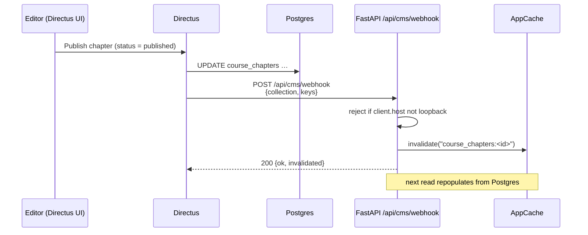

# Directus: the editorial write plane

## Scan box

- **Directus 11 is the editorial write surface; FastAPI is the runtime read
  surface.** Both operate over the same `codecoder` Postgres. Directus is never on
  the read path — the SPA and quiz read content through FastAPI `/api/*`, cached.
- Directus stands up **additively, by introspection**: it registers the existing
  Postgres tables as collections and renders editors over them. No DDL against
  application tables, no content moved, no media migrated.
- The cache stays honest through one seam: on a publish, Directus fires a
  **loopback webhook** to `POST /api/cms/webhook`, and FastAPI invalidates the one
  cache key that changed. No shared secret — reachability on `127.0.0.1` *is* the
  authentication.
- A **scoped `directus_app` Postgres role** is the floor of the security model:
  Directus can DML only the content tables, and is hard-denied SELECT on
  `attempts`, `quiz_sessions`, `signing_keys`, and `auth_audit`.
- **Postgres is the editable source of truth**; the git-JSON under
  `content/source/` is the seed and the export. Truth flows Postgres → git.

The platform runs two planes over one database. This page is about the editorial
plane — how Directus writes content without ever being on the read path, and how
the two planes stay consistent through a single narrow seam.

## Two planes, one database

```
   EDITORIAL PLANE (write)                 RUNTIME PLANE (read)
 ┌─────────────────────────┐            ┌─────────────────────────┐
 │  Directus 11 (cms/)      │            │  FastAPI app (backend/)  │
 │  - introspects tables    │            │  - reads via /api/*      │
 │  - renders editors       │            │  - cache-backed reads    │
 │  - role-based authoring  │            │  - serves the SPA + quiz │
 └───────────┬─────────────┘            └────────────┬────────────┘
   writes     │                            reads      │ (cached)
              ▼                                       ▼
        ┌──────────────────────────────────────────────────┐
        │              codecoder  (Postgres)               │
        │  course_chapters · frameworks · feed_items ·     │
        │  questions · app_config · media_assets metadata  │
        └──────────────────────────────────────────────────┘
                              ▲
              loopback webhook │  POST /api/cms/webhook on publish
                              └── Directus → FastAPI (cache invalidate)
```

The crucial property: **there is no service-to-service call on the read path.**
FastAPI does not call Directus to render a page. Both planes read the same Postgres
rows. Directus is an authoring console, not a runtime dependency — if Directus is
down, reading content is unaffected.

Directus is pinned to **version 11.17.4** and stood up as code in the `cms/`
directory: a Docker Compose deploy shape, a committed `.env.example`, an idempotent
`bootstrap.sh`, a `register-collections.mjs` that drives the Directus API, and a
captured `snapshot.yaml` of the data model. It runs as its own service on its own
port behind the same Apache.

## Introspect, do not own

Directus does not create the content tables. They already exist — built by the
FastAPI application and the Alembic migrations. Directus **introspects** them: it
registers each as a collection and renders an editor over the existing columns. Its
own metadata (`directus_collections`, `directus_fields`, and the rest of the
`directus_*` tables) describes the editors without altering the data columns.

The collections Directus registers (nine in the captured snapshot):

| Collection | Underlying table | Directus role |
|---|---|---|
| `course_chapters` | `course_chapters` | Content Author authoring surface |
| `frameworks` | `frameworks` | spine + explainer (two rows) |
| `feed_items` | `feed_items` | Feed Moderator surface (status only) |
| `questions` | `questions` | Quiz Admin: official authoring + UGC review |
| `app_config` | `app_config` | Platform Admin config UI |
| `media_assets` | `media_assets` | metadata browser, read-only (no bytes) |
| `users` | `users` | learner identity, read-only |
| `roles` | `roles` | role reference data |
| `user_roles` | `user_roles` | grants (read-only by default) |

The two identity systems stay separate. Directus editors live in
`directus_users` / `directus_roles` (the *staff* plane); learners live in the app's
`users` / `roles` (the *learner* + capability plane). They are bridged by the
authorisation model, not merged.

## The cache-invalidation seam

The one place the two planes must coordinate is the cache. FastAPI reads content
through a short-TTL cache; when an editor publishes in Directus, that cache must
drop the stale entry. The seam is a single loopback webhook.



The seam's properties, exactly as implemented in
`backend/app/modules/cms/routes.py`:

- **Loopback-only.** Directus and FastAPI are co-resident on one VM. FastAPI binds
  the receiver to `127.0.0.1`; Apache restricts the `/api/cms/webhook` location to
  `Require ip 127.0.0.1`; and the handler rejects any request whose
  `request.client.host` is not a loopback address (`127.0.0.1`, `::1`, and the
  rare `::ffff:127.0.0.1` stack-translation form). There is **no HMAC, no shared
  secret, no nonce** — network reachability is the authentication.
- **Per-key invalidation.** For `app_config`, the webhook invalidates
  `app_config:<key>` for each key changed. For the four content collections it
  invalidates `<collection>:<id>` per id. An empty key list invalidates the whole
  collection prefix, since Directus may post bulk events without keys.
- **TTL is the safety net.** Even if a webhook is missed, the short cache TTL means
  a stale value self-corrects within seconds. The webhook makes a publish feel
  instant; the TTL guarantees eventual consistency.

:::note[Why This Matters]

The webhook seam is the entire coupling between the two planes, and it is
deliberately tiny: one HTTP POST over loopback, no secret, no payload the app
trusts beyond a collection name and a list of keys. An architect should read this
as a feature, not a shortcut. A bigger seam — a shared signing secret, a
service-to-service read API, Directus on the request path — would be more surface
to secure and more to go wrong. The model reads the database, not the CMS.

:::

## The scoped `directus_app` role

Permissions in the Directus UI govern *editors*. They do not govern the database.
The floor of the security model is the Postgres role Directus connects as:
`directus_app`, created by Alembic migration `0008`. It is granted exactly what the
editorial plane needs and explicitly denied everything else.

| Table | Directus access |
|---|---|
| `course_chapters` | select / insert / update / delete |
| `frameworks` | select / insert / update (never delete the two rows) |
| `questions` | select / insert / update / delete |
| `feed_items` | select / update (status only; never insert or delete) |
| `app_config` | select / insert / update |
| `media_assets` | select only (metadata; bytes are FastAPI's) |
| `users`, `roles`, `user_roles` | select (read-only reference) |
| **`attempts`** | **denied** |
| **`quiz_sessions`** | **denied** |
| **`signing_keys`** | **denied** |
| **`auth_audit`** | **denied** |

The denied set is enforced with an explicit `REVOKE ALL` after the `GRANT` block,
in one transaction, so a future migration that adds a table does not silently grant
Directus access to it. The DB-level deny is beneath the UI RBAC, never replaced by
it — even an editor with full admin in the Directus UI literally cannot read
`attempts`, because the role Directus connects as cannot see the table.

## Source of truth: Postgres editable, git-JSON seed

The platform deliberately treats **Postgres as the editable source of truth** and
the JSON under `content/source/` as the seed and the export. This is a shift away
from the older "files are canonical" decision (recorded in ADR 0001), which named
its own trigger — *move to a database when non-technical editors need a CMS* — and
that trigger has fired: Directus is that CMS.

```
   one-time seed         live editing            periodic export
  git-JSON ──ETL──▶  Postgres (truth) ◀──Directus──  Postgres ──dump──▶ git-JSON
   (source/)         course_chapters,    edits        (source/, for diff/review/backup)
                     frameworks, …
```

Direction of truth is **Postgres → git**, not git → Postgres — except for the
one-time seed and a disaster-recovery re-seed. The git-JSON is a versioned snapshot
for diff, review, and backup; it is not a second live read path. An export script
reads the canonical tables and writes the JSON files, run on a schedule or a publish
event — keeping the "content in git" property that ADR 0001 valued while making the
database authoritative for editing.

:::caution[Common Pitfall]

Editing a `content/source/*.json` file and expecting the change to show up in the
running app. It will not. The runtime reads Postgres, not the file. A hand-edit to
the JSON only matters at the next seed — and if the export script runs first, your
edit is overwritten by the database. Edit content in Directus; let the export keep
git in step.

:::

:::tip[Agency Tip]

When a client asks "is our content in git or in a database?", the honest answer for
this platform is "both, with a direction". The database is where editing happens and
where the runtime reads; git holds a reviewable, restorable snapshot. Naming the
*direction of truth* — DB to git — is what stops the two from drifting into a
two-sources-of-truth mess.

:::
