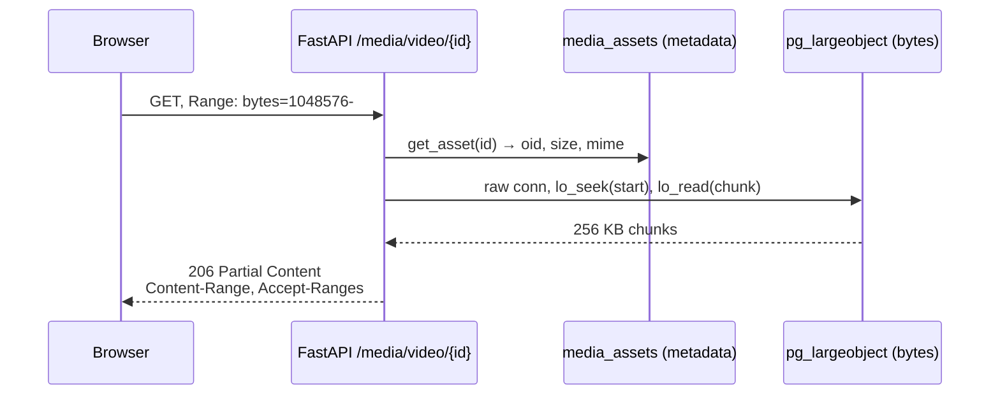

# Media large objects

## Scan box

- **Media bytes live in Postgres large objects.** `media_assets` holds the
  metadata row; the bytes sit in the `pg_largeobject` system catalogue,
  referenced by `media_assets.large_object_oid`. No S3, no object store, no
  filesystem media store — this is final.
- **FastAPI owns the whole media path.** Upload writes the large object and
  the metadata row; the `/media/video/{id}` and `/media/image/{id}` routes
  stream the bytes back, with HTTP Range support for video scrubbing.
- **Orphan bytes are handled two ways.** A `BEFORE DELETE` trigger calls
  `lo_unlink` on the happy-path delete (transactional with the row removal);
  a nightly `vacuumlo` cron sweeps orphans left by partial uploads.
- **The OID is not a foreign key.** Postgres exposes no catalogue you can FK
  a large object to, so referential integrity here is procedural — enforced
  by the trigger and the sweep, not by the schema.

The metadata model is `MediaAsset` in `backend/app/core/models.py`; the
large-object I/O is in `backend/app/modules/media/service.py`; the cleanup
trigger is `0006_lo_cleanup`. The design contract is
`docs/architecture/v2/03-data-model.md` §7.2.

## Why large objects, not BYTEA or a bucket

Postgres offers two ways to store binary data: a `BYTEA` column (the whole
blob in the row) and a large object (the blob in the `pg_largeobject`
catalogue, referenced by an OID). v2 uses large objects for media because
they support **seekable, streamed reads** — `lo_seek` plus `lo_read` lets
the server read an arbitrary byte range without pulling the whole file into
memory. That is exactly what HTTP Range requests need for video scrubbing.

The alternative of an external object store (S3 or similar) was considered
and **cancelled on 2026-06-06**. Keeping media in the same Postgres means one
backup boundary, one access-control surface, and no second credential to
manage. The trade-off — large objects are heavier to back up than a bucket
and need their own cleanup discipline — is accepted and managed by the
mechanisms below.

## The shape

```
┌──────────────────┐         ┌─────────────────────────────┐
│  media_assets    │         │  pg_largeobject (system)    │
│  (one row/asset) │         │  (the bytes, in 2KB pages)  │
├──────────────────┤         ├─────────────────────────────┤
│  id (uuid text)  │         │  loid  ◄── large_object_oid │
│  large_object_oid│────────▶│  pageno                     │
│  filename        │  (OID,  │  data                       │
│  mime_type       │  no FK) │                             │
│  size_bytes      │         │                             │
│  uploaded_by  FK │         │                             │
└──────────────────┘         └─────────────────────────────┘
        │                                  ▲
        │ FastAPI writes both              │ lo_create / lo_write
        └──────────────────────────────────┘ (raw connection)
```

`media_assets.large_object_oid` is typed `OID` and points at the `loid` in
`pg_largeobject`. Postgres does not let you declare a foreign key to a large
object, so this reference is unenforced at the schema level — the reason the
cleanup mechanisms below exist.

## The write path

Upload runs through `store_media_asset` in `media/service.py`. It uses a
**raw psycopg connection** (`engine.raw_connection()`), not a pooled
SQLAlchemy session, because the large-object API is a low-level cursor
operation:

1. Create a new large object and capture its OID.
2. Stream the file into it in 1 MB chunks (`lobj.write`), then commit the
   raw connection.
3. Open a normal ORM session and insert the `media_assets` row with the OID,
   filename, MIME type, size, and uploader.

Before any bytes are written, the upload path enforces MIME safety:
`detect_mime_type` checks magic bytes (so a renamed `.svg` cannot pose as a
PNG), and `assert_mime_allowed` hard-denies SVG, XML, and HTML —
`image/svg+xml` can carry inline `<script>`, and serving it same-origin
would be stored XSS. That check is centralised so both the route and any
internal caller share it.

:::caution[Common Pitfall]

Forgetting that the large object and the metadata row commit in *separate*
steps. `store_media_asset` commits the large object first, then inserts the
metadata row. If the metadata insert fails, the bytes are already
committed and orphaned — there is no metadata row to ever reference them.
This is the exact gap the `vacuumlo` sweep exists to close. Do not assume a
failed upload leaves the database clean; it can leave bytes behind.

:::

## The read path — Range streaming

The `/media/video/{asset_id}` route in `media/routes.py` supports HTTP Range
requests so a browser can scrub through a video without downloading it whole:

- **No Range header** → the whole object streams back as a normal
  `StreamingResponse`.
- **A Range header** → the route parses `start`/`end`, returns `206 Partial
  Content` with `Content-Range: bytes start-end/size` and
  `Accept-Ranges: bytes`, and streams only that slice. A malformed range is
  `400`; an unsatisfiable one is `416`.

The bytes come from `stream_video_chunks`, which opens the large object on a
raw connection, `lo_seek`s to the start byte, and yields 256 KB chunks until
the requested range is exhausted. Images (`/media/image/{asset_id}`) stream
the whole object — they are small and do not need partial reads.



## Orphan prevention — two mechanisms

Because the OID has no foreign key, deleting a `media_assets` row would, by
default, leave its bytes behind in `pg_largeobject` forever. v2 closes that
two ways.

### 1. The delete trigger (correctness)

`0006_lo_cleanup` installs a `BEFORE DELETE` trigger that unlinks the large
object transactionally with the row removal:

```sql
CREATE OR REPLACE FUNCTION media_assets_unlink_lo() RETURNS trigger AS $$
BEGIN
    PERFORM lo_unlink(OLD.large_object_oid);
    RETURN OLD;
EXCEPTION WHEN undefined_object THEN
    -- already unlinked elsewhere; don't block the metadata delete
    RETURN OLD;
END;
$$ LANGUAGE plpgsql;

CREATE TRIGGER trg_media_assets_unlink
    BEFORE DELETE ON media_assets
    FOR EACH ROW EXECUTE FUNCTION media_assets_unlink_lo();
```

The `EXCEPTION WHEN undefined_object` clause means that if the large object
was already removed by some other path, the row delete still succeeds rather
than aborting. This trigger guarantees no orphan is *created* by an
application delete.

### 2. The `vacuumlo` sweep (resilience)

The trigger only fires when a `media_assets` row is deleted. It cannot help
with the partial-upload case above, where bytes are committed but the
metadata row never lands — there is no row to delete and no trigger to fire.
For that, the standard Postgres contrib tool `vacuumlo` runs nightly as an
infra cron. It scans every OID-typed column in the database and unlinks any
large object referenced nowhere:

```
# /etc/cron.d/codecoder-vacuumlo
17 3 * * *  postgres  vacuumlo -v -n codecoder >> /var/log/codecoder/vacuumlo.log 2>&1
```

The `-n` (dry-run) flag is kept until the report is reviewed and confirmed to
contain only genuine orphans; then it is dropped so the sweep actually
unlinks.

:::note[Why This Matters]

The trigger and the sweep are not redundant — they cover different failure
modes. The trigger handles the happy path (a real delete) with transactional
guarantees the sweep cannot match. The sweep handles the crash path (a
partial upload) that the trigger structurally cannot see. Skip either and you
re-open one of the two orphan windows. Both, together, are the full
guarantee.

:::

## Backup implications

Large objects are not captured by an ordinary table-only dump — `pg_dump`
includes them by default in the custom and directory formats, but a
plain-SQL dump with `--table` filters will silently miss them. When you take
a logical backup of this database, use a whole-database custom-format dump
(`pg_dump --format=custom codecoder`) so the `pg_largeobject` contents come
along with the `media_assets` rows that reference them. A backup that has the
metadata rows but not the bytes is a backup of broken references.
