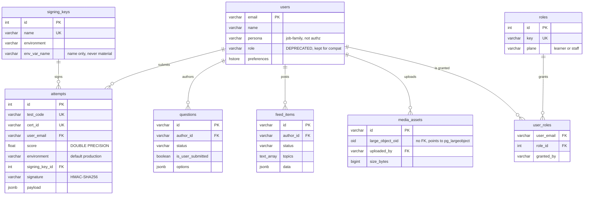

# Schema overview

## Scan box

- **Thirteen application tables** make up the v2 schema: seven carried over
  from the legacy backend and six added by Phase 2a. They live alongside
  Directus's `directus_*` system tables in the same database.
- **`users` is the hub.** Attempts, questions, feed items, media assets,
  quiz sessions and role grants all reference it by the email primary key.
- **Two write planes, one schema.** FastAPI writes the runtime tables;
  Directus edits the content and config tables. The `status` and
  `is_user_submitted` columns are the provenance seam where the two planes
  share a table.
- **The role split is the central v2 change.** The old overloaded
  `users.role` column is superseded by a `roles` reference table and a
  `user_roles` many-to-many grant table, so a user can hold several
  capability roles at once.

The schema is defined in `backend/app/core/models.py`. That file is the
source of truth; the migration chain (see
[Alembic migrations](./alembic-migrations.md)) builds it incrementally.

## The thirteen tables

| Table | Plane / owner | Primary key | Purpose |
|---|---|---|---|
| `users` | learner identity | `email` | One row per authenticated learner |
| `attempts` | FastAPI runtime | `id` (serial) | Graded quiz submissions, HMAC-sealed certificate data |
| `questions` | shared (Directus authors, FastAPI UGC) | `id` (text) | Quiz bank, official and user-submitted |
| `feed_items` | shared (FastAPI posts, Directus moderates) | `id` (text) | UGC feed stream |
| `media_assets` | FastAPI runtime | `id` (UUID text) | Metadata for large-object media |
| `course_chapters` | Directus content | `filename` | Authored course prose, one row per section file |
| `frameworks` | Directus content | `id` (text) | Framework spine + explainer, exactly two rows |
| `quiz_sessions` | FastAPI runtime | `quiz_id` | In-flight quiz state (replaces the in-memory dict) |
| `signing_keys` | infra / migration | `id` (serial) | Per-environment certificate key metadata |
| `roles` | reference data | `id` (serial) | The six capability roles |
| `user_roles` | staff grants | `(user_email, role_id)` | Many-to-many role grants |
| `app_config` | Directus config | `key` | Runtime-tunable, non-secret config |
| `auth_audit` | FastAPI runtime | `id` (bigserial) | Append-only authn/authz event log |

The first seven are the legacy backend, hardened in place. The last six are
the Phase 2a additions, created by `0003_new_tables` and seeded by
`0005_seed_data`.

## Entity-relationship diagram

The diagram below shows the foreign-key relationships. `users` is the hub;
the standalone reference and content tables sit apart because they carry no
FK into the learner graph.



The standalone tables — `course_chapters`, `frameworks`, `quiz_sessions`,
`app_config`, `auth_audit` — carry no foreign key into the `users` graph and
so do not appear above. `course_chapters` and `frameworks` are
Directus-authored content keyed by their own natural keys; `quiz_sessions`
holds short-lived runtime state keyed by `quiz_id`; `app_config` and
`auth_audit` are config and audit respectively. `media_assets.large_object_oid`
points into the `pg_largeobject` system catalogue, which Postgres does not
expose as a foreign-key target — that integrity is procedural, enforced by a
trigger (see [Media large objects](./media-large-objects.md)).

## Who writes each table

The same table can be written by both planes; the seam is a status or
provenance column, never a row owner.

```
┌──────────────────────────────────────────────────────────────┐
│  FastAPI runtime plane          │  Directus editorial plane    │
│  (learner SSO, scoped writes)   │  (directus_app DB role)      │
├──────────────────────────────────────────────────────────────┤
│  attempts        write-only     │  course_chapters   author    │
│  quiz_sessions   write-only     │  frameworks        author    │
│  auth_audit      write-only     │  app_config        config    │
│  media_assets    bytes+meta     │  questions         author    │
│  users           SSO upsert     │  feed_items        moderate  │
│  feed_items      post + flag    │  media_assets      read meta │
│  questions       UGC submit     │  users / roles     read-only │
└──────────────────────────────────────────────────────────────┘
        shared tables: questions, feed_items, media_assets
        seam columns:  status, is_user_submitted
```

:::note[Why This Matters]

The dual-writer model is what lets Directus be a real editorial CMS without
forking the data. Official questions and UGC questions are the *same table*;
the `status` and `is_user_submitted` columns record provenance. A
moderator's edit and a learner's submission land in one place, and the
runtime read API sees a single consistent view. The cost is that table
ownership has to be enforced at the database role level — which is exactly
what [Role isolation](./role-isolation.md) does.

:::

## The role split

The single most consequential v2 schema change is the split of the
overloaded `users.role` column. In the legacy backend that one
`VARCHAR(32)` carried two unrelated concepts at once: a **persona** (the
onboarding job family — `pm`, `ba`, `qa`, `sales`, `design`, `devops`,
`coder`, `architect`, `other`) that only nudges the recommended quiz
difficulty, and an **RBAC capability** (`User`, `FeedCreator`, `Moderator`,
`QuizManager`) that gated permissions. A user could be one or the other,
never both, because `set_user_role` overwrote whichever was there.

v2 separates the two cleanly:

- **Persona** becomes `users.persona` — a nullable profile attribute that
  drives only the recommended difficulty. It is not a permission.
- **Capability** becomes the `roles` reference table (six rows) plus the
  `user_roles` many-to-many grant table. A user can now hold `learner` and
  `feed_moderator` and `content_author` simultaneously.

The six capability roles, seeded by `0005_seed_data`:

| `roles.key` | `plane` | Meaning |
|---|---|---|
| `learner` | learner | Default; every authenticated user |
| `feed_contributor` | learner | May post UGC feed items and propose questions |
| `content_author` | staff | Authors official content and questions in Directus |
| `quiz_admin` | staff | Manages the quiz bank, scoring, pass-mark config |
| `feed_moderator` | staff | Reviews flagged feed items |
| `platform_admin` | staff | Grants/revokes roles, edits platform config |

:::caution[Common Pitfall]

Treating `users.persona` as an authorisation input. It is not. Persona only
feeds `recommended_level` — the suggested quiz difficulty. Authorisation is
resolved entirely through `user_roles`. The whole point of the split was to
stop one column meaning two things; reading `persona` to decide access would
re-introduce the exact defect v2 removed.

:::

The legacy `users.role` column still exists in the model
(`backend/app/core/models.py`, marked `DEPRECATED`) and is kept for
backward compatibility through the cutover. The backfill from `role` into
`user_roles` — including the locked rule that `QuizManager` maps to
`{learner}` only, never auto-granting admin — is owned by the authorisation
phase, not by these data-model migrations.
