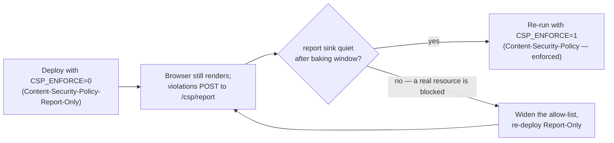

# The Apache vhost

## Scan box

- Apache is the single public listener and therefore the home of the whole
  edge: **TLS termination, HSTS, two CSP profiles, gzip, HTTP/2, the cache
  matrix, the `/cms/` proxy, rate limiting, and the loopback webhook guard.**
- Port 80 only **redirects** to 443. The 443 vhost serves `/anatomy/` and
  `/app/` off disk and proxies everything else to uvicorn, with `/cms/` proxied
  to Directus *before* the catch-all so it is not shadowed.
- **CSP ships Report-Only by default** (`CSP_ENFORCE=0`). You watch the report
  sink, then flip `CSP_ENFORCE=1` once the allow-list is proven clean. Three
  profiles exist: DEFAULT (app), COURSE (`/anatomy/`), and CMS (`/cms/`).
- Apache owns **exactly two** security headers — HSTS and CSP. The other six
  are set by the app's `SecurityHeadersMiddleware`; the vhost must not duplicate
  them.
- The cache matrix is per-location and always uses **`Header always set`** so
  the directive rides 304s and error responses, not just 200s.

## The two virtual hosts

The HTTP vhost does one job — send everyone to HTTPS:

```apache
<VirtualHost *:80>
    ServerName internal.in.deptagency.com
    RewriteEngine On
    RewriteRule ^/?(.*) https://internal.in.deptagency.com/$1 [R=301,L]
</VirtualHost>
```

All the work is in the `*:443` block. `deploy.sh` enables the modules it needs
first — `proxy`, `proxy_http`, `ssl`, `rewrite`, `headers`, `deflate`,
`expires`, `http2`, `ratelimit`, and (only when Directus is on) `proxy_wstunnel`.
On RHEL these ship with the base `httpd` / `mod_ssl` / `mod_http2` packages and
the script verifies rather than re-declares them; on Debian it runs `a2enmod`.

## TLS and HSTS

```apache
Protocols h2 http/1.1
SSLEngine on
SSLCertificateFile    /etc/pki/tls/certs/internal.in.deptagency.com.crt
SSLCertificateKeyFile /etc/pki/tls/private/internal.in.deptagency.com.key
SSLProtocol           -all +TLSv1.2 +TLSv1.3
SSLCipherSuite        HIGH:!aNULL:!MD5
SSLHonorCipherOrder   on

Header always set Strict-Transport-Security "max-age=31536000; includeSubDomains"
```

`Protocols h2 http/1.1` advertises HTTP/2 over ALPN; clients that do not speak it
fall back to HTTP/1.1. TLS is restricted to 1.2 and 1.3. The cert and key default
to the RHEL `/etc/pki/...` paths (Debian uses `/etc/ssl/...`); override with
`CERT_FILE` / `KEY_FILE`, and supply `CHAIN_FILE` if your CA needs an intermediate.

The HSTS header commits browsers to HTTPS for a year. Note what it does **not**
carry: `preload`. The security baseline (07 §3.1) is explicit that `preload`
commits to TLS-forever and should only be added after a 30-day soak on the
non-preload variant — so the shipped header omits it deliberately.

:::caution[Common Pitfall]
TLS is provisioned from cert files, not auto-renewed by the script. On expiry an
operator must re-supply the cert. If the box is publicly resolvable, prefer
`certbot --apache -d <DOMAIN>` plus `systemctl enable --now certbot.timer` so
renewal is automatic — the manual cert path is an ops liability the security
baseline calls out (F-NET-02).
:::

## What Apache serves vs what it proxies

```apache
Alias /anatomy "/opt/dept-anatomy/content/frozen"
<Directory "/opt/dept-anatomy/content/frozen">
    Require all granted
    DirectoryIndex anatomy-of-code-course.html
    Options -Indexes +FollowSymLinks
</Directory>

Alias /app "/opt/dept-anatomy/frontend"
<Directory "/opt/dept-anatomy/frontend">
    Require all granted
    DirectoryIndex index.html
    Options -Indexes +FollowSymLinks
    FallbackResource /app/index.html
</Directory>

ProxyPreserveHost On
RequestHeader set X-Forwarded-Proto "https"
ProxyPass        /anatomy !
ProxyPass        /app     !
ProxyPass        /cms/  http://127.0.0.1:8055/      # only when Directus is on
ProxyPassReverse /cms/  http://127.0.0.1:8055/
ProxyPass        /  http://127.0.0.1:8000/
ProxyPassReverse /  http://127.0.0.1:8000/
```

The frozen course and the SPA are served **off disk by Apache** — no proxy hop —
because they are static. The `ProxyPass /anatomy !` and `ProxyPass /app !`
exclusions stop those paths from being forwarded to uvicorn. There is
deliberately **no `Alias /static/`**: FastAPI mounts `/static/` itself, so it
must fall through to the proxy (decision Q-13).

Order matters for `/cms/`: its `ProxyPass` pair sits **before** the catch-all
`ProxyPass /` so it is not shadowed. `/cms/` is a fresh top-level subpath that
collides with none of the reserved paths (`/`, `/app`, `/anatomy`, `/media`,
`/certificate`, `/api`). When `DEPLOY_DIRECTUS=false`, both the `/cms/` proxy and
its CSP block are simply omitted, so a CMS-less box never proxies to a dead 8055.

## The Content-Security-Policy profiles

Apache sets the CSP because the policy differs by path, and three profiles are in
play. The DEFAULT profile applies to the app paths (`/`, `/app/`, `/api`); the
COURSE profile overrides it for `/anatomy/`; the CMS profile overrides it for
`/cms/`.

The allow-list is grounded in an actual grep of `frontend/` and `content/frozen/`:

| CDN / origin | Used by |
|---|---|
| `https://cdn.jsdelivr.net` | mermaid 11 — both the SPA `diagram.js` and the course HTML |
| `https://esm.sh` | Ajv 2020 + ajv-formats — the SPA feed `validate.js` |
| `https://fonts.googleapis.com` / `https://fonts.gstatic.com` | web fonts |
| `https://www.deptagency.com` | the DEPT logo SVG |

```apache
# DEFAULT — /, /app/, /api
Header always set Content-Security-Policy-Report-Only \
  "default-src 'self'; \
   script-src 'self' https://cdn.jsdelivr.net https://esm.sh; \
   style-src 'self' 'unsafe-inline' https://fonts.googleapis.com; \
   font-src 'self' https://fonts.gstatic.com; \
   img-src 'self' data: https://www.deptagency.com; \
   connect-src 'self' https://esm.sh; \
   frame-ancestors 'none'; base-uri 'self'; form-action 'self'; \
   object-src 'none'; report-to csp-endpoint"
```

Three differences across the profiles:

- **COURSE** (`/anatomy/`) drops `esm.sh` (the frozen course loads only mermaid)
  and **adds `media-src 'self'`** for the monolith's `<video>` tags (C-67).
- **CMS** (`/cms/`) is the only profile with `script-src 'unsafe-eval'` — the
  Directus admin is a Vue SPA bundle that needs it — plus `blob:` in `img-src`,
  `media-src`, and `worker-src` for upload previews and the web-worker bundle. It
  is scoped to a `<Location "/cms/">` so this widening never reaches the
  application paths.
- The DEFAULT and COURSE profiles carry **no `unsafe-eval`** and only the
  `'unsafe-inline'` that mermaid's injected `<style>` needs.

### The safe-rollout gate



`CSP_ENFORCE=0` (the default) ships the policy as `Content-Security-Policy-Report-Only`
so a too-tight allow-list logs violations instead of breaking the page. The
`Report-To` header names a `csp-endpoint` group pointing at the app's
same-origin `/csp/report`. Once the sink is quiet, re-deploy with `CSP_ENFORCE=1`
to switch the header name to the enforcing `Content-Security-Policy`.

:::note[Why This Matters]
Apache owns **only** HSTS and CSP. The other six security headers —
`X-Content-Type-Options`, `X-Frame-Options`, `Referrer-Policy`,
`Permissions-Policy`, COOP, and CORP — are set by the app's
`SecurityHeadersMiddleware`. Duplicating any of them in the vhost would ship the
header twice and is explicitly called out as wrong. The split is the contract:
edge headers in Apache, application headers in the middleware.
:::

## The cache matrix

Performance lives in per-location `Cache-Control`. The vhost also turns on gzip
and the per-path rate limit:

```apache
# Compression (06 §2.3)
AddOutputFilterByType DEFLATE text/html text/plain text/css \
    application/javascript application/json image/svg+xml application/xml
```

The cache rules, by path:

| Path | Cache-Control | Why |
|---|---|---|
| `/app/` | `public, max-age=0, must-revalidate` | Buildless SPA — filenames are stable across deploys, so **never** `immutable`; revalidate every load. |
| `/anatomy/` | `public, max-age=86400, must-revalidate` | Frozen monolith and runbooks change rarely; a 1-day window plus ETag. Also where the COURSE CSP profile is set. |
| `/api/course/` | `public, max-age=0, must-revalidate` | App emits a strong ETag; revalidate every load. |
| `/api/feed` | `no-cache` | Feed mutates (posts, flags) — never serve a cached copy without revalidating. |
| `/media/` | `public, max-age=86400, must-revalidate` | Stable `asset_id`, but a moderated or deleted asset must be able to expire — so **not** `immutable` (C-30). |
| `/certificate/` | `private, max-age=86400, must-revalidate` + `Vary: Cookie` | User-private and byte-stable; `private` keeps it out of shared caches, `Vary: Cookie` defends against a misconfigured proxy cross-serving PDFs (C-10). |

Every directive uses `Header always set`, not `Header set`. Plain `Header set` is
dropped on `304 Not Modified` responses (C-09), which would leave a conditional-GET
round trip with no freshness rule and let a browser fall back to heuristic
caching. `always set` covers 304s and error responses too.

:::caution[Common Pitfall]
Marking the SPA `immutable`. The buildless front-end ships stable filenames
(`main.js`, not `main.ab12cd34.js`) — there is no content hash in the URL, so
`immutable` would pin a stale bundle for a year. The vhost uses
`max-age=0, must-revalidate` for `/app/` precisely so a deploy is picked up on the
next load. The commented `immutable` block in the vhost only activates if hashed
cache-bust URLs are ever introduced.
:::

## Rate limiting and the webhook guard

Two `<Location>` blocks harden specific paths.

The media-upload endpoint is the only one where a misbehaving client can saturate
the uplink, so its outbound bandwidth is capped (C-29):

```apache
<Location "/api/media/upload">
    SetOutputFilter RATE_LIMIT
    SetEnv rate-limit 4096       # ~4 MB/s per active upload
</Location>
```

The cache-invalidation webhook is locked to loopback. This is defence in depth —
the app already rejects non-loopback callers — and it sits *after* the catch-all
`ProxyPass /` so the `Require` is evaluated for the proxied request:

```apache
<Location "/api/cms/webhook">
    Require ip 127.0.0.1 ::1
</Location>
```

This is the second half of the "network reachability is the authentication"
design (C-52): Apache denies the location from any non-loopback source, uvicorn
binds `127.0.0.1`, and only the co-resident Directus can reach it. No HMAC, no
shared secret — the topology is the auth.

## The Directus reverse proxy

When `DEPLOY_DIRECTUS=true`, two extra fragments are interpolated into the vhost.
The `<Location "/cms/">` scopes the CMS CSP profile and tells Apache the admin
shell uses no shared cache; a `mod_proxy_wstunnel` rewrite upgrades WebSocket
connections for Directus's realtime channel onto the same backend port:

```apache
<Location "/cms/">
    Header always set Content-Security-Policy-Report-Only "<CSP_CMS profile>"
    Header always set Cache-Control "no-cache"
</Location>
RewriteEngine On
RewriteCond %{HTTP:Upgrade} =websocket [NC]
RewriteRule ^/cms/(.*)$ ws://127.0.0.1:8055/$1 [P,L]
```

The Google SSO callback (`/cms/auth/login/google/callback`) rides this same proxy
— there is no separate vhost or subdomain. Stand-up details are on the
[Directus](./directus-cms) page.

## Validating and reloading

`deploy.sh` runs `httpd -t` (Debian: `apache2ctl -t`) and refuses to restart
Apache unless it prints `Syntax OK`. After any hand-edit of the vhost, do the
same before reloading:

```bash
sudo httpd -t                  # Syntax OK
sudo systemctl reload httpd    # or: systemctl reload apache2
```

`httpd -t` names the exact file and line of a config error — it is the first
thing to run when Apache will not start after an edit.
