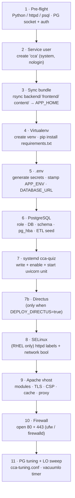

# The deploy.sh installer

## Scan box

- `deploy.sh` is **one idempotent script** that takes a fresh VM (with Apache,
  Python, and Postgres pre-installed) to a serving box. Every step is guarded so
  re-running it never wipes data, `.env`, or database rows.
- It runs as **root** and provisions, in order: service users, the venv, the
  `.env`, the database (role, schema, ETL seed), the `cca-quiz` systemd unit,
  Directus, SELinux labels, the Apache vhost, the firewall, and the Postgres
  tuning plus large-object sweep.
- Two modes: a **full install** (`sudo ./deploy.sh`) and `--update`
  (`sudo ./deploy.sh --update`), which re-syncs code and restarts services but
  skips the package/firewall/SELinux work.
- Configuration is by **environment variable**, optionally collected in a
  gitignored `deploy.env` next to the script so you do not retype it each run.
- It **defaults to `APP_ENV=production`**, which means the app's
  `validate_for_env()` refuses to boot on dev-default secrets — so the `.env`
  step generates real ones. This is the fail-closed posture, not an accident.

## Running it

```bash
# Full first-time install (dev-mode auth — email login, no Google OAuth)
sudo ./deploy.sh

# Production with OAuth wired in
sudo GOOGLE_CLIENT_ID='xxxx.apps.googleusercontent.com' \
     GOOGLE_CLIENT_SECRET='your-secret' \
     ./deploy.sh

# Re-sync code and restart services only (fast path for a new bundle)
sudo ./deploy.sh --update
```

The script must run as root — it writes systemd units, the Apache vhost, and
firewall rules. It refuses to start otherwise with a clear message.

### Configuration via `deploy.env`

Rather than passing variables on every invocation, copy `deploy.env.example` to
`deploy.env` (it is gitignored) and fill in what you need. `deploy.sh` sources it
automatically:

```bash
cp deploy.env.example deploy.env
chmod 600 deploy.env
# edit: POSTGRES_SUPERUSER_PASSWORD, DOMAIN, GOOGLE_CLIENT_ID/SECRET, …
sudo ./deploy.sh
```

The common knobs: `DOMAIN`, `APP_ENV` (`development` | `staging` | `production`),
`POSTGRES_SUPERUSER_PASSWORD`, the `GOOGLE_*` OAuth credentials, `CERT_FILE` /
`KEY_FILE` / `CHAIN_FILE` for TLS, `DEPLOY_DIRECTUS` to gate the CMS, and
`CSP_ENFORCE` to flip the Content-Security-Policy from Report-Only to enforced.

## What each step does

The script prints a numbered banner per step. The sequence (a CMS box adds the
Directus step, and SELinux is skipped on non-RHEL):



**1 · Pre-flight.** Confirms Python 3.8+, Apache, and `psql` are present;
locates the Postgres Unix socket *before* any `psql` call (so a misconfigured
server fails fast instead of hanging on a TCP fallback); and establishes a
superuser auth path — either a supplied `POSTGRES_SUPERUSER_PASSWORD` or peer
authentication, adding the `local all postgres peer` rule to `pg_hba.conf` if it
is missing.

**2 · Service user.** Creates `cca` as a system user with a `nologin` shell and
its own home. Skipped if it already exists.

**3 · Sync bundle.** `rsync -a --delete` of `backend/`, `frontend/`, and
`content/` into `APP_HOME`. Crucially, it **excludes** the runtime state that
must survive a deploy: `backend/.env`, `backend/quiz_results/`,
`backend/certificates/`, `backend/outbox/`, and every `.venv/`. A code update
never clobbers issued certificates or quiz results.

**4 · Virtualenv.** Creates `backend/.venv` if absent (reused otherwise),
upgrades pip, and installs `requirements.txt`.

**5 · Environment file.** On first create only, it generates a random
`SECRET_KEY` and `APP_PAYLOAD_SECRET`, stamps `APP_ENV`, builds the
`DATABASE_URL` with a generated DB password, and seeds the certificate-HMAC
continuity keys — `CERT_HMAC_LEGACY` is mirrored from the new `SECRET_KEY` so
freshly issued certs verify, and `CERT_HMAC_PROD` is generated fresh. An existing
`.env` is left untouched. The file is then `chmod 600`, owned by `cca`.

**6 · PostgreSQL.** The database half, all idempotent: ensure the cluster is
running and listening on localhost; create or password-sync the `codecoder` role;
create the database; add the `pg_hba.conf` md5 rules for local and `127.0.0.1`
access; apply `deploy_schema.sql` as the superuser; grant table and sequence
privileges to the app role; verify the app role can actually connect over TCP
with the `.env` password; then run the ETL migration
(`python -m scripts.migrate_to_postgres`) to seed questions, course chapters, the
framework, and feed items.

**7 · systemd (`cca-quiz`).** Writes `/etc/systemd/system/cca-quiz.service` — a
hardened `Type=exec` unit running uvicorn bound to `127.0.0.1:8000` with
`--proxy-headers`, then enables and (re)starts it. The hardening and worker count
are covered below.

**7b · Directus.** Runs only when `DEPLOY_DIRECTUS=true` (the default). Covered in
full on the [Directus stand-up](./directus-cms) page.

**8 · SELinux.** RHEL only. Sets `httpd_can_network_connect` so Apache may proxy
to uvicorn, and labels `content/frozen/` and `frontend/` as `httpd_sys_content_t`
so Apache may serve them off disk. Skipped (and not counted as a step) on Debian
or when SELinux is permissive.

**9 · Apache vhost.** Enables the required modules, writes the site config (TLS,
HSTS, the CSP profiles, gzip, HTTP/2, the cache matrix, the `/cms/` proxy), runs
`httpd -t` to validate, and restarts Apache. This is the
[Apache vhost](./apache-vhost) page's whole subject.

**10 · Firewall.** Opens 80 and 443 via `ufw` or `firewalld`, whichever is
active. It does not open 8000, 8055, or 5432 — those stay loopback-only.

**11 · Postgres tuning + LO sweep.** Installs `infra/postgres/cca-tuning.conf`
into Postgres's `conf.d` and reloads, and installs the `vacuumlo` orphan-cleanup
sweep as a nightly systemd timer (with a cron fallback). Both steps are guarded —
a bundle missing those `infra/` files skips them with a warning rather than
failing.

## The systemd unit it writes

The `cca-quiz` unit runs uvicorn and carries the v2 process hardening:

```ini
[Service]
Type=exec
User=cca
Group=cca
WorkingDirectory=/opt/dept-anatomy/backend
Environment=APP_ENV=production
EnvironmentFile=/opt/dept-anatomy/backend/.env
ExecStart=/opt/dept-anatomy/backend/.venv/bin/uvicorn app.main:app \
    --host 127.0.0.1 --port 8000 --workers 1 \
    --proxy-headers --forwarded-allow-ips='*'
Restart=on-failure
NoNewPrivileges=true
PrivateTmp=true
ProtectSystem=full
ReadWritePaths=/opt/dept-anatomy/backend
ProtectKernelTunables=true
ProtectControlGroups=true
ProtectKernelModules=true
RestrictAddressFamilies=AF_INET AF_INET6 AF_UNIX
RestrictNamespaces=true
LockPersonality=true
SystemCallFilter=@system-service
```

Two details earn explanation:

- **`--workers 1`.** The unit ships a single worker. The seam to raise it exists,
  but the launch default is one — a higher count is a tuning decision, not the
  out-of-the-box state. `Environment=APP_ENV` is also set on the unit (not only
  in `.env`) so the running mode is visible in `systemctl show` and survives an
  operator hand-editing `.env`.
- **No `MemoryDenyWriteExecute`.** The hardening set deliberately omits it. The
  media pipeline (Pillow, `ffprobe`) needs W^X off, so the aggressive
  write-execute denial and the `~@resources` syscall deny-list are left out to
  avoid media regressions (constraint C-64). The Directus unit omits it for the
  same reason — the V8 JIT also needs W^X off.

## Idempotency and re-running

Every step is existence-guarded, which is the property that makes the script
safe to re-run after a partial failure or for a routine update:

- The service user, role, and database are created only if absent.
- The schema (`deploy_schema.sql`) uses `CREATE … IF NOT EXISTS` throughout.
- The ETL migration skips rows that already exist and inserts only new ones.
- The `.env` is generated once and never overwritten; the DB password is synced
  in both directions so the role and the `.env` can never drift apart.
- `GOOGLE_REDIRECT_URI` is written on first create only — an operator who
  customised it keeps their value across `--update` runs.

The `--update` mode is the fast path for shipping a new bundle: it re-syncs code,
re-applies the Directus schema snapshot and `bootstrap.sh` (both idempotent), and
restarts the services, but skips the package, firewall, and SELinux work.

:::tip[Agency Tip]
After a content-only change (new chapters, more questions), you do not need a
full deploy. Re-run just the ETL on the live box and restart the app:

```bash
cd /opt/dept-anatomy/backend
sudo -u cca .venv/bin/python -m scripts.migrate_to_postgres
sudo systemctl restart cca-quiz
```

The migration is idempotent — it only inserts the new rows.
:::

## Verifying a deploy

The script prints a URL-and-operations summary at the end. The quick layered
check — local, then end-to-end:

```bash
systemctl status cca-quiz          # active (running)
systemctl status postgresql        # active (running)
curl -I http://127.0.0.1:8000/      # 200 or 307 (bypasses Apache)
curl http://127.0.0.1:8000/api/course/framework | head -c 200   # JSON
sudo httpd -t                       # Syntax OK
curl -I https://<DOMAIN>/           # 200 over TLS, no cert warning
curl -I https://<DOMAIN>/app/       # 200
```

:::caution[Common Pitfall]
A `404` on `/api/course/framework` immediately after a first deploy almost always
means the tables exist but are **empty** — the ETL did not run, or `content/source/`
did not sync to the VM. It is not a routing bug. Confirm
`ls /opt/dept-anatomy/content/source/course/framework.json` exists, then re-run
the ETL (above). On RHEL, a `403 Forbidden` on `/anatomy/` is the SELinux label
missing — `sudo restorecon -Rv /opt/dept-anatomy/content/frozen /opt/dept-anatomy/frontend`.
:::
