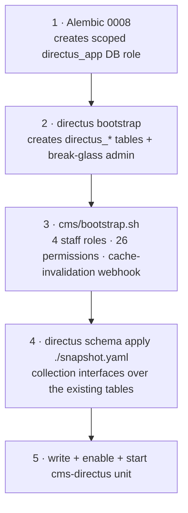

# The Directus stand-up

## Scan box

- Directus is the **editorial write plane** — a separate Node service (pinned to
  **11.17.4**) over the *same* `codecoder` Postgres, reverse-proxied under
  `/cms/`. It is additive, gated behind `DEPLOY_DIRECTUS`, and stores no app
  media.
- `deploy.sh` runs it as a **systemd Node unit** (`cms-directus`) that mirrors
  the `cca-quiz` hardening. A **Docker Compose** alternative exists for boxes
  that already run Docker — pick one, never both.
- The **bootstrap order is strict**: Alembic `0008` (the scoped `directus_app`
  role) → `directus bootstrap` (system tables + admin) → `bootstrap.sh` (roles,
  permissions, webhooks) → `schema apply` (the introspected collections).
- **Node 22 LTS** is the engine requirement. `deploy.sh` warns (does not fail) on
  anything outside 18/20/22; the local box's Node 25 does not compile a native
  dependency, so use a Node 22 toolchain there.
- Staff sign in with **Google SSO** restricted to `deptagency.com`, using a
  *separate* OAuth client from the learner one, with public registration **off**
  and a permanent **break-glass local admin** so a misconfigured SSO can never
  lock everyone out.

## systemd vs Docker Compose

`deploy.sh` stands Directus up as a **systemd Node service** to match the one
operational shape the box already uses for `cca-quiz` — one hardened unit, one
`journalctl` stream. The unit is written automatically when `DEPLOY_DIRECTUS=true`
(the default):

```ini
[Service]
Type=exec
User=directus
Group=directus
WorkingDirectory=/opt/dept-anatomy/cms
EnvironmentFile=/opt/dept-anatomy/cms/.env
ExecStart=/opt/dept-anatomy/cms/node_modules/.bin/directus start
Restart=on-failure
# Mirrors the cca-quiz hardening; ReadWritePaths scoped to uploads + cache.
ReadWritePaths=/opt/dept-anatomy/cms/uploads /opt/dept-anatomy/cms/.directus
NoNewPrivileges=true
ProtectSystem=full
ProtectKernelTunables=true
RestrictAddressFamilies=AF_INET AF_INET6 AF_UNIX
SystemCallFilter=@system-service
# Deliberately NOT MemoryDenyWriteExecute — the V8 JIT needs W^X off (C-64).
```

It runs as its own `directus` system user, so the CMS file and socket surface is
isolated from the app user. The hardening matches `cca-quiz`, including the same
deliberate omission of `MemoryDenyWriteExecute` — the V8 JIT, like the media
pipeline, needs write-execute pages.

**The Docker Compose alternative.** `cms/docker-compose.yml` runs the official
`directus/directus:11.17.4` image against the host Postgres, with `cms/.env` as
the `env_file` and `cms/uploads` bind-mounted. The Apache `/cms/` proxy and port
8055 are identical, so nothing downstream changes. Use it only if the box already
runs Docker.

:::caution[Common Pitfall]
Running both the systemd unit and the Docker container at once. They contend for
port 8055 and the same database tables. Pick exactly one. On the reference VM the
Docker daemon is not the deployment path — **systemd is canonical**.
:::

## The bootstrap order

Get this order wrong and the stand-up fails. Each step depends on the one before:



1. **Alembic `0008` first.** It creates the scoped `directus_app` role — DDL on
   `directus_*`, DML on the content tables only, with `REVOKE ALL` on `attempts`,
   `quiz_sessions`, `signing_keys`, and `auth_audit`. `deploy.sh` only *sets the
   role's password*; it does not create the role. If you stand Directus up by
   hand, run `cd /opt/dept-anatomy/backend && .venv/bin/alembic upgrade head`
   first.
2. **`npx directus bootstrap`** creates the `directus_*` system tables and the
   break-glass admin from `ADMIN_EMAIL` / `ADMIN_PASSWORD` in `cms/.env`.
3. **`cms/bootstrap.sh`** wires the four staff roles, the per-collection
   permissions, and the loopback cache-invalidation webhook. It is the source of
   truth for what a schema snapshot cannot capture — collections bound over
   introspected tables, the roles, the policies and permissions, and the Flow.
4. **`npx directus schema apply ./snapshot.yaml`** applies the captured
   collection schema (field interfaces, validations, groups) over the existing
   tables. Regenerate it after an intentional collection change with
   `npx directus schema snapshot ./snapshot.yaml`.

`deploy.sh` runs steps 2–4 for you; step 1 is part of the backend migration
chain. Steps 2–4 are all idempotent, so `--update` re-applies the snapshot and
`bootstrap.sh` without re-bootstrapping.

:::tip[Agency Tip]
After the first `bootstrap.sh` run, capture the four staff role ids it prints and
paste the `content_author` id into `AUTH_GOOGLE_DEFAULT_ROLE_ID` in `cms/.env`.
That is the least-privileged role a self-provisioned SSO user would land in — the
value is inert while public registration is off, but setting it keeps a future
flip safe by default.
:::

## The Node 22 requirement

Directus 11 targets Node LTS, and the engine requirement here is **Node >= 22**.
`deploy.sh` detects the Node major and **warns** (it does not fail) on anything
outside 18/20/22 LTS, so the as-code install still lands — but Directus may refuse
to boot. If `cms-directus` will not start with a Node-version error in the
journal, pin an LTS via `nodesource` (system-wide) or `nvm` for the `directus`
user, then point `ExecStart` at it through a unit drop-in.

:::caution[Common Pitfall]
The local dev box runs Node 25, which is newer than the supported set. Directus's
transitive `isolated-vm` native addon **does not compile against Node 25's V8
headers**, and `node-gyp` additionally needs a Python with `distutils`/
`setuptools` (removed from the 3.12+ stdlib). Use a Node 22 toolchain locally —
on this project, the node@22 build at `/usr/local/opt/node@22/bin` is the
sanctioned path. The official Docker image already compiles this addon against its
own Node, so the Docker route avoids the friction entirely.
:::

## Google SSO for staff

Staff authenticate to Directus with Google SSO restricted to `deptagency.com`,
using a **separate OAuth client** from the FastAPI learner one — one client per
plane. The console setup:

1. **Google Cloud Console → Credentials → Create OAuth client ID → Web
   application.**
2. **Authorised redirect URI** — must match Directus's callback exactly:
   `https://<DOMAIN>/cms/auth/login/google/callback`. That path routes through the
   Apache `/cms/` proxy to Directus on 8055; `PUBLIC_URL=https://<DOMAIN>/cms` in
   `cms/.env` is what makes Directus build that callback.
3. Supply the credentials via `AUTH_GOOGLE_CLIENT_ID` / `AUTH_GOOGLE_CLIENT_SECRET`
   in the deploy. If you do not provide CMS-specific creds, `deploy.sh` falls back
   to the FastAPI `GOOGLE_CLIENT_ID` / `SECRET` — fine for a quick stand-up, but a
   dedicated client is the documented end state.

The SSO posture is secure by default and must match between `deploy.sh` and
`cms/.env.example`:

- **`AUTH_GOOGLE_ALLOW_PUBLIC_REGISTRATION=false`** — admins pre-create each staff
  Directus user, matched to their `@deptagency.com` Google email. SSO then only
  *logs in* an existing user; it never self-provisions one.
- **`AUTH_GOOGLE_ALLOW_LIST=deptagency.com`** — defence in depth. Directus rejects
  any Google account whose verified email host is not on the list, even if public
  registration were ever turned on.
- **`AUTH_GOOGLE_DEFAULT_ROLE_ID`** — the role a self-registered user would land
  in (the least-privileged `content_author`). Inert while public registration is
  off, but set so a future flip stays least-privilege.

There is always one **break-glass local Directus admin**, generated on first
deploy and printed once in the deploy summary, so a misconfigured SSO cannot lock
everyone out. After changing any Google value, restart:
`sudo systemctl restart cms-directus`.

## The cache-invalidation seam

Directus only writes; the runtime read path is FastAPI's. On every content write,
a Directus **Flow** ("cache-invalidation") fires on `items.create` /
`items.update` / `items.delete` for `course_chapters`, `frameworks`, `questions`,
`feed_items`, and `app_config`, and POSTs to the FastAPI loopback receiver:

```
POST http://127.0.0.1:8000/api/cms/webhook
{ "collection": "{{$trigger.collection}}", "keys": "{{$trigger.keys}}" }
```

The receiver maps it to a `cache.invalidate(...)` call so the next read is fresh.
There is **no HMAC and no shared secret** — loopback reachability is the
authentication (C-52): uvicorn binds `127.0.0.1`, Apache denies the location from
non-loopback callers (the `Require ip` on the [vhost](./apache-vhost) page), and
the handler itself rejects non-loopback clients.

:::caution[Common Pitfall]
The webhook silently dropping. Directus's request-operation egress guard defaults
to `IMPORT_IP_DENY_LIST=0.0.0.0,169.254.169.254`; the `0.0.0.0` entry expands to
the local network interfaces and **blocks 127.0.0.1**, killing the webhook with no
error. `cms/.env` sets `IMPORT_IP_DENY_LIST=169.254.169.254` — keeping the
cloud-metadata block but dropping `0.0.0.0` — so the loopback POST is allowed.
This setting is required for the seam to work.
:::

## Media: read-only metadata, never bytes

Directus stores no app media. All media bytes live in Postgres large objects and
stream from FastAPI `/media/{video,image}/{asset_id}`. In Directus, `media_assets`
is bound as **read-only metadata** so editors can reference assets by id, and
**app-media uploads into Directus Files are disabled by permission** so nothing
app-facing lands on disk. The tiny `cms/uploads/` directory holds only incidental
Directus-internal files such as user avatars. Do not configure `STORAGE_S3_*` —
there is no S3 in this architecture. The backup consequence (the upload directory
is on the filesystem, not in the DB dump) is covered on the
[operations](./operations) page.

## Operating the service

```bash
sudo systemctl status  cms-directus
sudo systemctl restart cms-directus
sudo journalctl -u cms-directus -f
curl http://127.0.0.1:8055/server/health     # -> {"status":"ok"}
```

To run a box with no CMS at all, set `DEPLOY_DIRECTUS=false` in `deploy.env` —
nothing else changes, and the `/cms/` proxy is dropped from the vhost.
