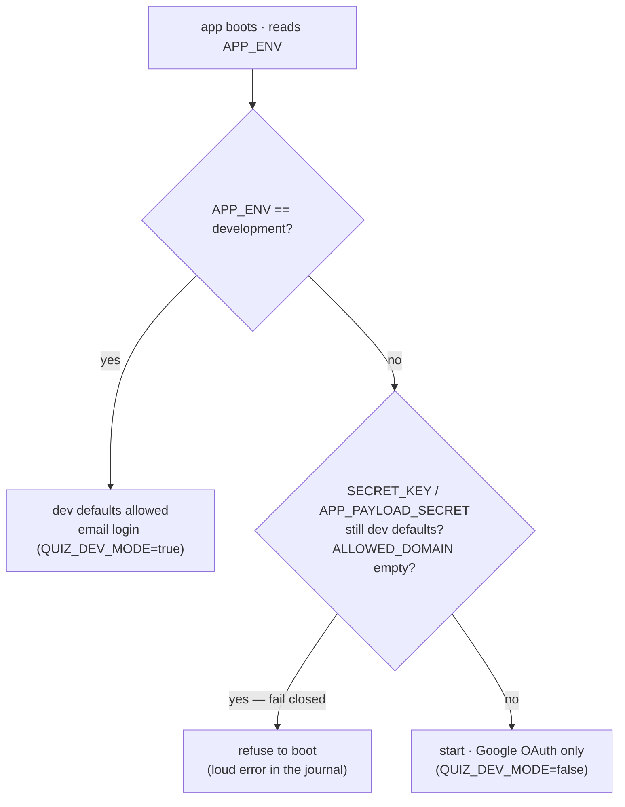

# Environments and secrets

## Scan box

- **`APP_ENV`** is the master switch: `development`, `staging`, or `production`.
  It is set on the systemd unit *and* in `.env`, and the app's
  `validate_for_env()` reads it to decide how strict to be at boot.
- Production is **fail-closed**: the app refuses to start if `SECRET_KEY` or
  `APP_PAYLOAD_SECRET` still carry their dev defaults, or if `ALLOWED_DOMAIN` is
  empty. A bad deploy fails loudly instead of running insecurely.
- Each environment has a committed template — `backend/.env.development.example`,
  `.env.staging.example`, `.env.production.example` — documenting the full key
  set. The real `.env` is gitignored and `chmod 600`.
- **`start_local.sh`** mirrors the production env model locally: `--env` selects
  which template seeds `.env`, `--with-cms` boots Directus, `--db` starts a local
  Postgres.
- The two planes hold separate secrets in separate files: the app in
  `backend/.env`, Directus in `cms/.env`. Neither is ever committed.

## APP_ENV and fail-closed validation

`APP_ENV` selects the operating mode. `deploy.sh` **defaults it to
`production`** — a real deploy is production unless you say otherwise
(`sudo APP_ENV=staging ./deploy.sh`). The value is written in two places on
purpose:

- In `backend/.env`, where `python-dotenv` loads it for the app's config.
- As `Environment=APP_ENV=...` on the `cca-quiz` systemd unit, so the running
  mode is visible in `systemctl show` and survives an operator hand-editing
  `.env`.

In any non-development environment the app's `validate_for_env()` enforces a
fail-closed contract. The production template states it plainly:

```ini
# backend/.env.production.example
# Production has NO defaults for any Tier-1 secret. validate_for_env refuses
# to start with APP_ENV=production if SECRET_KEY or APP_PAYLOAD_SECRET still
# carry the dev defaults, or if ALLOWED_DOMAIN is empty.
```



:::note[Why This Matters]
This is the single most important safety property of the v2 deploy. The v1
risk was a dev-default `SECRET_KEY` silently leaking into production. Now
`deploy.sh` generates fresh secrets at first `.env` create, and the app's own
startup check refuses to run on a dev default. You cannot accidentally ship a
production box signing sessions with a known key — it will not start.
:::

## The .env templates

Three committed templates document the key set per environment. They are
placeholders only — never real secrets:

| File | Purpose |
|---|---|
| `backend/.env.development.example` | Local dev defaults (`QUIZ_DEV_MODE=true`, email login). |
| `backend/.env.staging.example` | Staging — real secrets required, OAuth optional. |
| `backend/.env.production.example` | Production — every Tier-1 secret mandatory. |

The production template groups the keys an operator must fill:

```ini
# Run mode
APP_ENV=production
APP_BASE_URL=https://internal.in.deptagency.com

# Tier-1 secrets — MUST be set
SECRET_KEY=
APP_PAYLOAD_SECRET=

# Production Google OAuth client
GOOGLE_CLIENT_ID=
GOOGLE_CLIENT_SECRET=

# Production SMTP relay (certificate emails)
SMTP_HOST=
SMTP_USER=
SMTP_PASS=

# Allowlists
ALLOWED_DOMAIN=deptagency.com
ADMIN_EMAILS=                 # comma-separated; seeded as platform_admin

# Database
DATABASE_URL=                 # carries the DB password — keep this file 0600
DB_POOL_SIZE=5
DB_MAX_OVERFLOW=5

# Cache TTLs (seconds)
CACHE_TTL_FRAMEWORK=900
CACHE_TTL_FEED=30
CACHE_TTL_APP_CONFIG=60

# Cert HMAC keys
CERT_HMAC_LEGACY=             # verifies certs issued before v2 cutover
CERT_HMAC_PROD=               # signs new certs

# Directus seam
DIRECTUS_URL=https://internal.in.deptagency.com/cms
DIRECTUS_ADMIN_TOKEN=
```

A few keys deserve a note:

- **`CERT_HMAC_LEGACY` is certificate continuity.** It must hold the HMAC
  material that signed certificates at the v2 cutover, so every already-issued
  certificate keeps verifying. On a fresh install `deploy.sh` mirrors it from the
  generated `SECRET_KEY`; on a real cutover, the operator pre-populates it with
  the true legacy key and the script preserves that value.
- **The cache TTLs** (`CACHE_TTL_FRAMEWORK`, `CACHE_TTL_FEED`,
  `CACHE_TTL_APP_CONFIG`) drive the in-process cache's self-healing window — see
  [Day-two operations](./operations).
- **`DB_POOL_SIZE` / `DB_MAX_OVERFLOW`** are Tier-2 config (no secret material),
  safe to set in the template. They size the SQLAlchemy pool against Postgres's
  `max_connections`.

## start_local.sh — the same model locally

`start_local.sh` brings the development experience in line with the production
env model. It multiplexes the FastAPI backend (port 8000), a static file server
for the SPA and frozen content (port 8080), and optionally Directus and a local
Postgres:

```bash
./start_local.sh                       # development (default)
./start_local.sh --env staging         # boot as staging
./start_local.sh --env=production --db  # production env + start local Postgres
./start_local.sh --with-cms            # also boot Directus on :8055
```

Three flags:

- **`--env {development|staging|production}`** selects which
  `backend/.env.<env>.example` seeds `backend/.env` *when no `.env` exists yet* —
  an existing `.env` is never overwritten, so your local edits and secrets are
  respected. It also exports `APP_ENV` so the app's `validate_for_env()` agrees
  with the flag you passed.
- **`--with-cms`** boots Directus locally on `:8055` over the same Postgres. It is
  best-effort: a CMS failure does not bring down the FastAPI and static pair,
  because the CMS is for editorial work, not the runtime read path. It requires
  `cms/`, `cms/node_modules`, and a reachable Postgres.
- **`--db`** starts a local Postgres via `pg_ctl`, Homebrew services, or Docker,
  whichever is available.

:::caution[Common Pitfall]
In local dev, `/anatomy/*` resource links **404**. In production Apache aliases
`/anatomy/` to `content/frozen/`, but the stdlib `http.server` cannot mount an
alias. To test frozen content locally, open it directly at
`http://127.0.0.1:8080/content/frozen/anatomy-of-code-course.html`. This is a
known dev-only gap, documented at the top of `start_local.sh`.
:::

## Where secrets live, and where they do not

The never-in-database rule (07 §5.1) holds across the deploy. The clearest case
is certificate signing: the `signing_keys` table stores only *metadata* — which
env var holds the HMAC material, which environment it belongs to, and the verify
window. The key material itself lives **only** in the environment variable, never
in the database and never in a backup dump. (This is why the restore drill on the
[operations](./operations) page needs the env var present to pass the cert canary
— the key material is not in the dump it just restored.)

The two planes keep separate secret files:

| File | Holds | Owner / mode |
|---|---|---|
| `backend/.env` | App `SECRET_KEY`, payload secret, OAuth, SMTP, `DATABASE_URL`, cert HMAC keys | `cca` · `chmod 600` |
| `cms/.env` | Directus `KEY` / `SECRET`, the break-glass admin, the scoped DB password, Google SSO | `directus` · `chmod 600` |
| `deploy.env` | Deploy-time overrides (superuser password, OAuth, domain) | root · gitignored |

All three are gitignored. The DEPT recommendation for production is a pre-commit
`gitleaks` hook (07 §5.3) so a secret can never be committed in the first place,
and rotating any secret follows the documented rotation procedure rather than an
ad-hoc edit.
