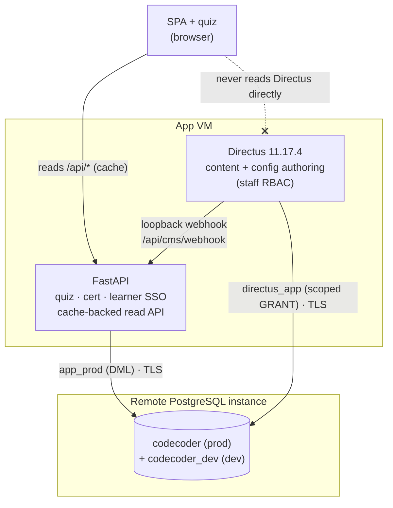

# Single-VM topology

## Scan box

- One **app VM**, one public listener. **Apache** owns ports 80 and 443; the
  application processes bind `127.0.0.1` and are unreachable from outside the
  host. **PostgreSQL is no longer on the VM** — it is a separate remote instance
  the app VM connects out to over TLS.
- Three long-lived processes on the VM: **Apache**, **uvicorn** (FastAPI on
  `:8000`), and optionally **Directus** (Node on `:8055`). They both connect to
  one **remote PostgreSQL** instance that hosts the prod (`codecoder`) and dev
  (`codecoder_dev`) databases side by side.
- The two application planes share a database but connect as **different roles**
  — the app role (`app_prod`) with DML access, `directus_app` scoped by Postgres
  GRANTs so the CMS literally cannot read `attempts`, `quiz_sessions`, or
  `signing_keys`. Dev uses distinct role names (`app_dev`, `directus_app_dev`) so
  a dev credential cannot reach prod.
- Static content is served **off disk by Apache** (no proxy hop) at `/anatomy/`
  and `/app/`; dynamic traffic is proxied to uvicorn; `/cms/` is proxied to
  Directus. Loopback binding plus the firewall guards the app VM; **TLS to the
  DB** (`sslmode=require`, `verify-full` preferred) guards the data in transit.
- This is a deliberately small app-VM footprint — no Redis, no object store at
  launch. The database is shared and remote; the FastAPI↔Directus loopback
  webhook still works because both services remain co-resident on the app VM.

## The app-VM model

The application plane is a single VM running on Azure (the reference image is a
4 vCPU / 8 GB host) — Apache, FastAPI, and Directus. The database is a
**separate remote PostgreSQL instance** the VM connects out to over TLS; it was
moved off-box because a co-resident Postgres consumed too much disk. The VM
targets Ubuntu 20.04/22.04 and CentOS/RHEL 8; `deploy.sh` detects the OS family
and adjusts package names, the Apache service name (`apache2` vs `httpd`), config
paths, and TLS cert defaults accordingly.

Three things must already be installed on the app VM before `deploy.sh` runs — it
provisions configuration, not base packages:

- **Apache httpd** with `mod_ssl`
- **Python 3.9+** (the script will offer to install `python39` on RHEL)
- **The PostgreSQL client** (`psql`, `pg_dump`) — the *server* is remote, so only
  the client tooling is needed on the VM, for migrations, backups, and ops.

Everything else on the VM — the service users, the virtualenv, the systemd units,
the vhost — is the script's job. The **database objects** (the databases, the
extensions, the per-env login roles) are pre-created by the DBA on the remote
instance; in `DB_MODE=external` `deploy.sh` does not provision a local Postgres,
it only wires the app and Directus to the supplied remote `DATABASE_URL`.

## Who listens on what

```
   ┌─────────────────── app VM ───────────────────────────────────────┐
   │                                                                   │
   │   :80  Apache  ── 301 redirect ──▶ :443                           │
   │   :443 Apache (httpd / apache2)  ◀── the ONLY public listener     │
   │            │                                                       │
   │            ├── Alias  /anatomy  ─▶  content/frozen/  (off disk)    │
   │            ├── Alias  /app      ─▶  frontend/         (off disk)   │
   │            ├── ProxyPass /cms/  ─▶  127.0.0.1:8055  Directus       │
   │            └── ProxyPass /      ─▶  127.0.0.1:8000  uvicorn        │
   │                                                                    │
   │   127.0.0.1:8000   uvicorn   (FastAPI · systemd cca-quiz)          │
   │   127.0.0.1:8055   Directus  (Node   · systemd cms-directus)       │
   │            │                                                       │
   │            │ egress :5432 · TLS (sslmode=require)                  │
   └────────────┼──────────────────────────────────────────────────────┘
                ▼
   ┌─────────────────── remote PostgreSQL instance ───────────────────┐
   │   REMOTE_DB_HOST:5432  ·  server cert (TLS)                       │
   │   database codecoder (prod)     · roles app_prod / directus_app   │
   │   database codecoder_dev (dev)  · roles app_dev / directus_app_dev│
   └────────────────────────────────────────────────────────────────────┘
```

The rule the topology enforces: **only Apache faces the public network.** uvicorn
binds `127.0.0.1:8000` and Directus binds `127.0.0.1:8055` on the app VM. The app
VM's firewall (`ufw` or `firewalld`) opens only 80 and 443 inbound; ports 8000 and
8055 are never exposed. The one outbound exception is **egress to
`REMOTE_DB_HOST:5432`** for the database connection, which travels over TLS — so
even though the DB link leaves the host, the bytes on it are encrypted, and on
Azure the Network Security Group scopes that egress to the DB host alone. SSH on
22 is restricted there too. The remote instance accepts only TLS connections and
authenticates each app VM by its per-env login role.

:::note[Why This Matters]
A single public listener is the whole security posture in one sentence. TLS
termination, HSTS, the CSP, rate limiting, and the loopback-only webhook guard
all live in Apache because Apache is the only door. The application processes can
assume every request they see has already passed through that door — which is why
the cache-invalidation webhook can authenticate on *network reachability alone*
(if the caller reached `127.0.0.1:8000/api/cms/webhook`, it is co-resident).
:::

## Two planes, one database

The defining architectural choice in v2 is that the **editorial write plane**
(Directus) and the **application plane** (FastAPI) sit over the *same* Postgres
database — they do not each own a private store, and there is no synchronisation
job between them.



The boundary is enforced at two levels:

- **At the Postgres GRANT level.** `directus_app` (created by Alembic migration
  `0008`) can DDL only the `directus_*` system tables and DML only the content
  tables. It holds `REVOKE ALL` on `attempts`, `quiz_sessions`, `signing_keys`,
  and `auth_audit` — Directus introspection literally cannot see them. The app
  role has full access; the two footprints are disjoint and enforced by the
  database, not by application code.
- **At the read-path level.** The SPA and quiz read all content through FastAPI
  `/api/*` (cache-backed), never through Directus. Directus only *writes*; on
  every write it fires a loopback webhook so FastAPI invalidates the affected
  cache key.

This is why Directus is *additive*: it introspects the tables that are already
there, moves no content, and decomposes no table. Turn it off
(`DEPLOY_DIRECTUS=false`) and the application plane is unchanged.

## Media is part of the topology

Media is not a separate tier. All media bytes live in Postgres large objects
(`media_assets.large_object_oid` + `pg_largeobject`) and are streamed by FastAPI
`/media/{video,image}/{asset_id}` with HTTP Range support. There is no S3, no
object store, and no filesystem media store.

This keeps the app VM to exactly three processes over one shared database — but
it has one consequence the operations page returns to: the **nightly backup must
dump large objects explicitly**, or it silently drops every video and image. The
backup now runs over TLS against the remote `codecoder`. Directus stores no app
media at all; its tiny `cms/uploads/` directory holds only incidental
Directus-internal files such as user avatars.

:::caution[Common Pitfall]
Now that Postgres is remote, the opposite tuning mistake is the live one:
treating the app VM's 8 GB as if it still had to leave headroom for a co-resident
database. It does not — the VM runs only Apache, uvicorn, and Directus, so its
memory is the application's. Postgres `shared_buffers` and connection limits are
now sized on the **remote instance** by the DBA, not in a local
`infra/postgres/cca-tuning.conf`. The connection-pool sizing still matters,
though: `pool_size × worker_count` (plus Directus's pool and the raw large-object
connections) must stay under the remote instance's `max_connections`.
:::

## Where things live on disk

`deploy.sh` lays the bundle out under `APP_HOME` (default `/opt/dept-anatomy`):

| Thing | Path |
|---|---|
| App code and venv | `/opt/dept-anatomy/backend/` |
| App config | `/opt/dept-anatomy/backend/.env` |
| SPA front-end | `/opt/dept-anatomy/frontend/` |
| Frozen HTML monolith | `/opt/dept-anatomy/content/frozen/` |
| Content source (JSON) | `/opt/dept-anatomy/content/source/` |
| Directus as-code | `/opt/dept-anatomy/cms/` |
| Directus config | `/opt/dept-anatomy/cms/.env` |
| PostgreSQL data | **on the remote instance** (`REMOTE_DB_HOST`), not on the app VM |
| DB CA cert (verify-full) | `/etc/dept-anatomy/db-ca.pem` (referenced by `sslrootcert=`) |
| App systemd unit | `/etc/systemd/system/cca-quiz.service` |
| Directus systemd unit | `/etc/systemd/system/cms-directus.service` |
| Apache site config | `/etc/httpd/conf.d/cca-quiz.conf` (RHEL) · `/etc/apache2/sites-available/cca-quiz.conf` (Debian) |

The service users on the app VM are deliberately separate: `cca` runs uvicorn and
`directus` runs the CMS. Each has its own home and a `nologin` shell, so a
compromise of one process does not hand over the others' files. The `postgres`
superuser now lives on the **remote instance**, not on the app VM — a compromise
of the app VM yields only the DML-scoped runtime role, never DB superuser.

## What the topology defers

The single app-VM shape (over a shared remote database) is the launch target,
not a ceiling. Three seams exist for scale-out without re-architecture:

- **Cache backend.** The in-process `AppCache` is the default; pointing
  `REDIS_URL` at a shared Redis swaps the backend behind the same interface
  (see [Day-two operations](./operations)). Needed only past a couple of workers.
- **Worker count.** `QUIZ_WORKERS` is pinned to `1` in `deploy.sh` so the
  application can keep its design simple at launch; the seam to raise it exists.
- **A second VM.** Because both planes are already roles over one Postgres — and
  that Postgres is now remote, reachable from any VM that has the role and the
  egress rule — splitting Apache + uvicorn onto a second app VM is a
  configuration change, not a redesign. The remote database stays the single
  point of coordination.

None of these are on at v2 launch. The app VM is one box; the database is a
shared remote instance.
