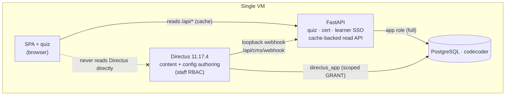

# Single-VM topology

## Scan box

- One VM, one public listener. **Apache** owns ports 80 and 443; everything
  else binds `127.0.0.1` and is unreachable from outside the host.
- Three long-lived processes: **Apache**, **uvicorn** (FastAPI on `:8000`), and
  optionally **Directus** (Node on `:8055`). One **PostgreSQL** cluster serves
  both application processes.
- The two application planes share the `codecoder` database but connect as
  **different roles** — the app role with full access, `directus_app` scoped by
  Postgres GRANTs so the CMS literally cannot read `attempts`, `quiz_sessions`,
  or `signing_keys`.
- Static content is served **off disk by Apache** (no proxy hop) at `/anatomy/`
  and `/app/`; dynamic traffic is proxied to uvicorn; `/cms/` is proxied to
  Directus. Loopback binding plus the firewall is the network trust boundary.
- This is a deliberately small footprint — no Redis, no object store, no second
  host at launch. The seams to scale out exist, but the v2 box is one VM.

## The one-host model

The platform is a single VM running on Azure (the reference image is a 4 vCPU /
8 GB host). It targets Ubuntu 20.04/22.04 and CentOS/RHEL 8; `deploy.sh` detects
the OS family and adjusts package names, the Apache service name (`apache2` vs
`httpd`), config paths, and TLS cert defaults accordingly.

Three things must already be installed before `deploy.sh` runs — it provisions
configuration, not base packages:

- **Apache httpd** with `mod_ssl`
- **Python 3.9+** (the script will offer to install `python39` on RHEL)
- **PostgreSQL** server and client

Everything else — the service users, the virtualenv, the database objects, the
systemd units, the vhost — is the script's job.

## Who listens on what

```
   ┌─────────────────── single VM ───────────────────────────────────┐
   │                                                                   │
   │   :80  Apache  ── 301 redirect ──▶ :443                           │
   │   :443 Apache (httpd / apache2)  ◀── the ONLY public listener     │
   │            │                                                       │
   │            ├── Alias  /anatomy  ─▶  content/frozen/  (off disk)    │
   │            ├── Alias  /app      ─▶  frontend/         (off disk)   │
   │            ├── ProxyPass /cms/  ─▶  127.0.0.1:8055  Directus       │
   │            └── ProxyPass /      ─▶  127.0.0.1:8000  uvicorn        │
   │                                                                    │
   │   127.0.0.1:8000   uvicorn   (FastAPI · systemd cca-quiz)          │
   │   127.0.0.1:8055   Directus  (Node   · systemd cms-directus)       │
   │   127.0.0.1:5432   PostgreSQL (listen_addresses = localhost)       │
   │                                                                    │
   └────────────────────────────────────────────────────────────────────┘
```

The rule the topology enforces: **only Apache faces the network.** uvicorn binds
`127.0.0.1:8000`, Directus binds `127.0.0.1:8055`, and Postgres is pinned to
`listen_addresses = 'localhost'` with a `pg_hba.conf` host rule scoped to
`127.0.0.1/32`. The firewall (`ufw` or `firewalld`) opens only 80 and 443. Ports
8000, 8055, and 5432 are never exposed; on Azure the Network Security Group is the
second layer that keeps them closed, and SSH on 22 is restricted there too.

:::note[Why This Matters]
A single public listener is the whole security posture in one sentence. TLS
termination, HSTS, the CSP, rate limiting, and the loopback-only webhook guard
all live in Apache because Apache is the only door. The application processes can
assume every request they see has already passed through that door — which is why
the cache-invalidation webhook can authenticate on *network reachability alone*
(if the caller reached `127.0.0.1:8000/api/cms/webhook`, it is co-resident).
:::

## Two planes, one database

The defining architectural choice in v2 is that the **editorial write plane**
(Directus) and the **application plane** (FastAPI) sit over the *same* Postgres
database — they do not each own a private store, and there is no synchronisation
job between them.



The boundary is enforced at two levels:

- **At the Postgres GRANT level.** `directus_app` (created by Alembic migration
  `0008`) can DDL only the `directus_*` system tables and DML only the content
  tables. It holds `REVOKE ALL` on `attempts`, `quiz_sessions`, `signing_keys`,
  and `auth_audit` — Directus introspection literally cannot see them. The app
  role has full access; the two footprints are disjoint and enforced by the
  database, not by application code.
- **At the read-path level.** The SPA and quiz read all content through FastAPI
  `/api/*` (cache-backed), never through Directus. Directus only *writes*; on
  every write it fires a loopback webhook so FastAPI invalidates the affected
  cache key.

This is why Directus is *additive*: it introspects the tables that are already
there, moves no content, and decomposes no table. Turn it off
(`DEPLOY_DIRECTUS=false`) and the application plane is unchanged.

## Media is part of the topology

Media is not a separate tier. All media bytes live in Postgres large objects
(`media_assets.large_object_oid` + `pg_largeobject`) and are streamed by FastAPI
`/media/{video,image}/{asset_id}` with HTTP Range support. There is no S3, no
object store, and no filesystem media store.

This keeps the topology to exactly three processes and one database — but it has
one consequence the operations page returns to: the **nightly backup must dump
large objects explicitly**, or it silently drops every video and image. Directus
stores no app media at all; its tiny `cms/uploads/` directory holds only
incidental Directus-internal files such as user avatars.

:::caution[Common Pitfall]
Treating the single VM as "just a web server" and tuning Postgres connection
limits, `shared_buffers`, or worker counts as if the database were on a separate
box. It is not — Postgres, uvicorn, and Directus all share the same 8 GB. The
tuning in `infra/postgres/cca-tuning.conf` is sized for *co-residence*; raising
`shared_buffers` past ~25% of RAM starves the application processes on the same
host.
:::

## Where things live on disk

`deploy.sh` lays the bundle out under `APP_HOME` (default `/opt/dept-anatomy`):

| Thing | Path |
|---|---|
| App code and venv | `/opt/dept-anatomy/backend/` |
| App config | `/opt/dept-anatomy/backend/.env` |
| SPA front-end | `/opt/dept-anatomy/frontend/` |
| Frozen HTML monolith | `/opt/dept-anatomy/content/frozen/` |
| Content source (JSON) | `/opt/dept-anatomy/content/source/` |
| Directus as-code | `/opt/dept-anatomy/cms/` |
| Directus config | `/opt/dept-anatomy/cms/.env` |
| PostgreSQL data | `/var/lib/pgsql/data/` (RHEL) · `/etc/postgresql/<ver>/main/` (Debian) |
| App systemd unit | `/etc/systemd/system/cca-quiz.service` |
| Directus systemd unit | `/etc/systemd/system/cms-directus.service` |
| Apache site config | `/etc/httpd/conf.d/cca-quiz.conf` (RHEL) · `/etc/apache2/sites-available/cca-quiz.conf` (Debian) |

The service users are deliberately separate: `cca` runs uvicorn, `directus` runs
the CMS, and `postgres` owns the database. Each has its own home and a `nologin`
shell, so a compromise of one process does not hand over the others' files.

## What the topology defers

The single-VM shape is the launch target, not a ceiling. Three seams exist for
scale-out without re-architecture:

- **Cache backend.** The in-process `AppCache` is the default; pointing
  `REDIS_URL` at a shared Redis swaps the backend behind the same interface
  (see [Day-two operations](./operations)). Needed only past a couple of workers.
- **Worker count.** `QUIZ_WORKERS` is pinned to `1` in `deploy.sh` so the
  application can keep its design simple at launch; the seam to raise it exists.
- **A second VM.** Because both planes are already roles over one Postgres,
  splitting Apache + uvicorn onto a second host is a configuration change, not a
  redesign — the database stays the single point of coordination.

None of these are on at v2 launch. The box is one VM.
