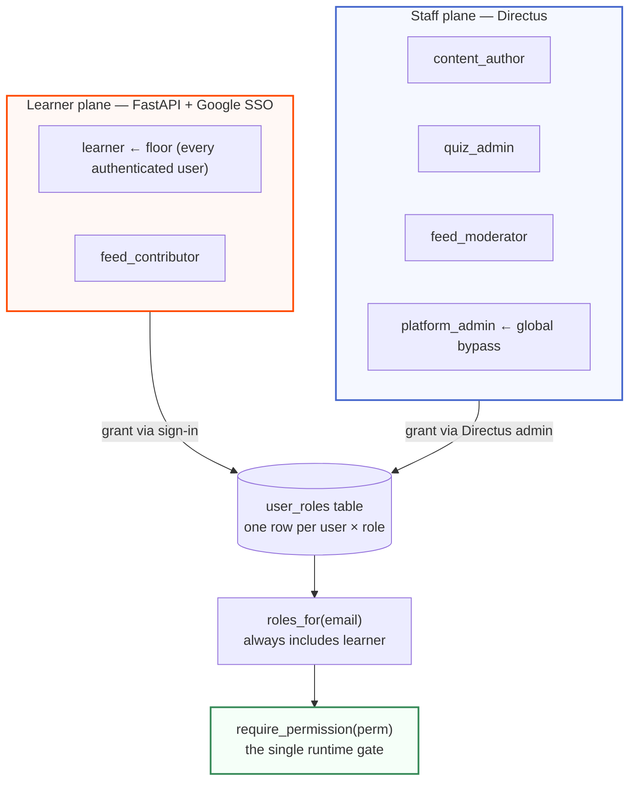

# Auth planes

## Scan box

- **Two authentication systems, by design.** The learner plane authenticates
  through Google SSO (with PKCE and nonce) and carries `learner` and
  `feed_contributor`. The staff plane authenticates through Directus and carries
  `content_author`, `quiz_admin`, `feed_moderator`, and `platform_admin`.
- **`require_permission(perm)` is the single runtime gate.** Every protected
  FastAPI route depends on it. It reads the user's role set, applies the
  `platform_admin` bypass, then checks the locked permission matrix in
  `core/deps.py`. That file is the one runtime source of truth for the matrix.
- **Roles are multi-valued and additive; persona is not a role.** A user holds
  a *set* of roles via the `user_roles` table; `learner` is the floor every
  authenticated user holds. The old `pm`/`ba`/`architect` value is now a
  non-authorising *persona* that only drives quiz-level recommendation.
- **The SPA mirrors the server, it does not replace it.** `/auth/me` returns the
  user's roles **and** the permissions they imply, so the SPA can show or hide
  the moderation nav. The API still enforces every permission server-side
  regardless of that hint.
- **Sessions are hardened.** The session cookie is `HttpOnly`, `SameSite=Lax`,
  `Secure` in production, with an 8-hour max age. The OAuth pre-auth state lives
  in a separate short-lived signed cookie.

The v2 authorisation model fixes a real defect in the old system: two role
systems existed and did not connect. One stored *persona* values
(`pm`/`ba`/`architect`) in `users.role`; the other authorised against
*capability* strings (`QuizManager`/`FeedCreator`) that no persona ever mapped
to. The net effect in production was that an onboarded user failed every
capability check and silently had no elevated access. v2 replaces both with one
multi-valued role model and a single enforcement point. The full history is in
`04-authz-model.md`.

## The two planes

The split is along *who you are to the system*. A learner consumes the course,
takes quizzes, and (if granted) contributes to the feed. A staff member edits
content and configuration, moderates the feed, and manages quiz questions.



Both planes ultimately resolve through the **same** `user_roles` table. A staff
role and a learner role are rows in the same table; the "plane" is which surface
grants them (Directus admin vs. Google sign-in plus an explicit grant). At
runtime there is one role set per user, read by `core.users.roles_for(email)`,
which always includes `learner` as the floor.

## Learner sign-in: Google SSO with PKCE

The learner flow is a standard OAuth Authorization Code flow hardened with PKCE
(Proof Key for Code Exchange) and a nonce. The transient state — verifier,
state, and nonce — rides in a short-lived signed pre-auth cookie (`aoc_preauth`),
separate from the long-lived session cookie, and is cleared the moment it is
used.

```mermaid
sequenceDiagram
    autonumber
    actor User as Learner
    participant SPA as Browser / SPA
    participant API as FastAPI auth module
    participant Google
    participant DB as PostgreSQL

    User->>API: GET /auth/google
    API->>API: mint state + nonce + PKCE verifier/challenge
    API-->>SPA: 302 to Google (with challenge) + set aoc_preauth cookie
    SPA->>Google: authorize (PKCE challenge, nonce)
    Google-->>SPA: 302 /auth/google/callback?code&state
    SPA->>API: GET /auth/google/callback?code&state (sends aoc_preauth)
    API->>API: verify state == preauth.state
    API->>Google: exchange code with PKCE verifier
    Google-->>API: id_token (+ profile)
    API->>API: verify id_token + nonce; check @deptagency.com
    API->>DB: upsert_user (grants learner floor) + write auth_audit
    API-->>SPA: 302 / (or /onboarding/role); set session; clear aoc_preauth
```

Two details matter for the security posture. First, domain enforcement is real:
the callback checks the email against the allowed domain
(`deptagency.com`), not just the Google `hd` hint. Second, every sign-in writes
an `auth_audit` row, so the audit trail names the principal and the provider.

In development, `DEV_MODE=true` enables a `/login/dev` email login — but with
**no auto-elevation**. The dev user lands with `learner` only, exactly as in
production. Elevated roles in development are granted deliberately, via the seed
script and `ADMIN_EMAILS`. This is what makes local behaviour match production
authorisation instead of handing every dev login an admin.

:::caution[Common Pitfall]
The v1 system gave every dev login `QuizManager` (a global bypass), which meant
local testing never exercised the real permission path — and that is exactly how
the two-role-system disconnect went unnoticed. In v2, dev and prod authorise
identically. If a permission check fails locally, it would fail in production
too; do not "fix" it by re-adding auto-elevation. Grant the role explicitly.
:::

## Staff sign-in: Directus

Staff members authenticate against Directus, which carries the editorial roles
(`content_author`, `quiz_admin`, `feed_moderator`, `platform_admin`).
Self-registration is off — administrators pre-create staff users matched to
their `@deptagency.com` Google email, with the allow-list as defence-in-depth
domain enforcement. The default role for any future registration flip is set to
the least-privilege `content_author` placeholder, so flipping registration on
later stays safe by default. These grants land in the same `user_roles` table
the runtime reads, so a staff role is enforced by `require_permission` exactly
like a learner role.

## The locked permission matrix

`require_permission(perm)` is the one gate. Its logic, from `04-authz-model §3`:

1. Pull the authenticated user — `401` (JSON) or `302 → /login` (HTML) if absent.
2. Read the role set via `core.users.roles_for(email)` — always at least
   `{learner}`.
3. `platform_admin` is the single global bypass, checked first.
4. Otherwise the user must hold a role in `PERMISSION_GRANTS[perm]`.

The matrix lives in `backend/app/core/deps.py` as `PERMISSION_GRANTS`, and that
module is the single runtime source of truth. Each permission maps to the set of
roles that hold it (`platform_admin` excluded, since it bypasses):

| Permission | Roles that hold it |
|---|---|
| `feed.create` | `feed_contributor` |
| `feed.flag` | `learner`, `feed_contributor`, `content_author`, `quiz_admin`, `feed_moderator` |
| `moderate.view` | `feed_moderator` |
| `moderate.action` | `feed_moderator`, `quiz_admin` |
| `question.write` | `quiz_admin` |
| `media.upload` | `feed_contributor`, `content_author` |
| `attempts.view_all` | `quiz_admin` |
| `config.read` / `config.write` / `role.assign` | (no role — `platform_admin` only) |

The last three permissions grant to no role, which means only `platform_admin`
holds them via the bypass. That is deliberate: config writes and role assignment
are the most sensitive operations and are reserved to the top role.

:::tip[Agency Tip]
To add a new protected operation, add the permission string to
`PERMISSION_GRANTS` in `core/deps.py` *first*, then reference it from the route
with `Depends(require_permission("your.perm"))`. The gate raises a loud
`RuntimeError` at request time if a route asks for a permission the matrix does
not define — so a typo fails fast rather than silently allowing access. Keep the
matrix and the routes in lockstep.
:::

## How the SPA stays in agreement

The SPA needs to know whether to show the moderation nav or the feed composer —
but it must never be the thing that decides access. `/auth/me` resolves this by
returning both the role set and the permissions those roles imply, computed by
inverting the **same** `PERMISSION_GRANTS` matrix the server enforces against
(with `platform_admin` returning the full set, mirroring the bypass).

```json
{
  "email": "asha@deptagency.com",
  "persona": "architect",
  "roles": ["feed_contributor", "learner"],
  "permissions": ["feed.create", "feed.flag", "media.upload"]
}
```

Because the SPA hint and the server enforcement derive from one matrix, the
conditional nav and the actual authorisation cannot drift. And because the
server re-checks on every protected call, a tampered client gains nothing — the
worst it can do is show itself a button that returns `403`.

## Persona is a profile attribute, not a role

The old `pm`/`ba`/`architect` values are now stored in `users.persona`, a
non-authorising profile attribute collected at onboarding. Its only job is to
drive the quiz-level recommendation (some personas are nudged toward the
advanced quiz). It grants nothing. `roles_for()` never reads it, and the v2
session payload deliberately omits the dead `role` column so no downstream code
can read it accidentally. Keeping persona out of the authorisation path is what
makes the role model auditable: every capability a user holds is an explicit,
audited `user_roles` row.
