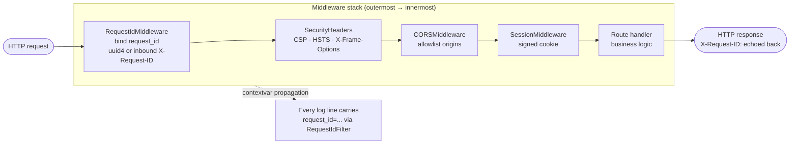
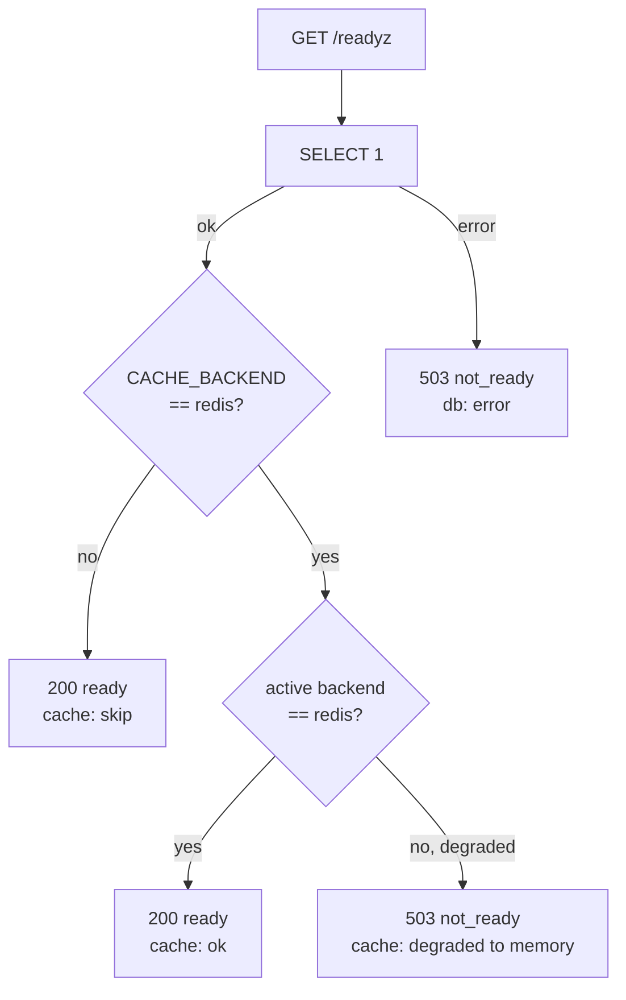

# Observability

## Scan box

- **Every request carries a correlation id.** An ASGI middleware reads an inbound
  `X-Request-ID` (so Apache or a load balancer can set it) or mints a `uuid4`,
  binds it to the request, and echoes it on the response. Every log line inside
  the request carries it.
- **Logs are structured logfmt.** One greppable line per record:
  `ts=… level=… logger=… request_id=… msg=…`. The formatter is installed once at
  startup and is idempotent.
- **Two unauthenticated probes.** `/healthz` is liveness (the process is up).
  `/readyz` is readiness (the database is reachable, and Redis too when it was
  requested). Neither ever redirects to `/login`.
- **Directus keeps an audit trail; so does auth.** Editorial changes are audited
  by Directus; sign-ins, logouts, and role grants/revokes write `auth_audit`
  rows naming the principal.
- **What to watch:** `/readyz` flips to `503`, a Redis-requested backend that
  degraded to memory, uvicorn error-level lines, and Postgres slow queries.

Observability in v2 is deliberately light but complete: enough to trace a single
request end-to-end, prove the process is healthy, and reconstruct who did what.
The seam is `core/observability.py`, wired in at composition time alongside the
security middleware.

## Request correlation

The `RequestIdMiddleware` is the spine of tracing. For every HTTP request it:

1. reads an inbound `X-Request-ID` header if present, validating its length and
   charset so a hostile upstream cannot inject newlines into log lines
   (log-forging) or bloat memory;
2. mints a fresh `uuid4` if the header is absent or implausible;
3. stashes the id in a `contextvar` for the life of the request;
4. echoes the id back on the response as `X-Request-ID`, replacing any
   upstream-set value so the response always reflects the id actually logged.

It is added **last** in the middleware stack, which makes it the outermost
layer: it binds the id before any inner middleware or handler runs, so their
logs carry it, and stamps the response on the way out regardless of what the
inner stack did.



Because the id lives in a `contextvar`, any module that logs during the request
— in `core`, in a module service, in a storage call — emits the same
`request_id` without passing it around. One id ties a whole request together
across the monolith.

## Structured logging

`configure_logging(level)` installs a `KeyValueFormatter` on the root logger that
emits one logfmt-style line per record:

```
ts=2026-06-06T09:14:02 level=INFO logger=app.modules.quiz request_id=3f9a… msg="quiz graded"
```

The format greps cleanly and parses with logfmt tooling. Three properties make
it safe to call from anywhere:

- **Idempotent.** Calling `configure_logging` twice does not stack handlers — it
  tags its handler and reuses it. So lifespan startup and tests can both call it.
- **Request-id on every record.** A `RequestIdFilter` injects the current
  request's id (or `-` outside a request) onto each record.
- **Configured before the first log line.** It is the very first thing lifespan
  does, so even startup logs carry the structured format with `request_id="-"`.

:::tip[Agency Tip]
Because every line is `request_id=<id>`, an operator debugging a single failed
request greps the logs for that one id and sees the whole request's path through
the monolith — the auth check, the service call, the storage query — in order.
When a user reports a failure, ask them for the `X-Request-ID` from the response
(or read it from their browser's network tab) and you have the exact log slice.
This is the payoff of correlation: no guessing which lines belong together.
:::

## Health and readiness probes

Two endpoints answer the orchestration layer (systemd, Apache, uptime checks).
Both are **unauthenticated** and live inline in `main.py` — not in any module —
so they have zero dependency on an auth surface and can answer even if a module
fails to import. Critically, neither ever `302`s to `/login`.

| Probe | Meaning | Behaviour |
|---|---|---|
| `GET /healthz` | Liveness | `200 {status, version, env}`. No dependency checks — just "the process is serving". |
| `GET /readyz` | Readiness | `200` if dependencies are reachable; `503` otherwise. |

`/readyz` runs two checks:

- **Database** — a `SELECT 1` must succeed.
- **Cache** — only meaningful when `CACHE_BACKEND=redis`. If Redis was requested
  but the active backend has degraded to memory, readiness reports `not_ready`.
  In the default memory configuration the cache is always ready.



The split between liveness and readiness matters operationally: a `503` from
`/readyz` while `/healthz` stays `200` means "the process is fine but a
dependency is down" — do not restart the process, fix the database or Redis.

:::caution[Common Pitfall]
Do not wire `/healthz` to dependency checks "to be thorough". Liveness must stay
free of dependency I/O — if `/healthz` checked the database, a transient DB blip
would mark the *process* unhealthy and trigger a restart that does nothing to
fix the actual problem. Keep liveness about the process and readiness about the
dependencies. They answer different questions and drive different actions.
:::

## Audit trails

Observability is not only logs — it is the durable record of who changed what.

- **Directus audit trail.** The editorial plane records content and config
  changes through Directus's own activity/revisions log. An editor's saves are
  attributable in the CMS.
- **Auth audit.** The application writes `auth_audit` rows for sign-ins
  (`auth.login.dev`, `auth.login.google`), logouts (`auth.logout`), and role
  grants/revokes (`role.grant`, `role.revoke`), each naming the actor and target.
  This is the append-only record behind the role model — and, as
  [Security baseline](./security-baseline.md) notes, it is one of the tables the
  `directus_app` role is explicitly denied, so the audit trail cannot be edited
  from the CMS.

## What to watch

For a healthy v2 deployment, the signals worth alerting on:

- **`/readyz` → `503`** — a dependency is down. Check the `checks` body for which.
- **Cache degraded** — a `CACHE_BACKEND=redis` deployment whose `/readyz` reports
  the cache degraded to memory: Redis is unreachable and cross-worker
  invalidation has silently stopped.
- **uvicorn error-level lines** — grep the structured logs for `level=ERROR`;
  the `request_id` ties each to its request.
- **Postgres slow queries** — the read-heavy course/feed workload is the place
  query latency shows up first; watch the slow-query log.

## The v2 phase history, at a glance

This section is the capstone of a sealed re-architecture. The work landed in
sequential, gated phases on the `v2` branch, with `main` untouched throughout and
parity re-proven at every gate.

| Phase | What it delivered | Gate state |
|---|---|---|
| **0** | Design contracts + the parity safety net + the docs scaffold | Blueprint approved |
| **1** | The restructure into the modular monolith; dead code removed; paths fixed | Parity matched baseline |
| **2** | Backend hardening: Alembic migrations, the two-plane authZ model, per-environment cert signing, tiered config with fail-closed startup, the security middleware | Tests + security review |
| **3** | Infra and performance: environment management, the cache layer (memory/Redis seam), network/process security, this observability seam | Deploy dry-run + security review |
| **4a** | Directus stood up over the shared Postgres as the scoped `directus_app` role; the webhook → cache-invalidation seam live; media locked to Postgres large objects | GO for the 4a gate |
| **4b** | Unified navigation and theme across the three same-origin surfaces; the moderator UI over the moderation API; `/auth/me` exposing roles + permissions | GO for the 4b gate |

At the 4b gate the system is **stable and final**: the Alembic head is `0008`,
the smoke suite is green, and the protected content is byte-identical to the 4a
baseline. The one deliberate deferral is **4c** — the relational decomposition of
the course content into editable chapter tables (an Alembic migration past
`0008`), after which Directus would author chapters directly and the frozen
course artefact would retire. The current architecture is complete and correct
without it; 4c is an enhancement, not a missing piece. See
[Modular monolith](./modular-monolith.md) and
[Directus topology](./directus-topology.md) for where 4c picks up.
