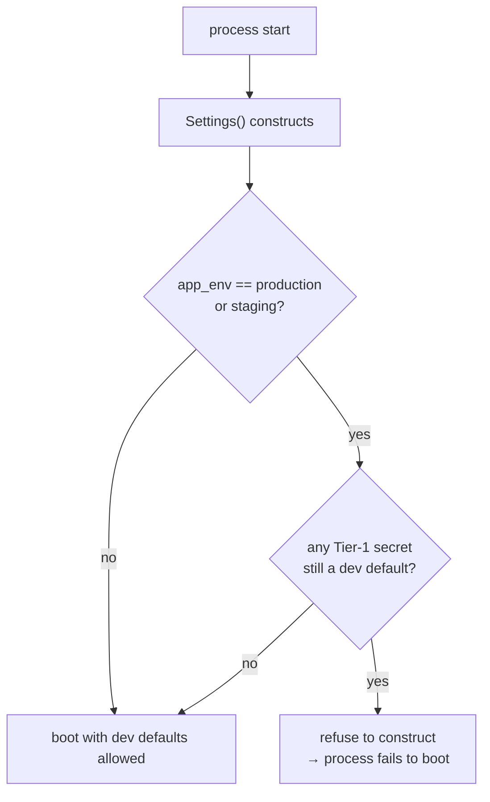

# Security baseline

## Scan box

- **Headers are split by owner.** FastAPI always sets the app-side headers
  (`X-Content-Type-Options`, `X-Frame-Options`, `Referrer-Policy`,
  `Permissions-Policy`, COOP, CORP). Apache is the single owner of HSTS and CSP,
  because those interact with vhost `Alias` mounts and SRI hashes.
- **Secrets are tiered and fail closed.** Tier-1 secrets (`SECRET_KEY`,
  `APP_PAYLOAD_SECRET`, Google client secret, SMTP) come from the environment.
  A non-development environment carrying dev-default secrets refuses to start.
- **Certificates are HMAC-signed per environment.** Each certificate carries an
  HMAC-SHA256 over its identifying fields, keyed by a per-environment signing
  key recorded in the `signing_keys` table. A development certificate cannot
  verify as a production one.
- **CORS is an allow-list, never `*`.** Explicit origins, methods, and headers.
  Production with no configured origins attaches no CORS middleware at all —
  same-origin only via Apache.
- **Directus is fenced at the database.** The `directus_app` role has explicit
  `REVOKE ALL` on the runtime and audit tables, so editorial access cannot reach
  signing keys, quiz attempts, or the auth audit trail. The role name is per-env
  (`directus_app` / `directus_app_dev`) so the one shared remote instance keeps
  dev and prod credentials apart.
- **The database link is TLS.** Postgres is a remote shared instance; every
  connection enforces `sslmode=require` (`verify-full` with a CA preferred) from
  the `DATABASE_URL`, and the runtime app role is DML-only.

The security baseline is the set of always-on controls that hold regardless of
which feature a request hits. The design contract is `07-security-baseline.md`,
which tracks a findings table across auth, session, headers, CORS, CSP, secrets,
upload, and certificates. This page is the architecture-level summary of where
each control lives.

## Header ownership: FastAPI and Apache

Security headers have two owners, and the split is deliberate.

**FastAPI** sets the app-side headers on every response through
`SecurityHeadersMiddleware` (`core/security.py`). Because it is an ASGI
middleware, it stamps even streaming media responses and error responses:

| Header | Value |
|---|---|
| `X-Content-Type-Options` | `nosniff` |
| `X-Frame-Options` | `DENY` |
| `Referrer-Policy` | `strict-origin-when-cross-origin` |
| `Permissions-Policy` | `geolocation=(), microphone=(), camera=()` |
| `Cross-Origin-Opener-Policy` | `same-origin` |
| `Cross-Origin-Resource-Policy` | `same-origin` |

**Apache** owns HSTS and CSP — and *only* Apache sets them. These two headers
interact with the vhost-level `Alias` mounts and with Subresource Integrity
hashes, so giving the application a second voice on them would invite drift
between what the app says and what the proxy says.

:::tip[Why This Matters]
The rule "app sets app headers, proxy sets CSP and HSTS" prevents the most
common cause of a broken CSP: two layers each emitting a `Content-Security-Policy`
header and the browser honouring only one, unpredictably. By making Apache the
single CSP owner, the policy is authored in one place where the `Alias` mounts
and SRI hashes it must reference are also defined. The application never
second-guesses it.
:::

## CORS

CORS is configured in `core/security.py` as an explicit allow-list — never
`["*"]`. The middleware allows credentialed requests only from configured
origins, with a bounded method set (`GET`, `POST`, `OPTIONS`) and a bounded
header set (`Content-Type`, `X-Encrypt-Payload`, `Accept`).

The production posture is the strict one: when `CORS_ORIGINS` is empty in
production, **no CORS middleware is attached at all**. The SPA reaches the API
same-origin through Apache, so cross-origin access is simply not a thing that
exists. In development, an empty list falls back to `localhost:8080` so the
buildless front-end works without configuration.

## The session

The session cookie is hardened in `install_middleware`:

- named `aoc_session`,
- `HttpOnly` (no JavaScript access),
- `SameSite=Lax`,
- `Secure` in production (`https_only` follows the environment),
- 8-hour `max_age`.

The OAuth flow does **not** reuse this cookie for its transient state. The PKCE
verifier, state, and nonce ride in a separate short-lived signed pre-auth cookie
(`aoc_preauth`) that is cleared the moment the callback consumes it. Keeping the
pre-auth state off the long-lived session cookie is what lets the session cookie
stay long-lived without carrying single-use secrets. See
[Auth planes](./auth-planes.md) for the full flow.

## Secret tiers and fail-closed startup

Configuration is tiered in `core/config.py`:

- **Tier-1 (secrets)** — `SECRET_KEY`, `APP_PAYLOAD_SECRET`,
  `GOOGLE_CLIENT_SECRET`, SMTP credentials, the certificate HMAC keys. These come
  from the environment (`.env` via pydantic-settings) and are held as
  `SecretStr` so they do not leak into logs.
- **Tier-2 (runtime tunables)** — quiz duration, media caps, feature flags. These
  live in the `app_config` table and are read through the cache (see
  [Caching and performance](./caching-performance.md)).
- **Structural config** — `BASE_DIR`, `ALLOWED_DOMAIN`, the database URL.

The load-bearing control is the startup validator. `Settings` carries a
model-validator that **refuses to construct the settings singleton** if a
non-development environment still carries a dev-default secret. A production
deploy that forgot to set `SECRET_KEY` does not boot with a guessable key — it
fails to boot, loudly. That is the fail-closed posture the baseline requires.

## Certificate signing

Certificates are anti-tamper sealed with an HMAC, and the signing is
*per-environment*. Each attempt's certificate carries an `HMAC-SHA256` over its
identifying fields (`cert_id | email | score | submitted_at`), and the row
records both the `environment` and the `signing_key_id` used. The key material
lives in environment variables (`CERT_HMAC_PROD`, `CERT_HMAC_STG`,
`CERT_HMAC_DEV`, `CERT_HMAC_LEGACY`); the `signing_keys` table records the
metadata and which environment each key serves.

The consequence is the important one: a certificate signed with the development
key does not verify against the production key. A development certificate is
visibly and cryptographically *not* a production certificate — closing the v1
gap where dev and prod shared whatever `SECRET_KEY` happened to be. Verification
re-computes the HMAC over the stored fields using the recorded key and compares;
any tamper to the score, email, or id breaks the signature.

:::caution[Common Pitfall]
Do not treat the certificate HMAC as a generic secret you can rotate casually.
The key is bound to an environment and to already-issued certificates: rotating
the production key without keeping the old key available for verification would
make every previously-issued certificate fail to verify. The per-environment
`signing_keys` table and the `CERT_HMAC_LEGACY` slot exist precisely so old
certificates keep verifying through a rotation. Rotation adds a key; it does not
replace one in flight.
:::

## Database isolation for Directus

The final always-on control is at the database, not the application. Directus
connects as the scoped `directus_app` role created by Alembic migration `0008`,
which has explicit `REVOKE ALL` on the sensitive tables — `attempts`,
`quiz_sessions`, `signing_keys`, and `auth_audit`. No editorial action, however
the Directus permissions are configured, can read a signing key or alter a quiz
attempt, because the role they connect as cannot. This is the database-level
backstop behind the application-level RBAC: even a misconfigured Directus
permission set cannot reach the runtime-only and audit data. The full grant
table is in [Directus topology](./directus-topology.md).

Two further isolation properties follow from the database being a **remote
shared instance** rather than co-resident on the app VM:

- **Per-environment role names.** The role name is parameterised
  (`DIRECTUS_DB_ROLE`: `directus_app` for prod, `directus_app_dev` for dev), and
  the FastAPI app role is per-env too (`app_prod` / `app_dev`). Because Postgres
  roles are cluster-global while GRANTs are per-database, a *distinct role name
  per environment*, GRANTed only on its own database, is what keeps a dev
  credential off the prod database on the one shared instance.
- **The runtime role is DML-only.** The app role written into `DATABASE_URL`
  cannot run DDL, create extensions, or alter roles on the managed instance — so
  a compromise of the app VM yields a least-privilege credential, never DB
  superuser. Schema changes are owned by Alembic, run with a separate privileged
  migration credential.

## TLS to the database

The database link now leaves the app VM, so the connection is encrypted in
transit. Every connection string carries `sslmode=require` at minimum
(`verify-full` with a provisioned CA preferred) — psycopg2 and SQLAlchemy honour
the `sslmode` query parameter, so TLS is enforced from the `DATABASE_URL` itself
with no extra code. `verify-full` additionally pins the connection to a trusted
CA and matches the host against the server certificate, defending against an
active man-in-the-middle, not just passive sniffing. A connection that cannot be
established over TLS fails closed rather than silently downgrading to cleartext.

:::caution[Common Pitfall]
Relying on "the DB is on a private network" instead of TLS. A remote connection
without `sslmode=require` is cleartext on the wire — credentials and every row,
including media bytes, are exposed to anything that can observe the path between
the app VM and the instance. Network segmentation is defence in depth, not a
substitute: keep `sslmode=require` in the URL and verify with
`psql … -c "\conninfo"` that an `SSL connection` line is reported.
:::

## What lives where

| Control | Owner | Location |
|---|---|---|
| App-side security headers | FastAPI | `core/security.py` |
| HSTS, CSP | Apache | vhost (deployment section) |
| CORS allow-list | FastAPI | `core/security.py` |
| Session cookie hardening | FastAPI | `core/security.py` |
| OAuth PKCE + nonce + pre-auth cookie | FastAPI | `core/auth.py`, `modules/auth/routes.py` |
| Fail-closed secret validation | FastAPI | `core/config.py` |
| Certificate HMAC signing | FastAPI | `modules/quiz/storage.py`, `signing_keys` table |
| Directus DB isolation (per-env roles) | PostgreSQL | Alembic `0008` (`DIRECTUS_DB_ROLE`) |
| Database TLS (`sslmode=require` / `verify-full`) | FastAPI / Directus | `DATABASE_URL`, `cms/.env` |
| Payload encryption (AES-GCM) | FastAPI | `core/encryption.py` |
