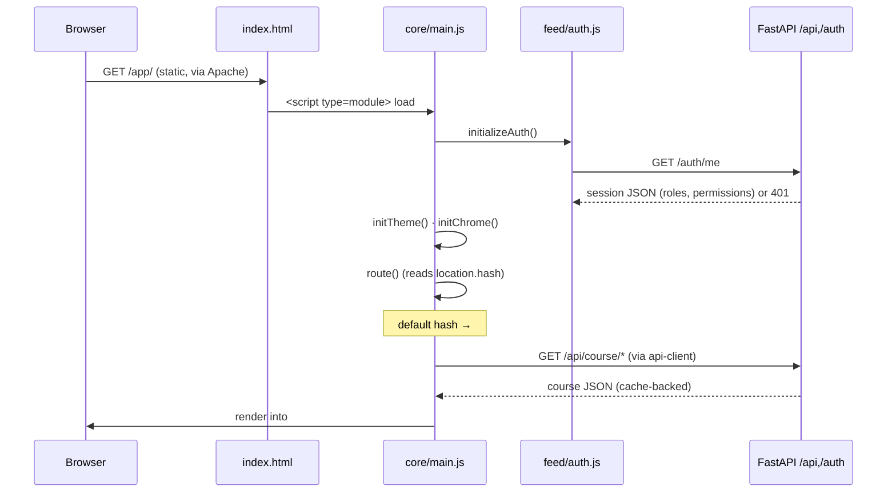

# Architecture: buildless ES modules

## Scan box

- **No bundler, no build step.** The SPA is plain ES modules. `index.html`
  loads `core/main.js` with ``.

The Moderation tab ships `hidden` in the markup and is unhidden by JavaScript
only for authorised sessions (see [Router and the four modes](./router-and-modes.md)).

The boot sequence is exactly the IIFE at the bottom of `core/main.js`:
`initializeAuth()` (best-effort — a 401 is fine and means "signed out"), then
`initTheme()`, then `initChrome()`, then a `hashchange` listener, then the first
`route()`.

## The import-resolution baseline

Because there is no compiler, a mistyped relative import does not fail the build
— it fails silently in one browser surface. v2 treats the set of resolvable
imports as a baseline to defend.

The check is mechanical: walk every `.js` under `frontend/`, extract each
relative `import`/`export … from` and dynamic `import()` specifier, and confirm
the target file exists on disk. CDN specifiers (the Ajv loader in
`feed/validate.js`) and bare specifiers are excluded — only the project's own
relative graph is in scope.

The current baseline is **98/98 local relative imports resolve**.

:::caution[Common Pitfall]
The most common breakage in a buildless ES-module SPA is a relative import that
is off by one directory — `'../render/diagram.js'` where the file actually lives
at `'../../shared/render/diagram.js'`. The Phase 4b report recorded exactly this
class of bug in three feed/course files; it has since been corrected, which is
why the baseline now resolves cleanly. There is no compiler to catch the next
one. Re-run the import-resolution check on every front-end change, and verify the
affected mode boots in a real browser, not only in tests.
:::

## Where the runtime constants come from

Nothing about the environment is hard-coded into module logic. `API_BASE`,
`QUIZ_URL`, the chapter file list, the theme key and the media aliases all live
in `core/config.js`, derived from `window.location` so the same files run under
`python -m http.server` in dev and behind Apache in production. That
centralisation is what makes the buildless approach safe to ship to multiple
environments without a per-environment build. See
[Configuration and theming](./config-and-theming.md).
