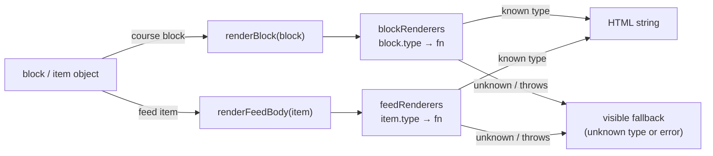
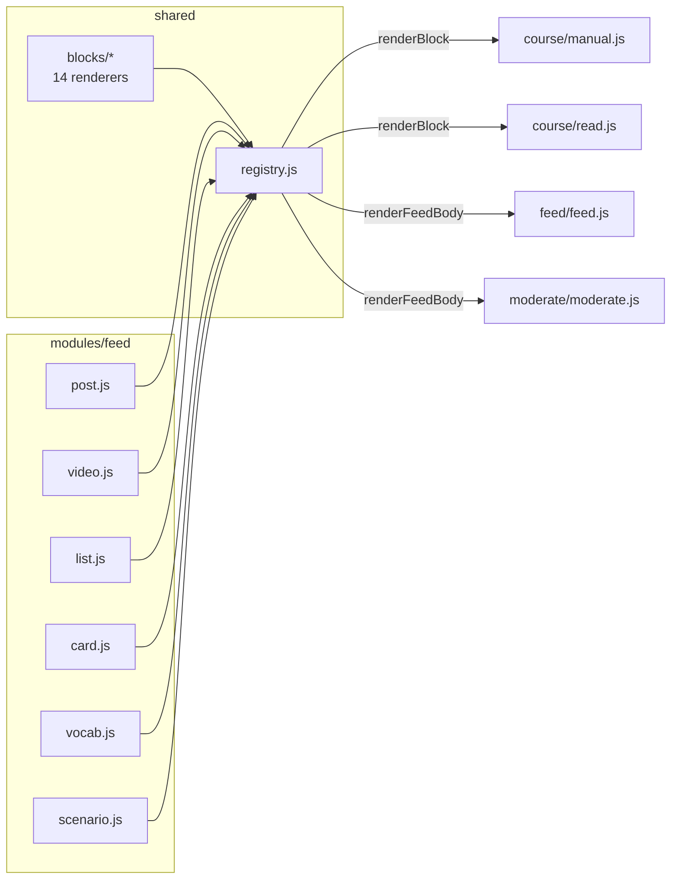

# Blocks and the renderer registry

## Scan box

- **Two dispatch tables, one file.** `shared/registry.js` holds
  `blockRenderers` (course content blocks) and `feedRenderers` (feed-item
  bodies). Each maps a `type` string to a render function.
- **Adding a type is two edits.** Write the renderer file, add one entry to the
  table. No other code changes. The registry is the extensibility contract — the
  same pattern for course blocks and feed items.
- **14 block renderers, 6 feed-item renderers.** Blocks live in
  `shared/blocks/`; feed bodies live in `modules/feed/`. The registry imports
  both and exposes `renderBlock(block)` and `renderFeedBody(item)`.
- **Failure is contained.** An unknown type renders a visible fallback; a
  throwing renderer is caught and logged so one bad block never takes down the
  page.

## The dispatch contract

`shared/registry.js` is small on purpose. It imports each renderer, builds a
lookup keyed by `type`, and exposes two dispatch functions:

The function signature is uniform: a renderer takes one data object and returns
an HTML string. It does not touch the DOM, fetch anything, or hold state. That
purity is what lets the same renderers run in the Manual mode, the Read mode and
the equivalence test harness without change.

## The 14 course block renderers

Each block type in the course JSON has exactly one renderer under
`shared/blocks/`. The registry keys are:

| Registry key | File | Role |
|---|---|---|
| `chapter-open` | `chapterOpen.js` | Chapter opener (breadcrumb, letter, lede). |
| `lead` | `lead.js` | Drop-cap lede paragraph. |
| `prose` | `prose.js` | Body prose. |
| `heading` | `heading.js` | Section headings. |
| `tierlist` | `tierlist.js` | Tier / ranking layout. |
| `diagram` | `diagram.js` | Mermaid or ASCII diagram. |
| `callout` | `callout.js` | The four callout variants. |
| `code` | `code.js` | Syntax-highlighted code example. |
| `quote` | `quote.js` | Blockquote. |
| `architects-review` | `architectsReview.js` | "Architect's Review" checklist block. |
| `cardgrid` | `cardgrid.js` | Card grid. |
| `chips` | `chips.js` | Chip / pill row. |
| `notes` | `notes.js` | Annotated notes list. |
| `map` | `map.js` | The framework map. |

These are the renderers the equivalence harness checks against the frozen
monolith — for the callout family, the four authorised callout types ("Why This
Matters", "Agency Tip", "Common Pitfall", "Before / After") render through
`callout.js` and `architectsReview.js`.

:::tip[Agency Tip]
The registry is the single point you extend when authoring introduces a new
content shape. Resist the temptation to special-case a new block inside a mode
file (`manual.js` / `read.js`) — both modes call `renderBlock`, so a renderer
added to the registry lights up everywhere at once, and the equivalence harness
can hold it to parity. A block handled inline in one mode is a parity gap waiting
to happen.
:::

## The 6 feed-item renderers

Feed items are the social-plane counterpart to course blocks. Their renderers
live in `modules/feed/` (they are feed-domain, not shared course content), and
`registry.js` imports them to build `feedRenderers`:

| Registry key | File | Role |
|---|---|---|
| `post` | `post.js` | A text field-note. |
| `video` | `video.js` | A video post. |
| `list` | `list.js` | A curated list. |
| `card` | `card.js` | A concept card. |
| `vocab` | `vocab.js` | A vocabulary / term entry. |
| `scenario` | `scenario.js` | A judgement scenario (fans out to a quiz question on the backend). |

`renderFeedBody(item)` renders only the type-specific body. The surrounding
chrome — the kind pill, author, footer bridge and any attached media — is
composed by the Feed view from `modules/feed/envelope.js` and
`modules/feed/media.js`. So a feed card is: shared envelope + type body
(`renderFeedBody`) + media. This is why the moderator view can reuse exactly the
same body rendering for a flagged post that the stream uses — same
`renderFeedBody`, different toolbar.

## The shared ↔ feed seam

The registry is the one place `shared/` reaches into `modules/`. It is
deliberate and narrow:

Keeping both dispatch tables in one file means there is exactly one answer to
"what types exist and who renders them." A new course block or a new feed type is
a one-line registry change plus one renderer file — nothing else moves.

## Diagram rendering

Both a course `diagram` block and a feed `diagram` media attachment route
through the same helper, `shared/render/diagram.js` (`renderDiagram` for the
markup, `runMermaid` to hydrate Mermaid after insertion). There is no second
diagram implementation. This matters for the hybrid diagram convention — ASCII
architecture diagrams and Mermaid flows both land through one path, so the SPA
renders them consistently wherever they appear.

## Cross-references

- `frontend/shared/registry.js` — the dispatch source.
- [The content read path](./content-read-path.md) — how the data that feeds
  these renderers arrives.
- [Module layout and parity](./module-layout.md) — the equivalence harness that
  holds the block renderers to the monolith.
