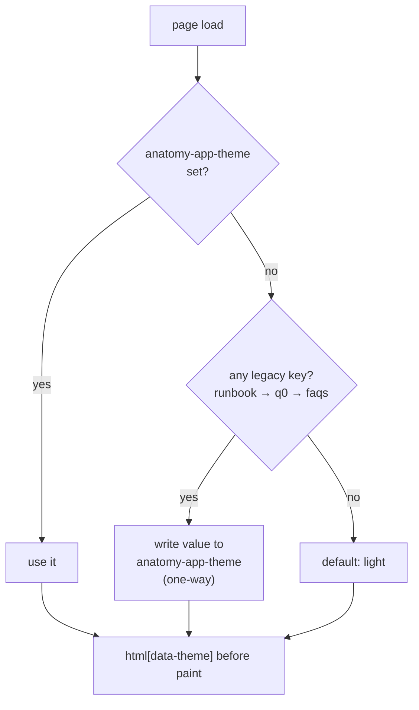

# Configuration and theming

## Scan box

- **One file for every runtime constant.** `core/config.js` holds `API_BASE`,
  `QUIZ_URL`, `SECTION_FILES`, the theme key, the media aliases and the auth
  domain. Values derive from `window.location`, so the same files run in dev and
  behind Apache without a build.
- **One theme key across three surfaces.** `anatomy-app-theme` is the single
  write target for the SPA, the resource islands and the quiz. Because all three
  are same-origin in production, the choice carries across all of them.
- **Adopt-legacy on first load.** `theme.js` (SPA) and `theme-boot.js`
  (resources) migrate the old per-surface keys one-way, so nobody loses their
  setting on upgrade. The legacy keys are read once and never written again.
- **Brand tokens come from the frozen monolith.** Ochre `#FF4900`, Syne / DM
  Sans / JetBrains Mono and the `[data-theme]` dark-mode pivot all live in
  `styles/monolith.css` and are mirrored in this docs site's `custom.css`.

## Configuration centralisation: `core/config.js`

Nothing about the environment is hard-coded into module logic. The single source
is `core/config.js`, and every constant is derived from `window.location` so one
set of files serves both `python -m http.server` in dev and Apache in
production:

| Constant | Value | Notes |
|---|---|---|
| `API_BASE` | `'' ` (same origin) | Apache routes non-static requests to FastAPI, so `''` is the production truth. Override at runtime via `window.__API_BASE`. |
| `QUIZ_URL` | `${location.origin}/` over http(s); `http://localhost:8000/` under `file://` | The separately served quiz app. One constant to repoint. |
| `MEDIA.explainer` | `/media/video/explainer` | A stable server-side alias; FastAPI resolves the slug to the active `media_assets` row and Range-streams it. The browser never holds the per-environment asset UUID. |
| `SECTION_FILES` | the 31 chapter JSON filenames | Enumerated so Contents and Manual agree on what exists without a directory listing. Display order is `framework.json`'s, not this list's. |
| `THEME_KEY` | `'anatomy-app-theme'` | The single localStorage theme key. |
| `ALLOWED_DOMAIN` | `'deptagency.com'` | The auth domain allow-list (still a literal; a future config-CMS read). |
| `GOOGLE_CLIENT_ID` | `'' ` by default | Empty disables Google sign-in; set per environment via `window.__GOOGLE_CLIENT_ID`. |
| `DEV_MOCK` | `true` | Shows the dev sign-in fallback; off in production. |

The payoff of this centralisation is what makes the buildless approach safe to
deploy to several environments: there is no per-environment build, only a handful
of constants in one file (and a couple of `window.__*` runtime overrides for
experiments).

:::tip[Agency Tip]
`API_BASE = ''` is the right default precisely because production is same-origin
— Apache fronts both the SPA and FastAPI. If you ever see CORS errors in a real
deployment, the bug is almost certainly that something is being served from a
different origin than it should be, not that `API_BASE` needs a value. Reach for
the `window.__API_BASE` override only for a deliberate cross-origin experiment,
never as a production fix.
:::

## The unified theme

Before Phase 4b, three surfaces kept three theme keys: the SPA, the resource
islands (`runbook-theme` / `faqs-theme`) and the quiz (`q0-theme`). Because all
three are same-origin in production, they share one `localStorage` — yet a
reader who toggled dark mode on the SPA still saw a light runbook. Phase 4b
collapsed them onto one key.

- **`anatomy-app-theme` is the sole write target** across the SPA (`core/theme.js`),
  the resource islands (`content/frozen/theme-boot.js`) and the quiz
  (`backend/templates/base.html`). The value is applied to `<html data-theme>`
  before paint, and `monolith.css` + `app.css` pivot every colour off the
  `[data-theme]` selector.
- **Adopt-legacy migrates old settings one-way.** On first load after the
  upgrade, if `anatomy-app-theme` is absent, the resolver adopts the first
  present legacy key (`runbook-theme` → `q0-theme` → `faqs-theme`), writes it
  back under the unified key, and never reads the legacy keys again. Nobody loses
  their setting. Phase 4b verified zero `setItem` writes to any legacy key — they
  survive only as read-once adopt constants.

### Two implementations, one contract

The SPA and the resource islands are different kinds of page, so the theme logic
exists twice — and the two must agree:

- **`frontend/core/theme.js`** is an ES module. It exports `initTheme`,
  `toggleTheme`, `getCurrentTheme`; `core/main.js` wires
  `window.toggleAppTheme = toggleTheme` so the inline `onclick` in the app-bar
  works.
- **`content/frozen/theme-boot.js`** is a classic `<script src>` — the resource
  pages are standalone HTML, not modules. It is the non-module sibling of
  `theme.js` and carries identical adopt-legacy logic and the same key. It also
  exposes `window.toggleAppTheme()` (aliased `toggleTheme()`) and auto-binds any
  `#themeToggle` button.

All `localStorage` access in both is wrapped: private-mode browsers throw on
access, and the toggle must still work in-memory for the session.

:::caution[Common Pitfall]
Two implementations of the same behaviour is a standing parity risk: edit one and
forget the other and the surfaces drift — a dark SPA next to a light runbook,
exactly the bug Phase 4b fixed. The guardrail is the shared contract: one key
(`anatomy-app-theme`), the same legacy-adopt order, `data-theme` applied before
paint. If you touch theming, touch both `theme.js` and `theme-boot.js`, and
verify on a real same-origin proxy that a toggle on one surface carries to the
others — not on `file://`, where the origin trick does not apply.
:::

## Brand tokens

The brand is fixed and inherited from the frozen monolith, not re-declared in the
SPA:

- **Ochre `#FF4900`** — the exact masthead and accent colour.
- **Syne** for display, **DM Sans** for body, **JetBrains Mono** for labels —
  loaded once via the Google Fonts link in `index.html`.
- **Dark mode** via the `[data-theme="dark"]` selector that every colour variable
  in `monolith.css` pivots off.

`styles/monolith.css` is frozen — the SPA never redefines these tokens; it
inherits them. The mode stylesheets (`app.css`, `read.css`, `feed.css`,
`moderate.css`) reference the brand tokens (for example `moderate.css` uses the
`--ochre` token rather than a hard-coded hex) so the whole surface moves together.
This documentation site mirrors the same tokens in its own `src/css/custom.css`,
so the docs read as part of the same product.

## Cross-references

- `frontend/core/config.js`, `frontend/core/theme.js` — the config and theme
  sources.
- `content/frozen/theme-boot.js` — the resource-island theme sibling.
- `docs/architecture/v2/05-config-cms.md` — where `ALLOWED_DOMAIN` and friends
  become DB-config reads.
- Phase 4b report §2 (slice 4b-B) — the theme unification.
