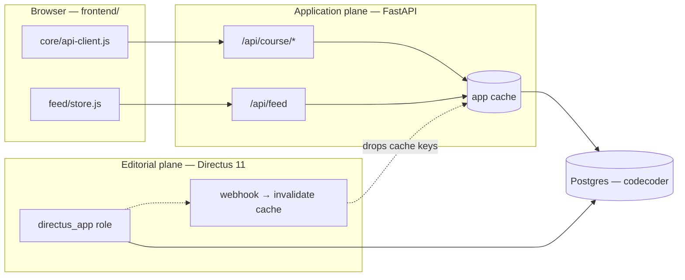

# The content read path

## Scan box

- **The SPA reads through FastAPI, never Directus or Postgres directly.** Course
  content arrives via `core/api-client.js` (`loadJSON`) calling `/api/course/*`;
  feed data arrives via `modules/feed/store.js` calling `/api/feed`. Directus is
  the editorial *write* plane and is invisible to the browser.
- **The API is cache-backed.** FastAPI serves the course and feed reads from an
  application cache that the Directus webhook and moderation actions invalidate
  on write. The SPA gets fresh content without knowing the cache exists.
- **One rewrite seam for course content.** `loadJSON` maps the old
  filesystem-style URLs (`/course/framework.json`, `/course/sections/<file>.json`)
  onto the API endpoints. Mode files call `loadJSON` with logical paths; the seam
  routes them.
- **The feed has its own seam.** `feed/store.js` is the single place feed data is
  read and written; the Feed view and validator go through it and never fetch
  directly.

## Why the SPA never talks to Directus

The v2 architecture has two planes over one Postgres database. Directus 11
(`cms/`) is the editorial write plane — content authors, quiz admins and feed
moderators edit through it as the scoped `directus_app` role. The FastAPI app
(`backend/app/`) is the application plane — it owns the learner-facing read API,
the quiz and certificate logic, learner Google SSO, and media streaming.

The browser only ever sees the application plane. There is no Directus SDK in
`frontend/`, no Directus URL in `core/config.js`, and no GraphQL or Directus REST
call anywhere in the tree. This is the boundary that makes the system safe to
operate: the editorial tool is never exposed to unauthenticated readers, and the
read path is a small, cache-controlled API surface rather than a database client
in the browser.

The browser's arrows all point at FastAPI. The dotted arrows — Directus editing
Postgres and firing a webhook that invalidates the FastAPI cache — happen
entirely server-side. The SPA never participates in a write to authored content;
it only reads, and the cache makes those reads fast.

## The course read seam: `loadJSON`

`core/api-client.js` exports one function, `loadJSON(url)`. The mode and
framework code calls it with logical, filesystem-style paths — `shared/framework.js`
asks for `${base}/course/framework.json` — and `loadJSON` rewrites the request
to the API:

| Logical URL contains | Rewritten to |
|---|---|
| `/course/framework.json` | `/api/course/framework` |
| `/course/framework-explainer.json` | `/api/course/framework-explainer` |
| `/course/sections/<file>.json` | `/api/course/chapters/<file>` |

The rewrite exists because of the dev/prod path split. In dev, serving from the
repo root, the old relative URLs resolved against the filesystem. In production
the SPA is mounted at `/app/` behind Apache and there is no
`/content-architecture/` static alias — so every content URL routes through the
API, which reads from Postgres (with a filesystem fallback for the static framing
JSON). One seam, both environments.

The response is parsed as JSON and any non-2xx is thrown as an error the mode's
`route()` catch turns into a "Couldn't load" placeholder.

## The feed seam: `feed/store.js`

The feed has a richer data layer because it both reads and writes.
`modules/feed/store.js` is THE seam — the single module where feed data crosses
the network — and every other feed file goes through it:

- **`listPosts(filter)`** — `GET /api/feed`, then applies the category / tag /
  since filters and the deterministic sort client-side.
- **`getPost(id)`** — `GET /api/feed`, find by id.
- **`createPost(item)`** — validates through `feed/validate.js` first, then
  `POST /api/feed`. The server re-validates against the same JSON Schema; the
  client gate is a courtesy, not the authority.
- **`flagPost(id)`** — `POST /api/feed/flag`.
- **`getAllCategories()`** — derives the category chips from
  `GET /api/course/framework` (the CODE and CODER rings), cached at module level.

Session reads and writes are not in the store — they live in `modules/feed/auth.js`,
which calls `/auth/me`, `/login/dev`, `/auth/google` and `/logout`, and holds the
session in memory. The store and the auth module are the only two feed files that
speak to the network.

:::tip[Agency Tip]
When a single module is declared "the seam," honour it. Every feed read in this
SPA goes through `store.js`; the Feed view, the composer and the validator never
issue their own `fetch` for feed data. That discipline is what let v2 swap the
feed's backing from a `localStorage` overlay to the FastAPI/Postgres API by
editing one file — the seam absorbed the change and no caller moved. Add a direct
`fetch('/api/feed')` in a view and you have quietly created a second seam that the
next backend change will miss.
:::

## Client-side validation mirrors the server

`modules/feed/validate.js` is the one feed-item validator, used by both the
composer (for inline field errors) and `store.createPost` (the defensive
data-layer gate). It validates against `content/schemas/feed.schema.json` —
draft 2020-12 — using a lazily imported Ajv from a pinned CDN module, with a
hand-rolled fallback if the CDN is blocked. It also enforces the one rule the
schema cannot express but the server does: a `post` body of at most 100 words,
mirrored exactly from `validate.py`.

The point is that the same schema validates on both ends. The client validation
is for fast feedback; the server is the authority and re-validates every write.

## What the read path is *not*

- **Not a generic fetch wrapper.** `core/api-client.js` is the course-content
  read helper, not a universal `apiFetch`. Feed and auth calls use their own
  modules. (The Phase 0 blueprint sketched a generic wrapper; the shipped code is
  the narrower, real need.)
- **Not a cache.** The browser does not cache content itself — `loadJSON` fetches
  with `cache: 'no-cache'`. The caching that matters is the *server's*
  application cache, invalidated by Directus and by moderation actions. The SPA
  trusts the API to be fresh.
- **Not a Directus client.** There is no path from the browser to the editorial
  plane. Every read is FastAPI.

## Cross-references

- `frontend/core/api-client.js`, `frontend/modules/feed/store.js`,
  `frontend/modules/feed/auth.js` — the read/write seams.
- `docs/architecture/v2/06-caching-performance.md` — the server-side cache and
  its invalidation.
- `docs/architecture/v2/05-config-cms.md` — the Directus editorial plane and the
  webhook that invalidates the cache.
- Phase 4b report §2 (slice 4b-A) — moderation cache invalidation.
