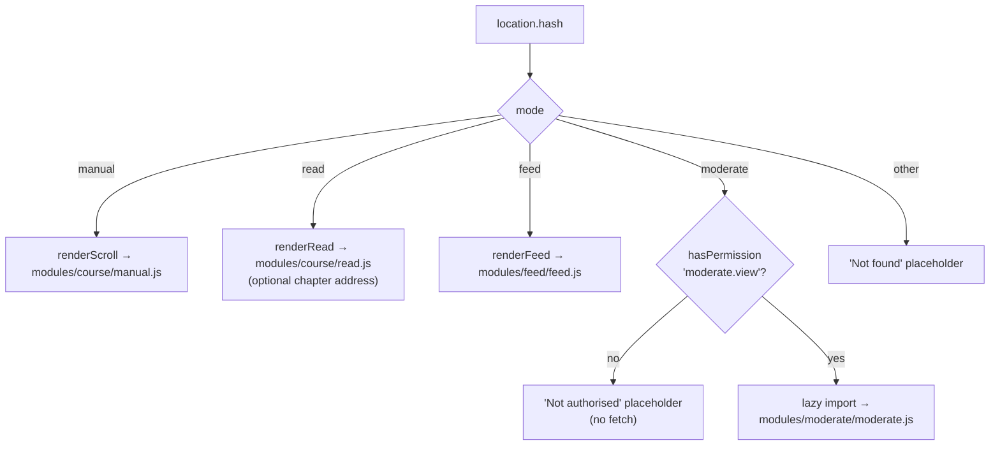
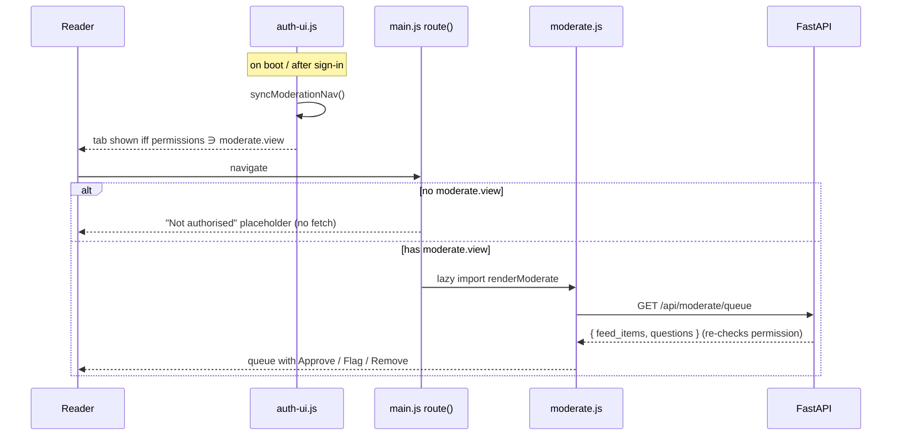

# Router and the four modes

## Scan box

- **One hash router.** `core/main.js` reads `location.hash`, picks a mode, and
  renders it into `#view`. The default is `#/manual`. There is no history API,
  no server-side route table — the SPA is one page, and the hash is the address.
- **Three reader modes + a gated moderator view.** Manual (scroll + explainer
  video), Read (the chapter reader), Feed (the social stream), and Moderation
  (`#/moderate`) which is role-gated.
- **Moderation is gated twice.** The nav entry is hidden unless `/auth/me`
  reports the `moderate.view` permission; the route refuses to fetch for
  non-moderators; and the API enforces the permission server-side regardless.
- **Navigation is unified.** Resources (the `/anatomy/*` islands) open same-tab
  and carry a shared header back to the SPA; the Quiz link opens its own page
  set in a new tab.

## The hash router

The router is the `route()` function in `core/main.js`. Its logic is direct:

1. Read `location.hash`, strip the leading `#/`, default to `manual`.
2. A silent alias redirects any legacy `#/scroll` link to `#/manual` (the mode
   was renamed; old links keep working).
3. Split on `/` to get the mode (and, for Read, an optional chapter address).
4. Highlight the matching mode tab, show a loading placeholder, and dispatch.

A `hashchange` listener re-enters `route()` on every navigation, and the boot
IIFE calls it once for the initial address. Any error in a mode's render is
caught and shown as a "Couldn't load" placeholder rather than a blank screen.

## Manual mode

`modules/course/manual.js` (`renderScroll`) is the renderer-based reproduction of
the live monolith page: every section in framework order, every block rendered
linearly through `renderBlock`. It is built *alongside* the monolith, which stays
live — it does not replace it.

It opens with a dismissable hero: the CODE-CODER explainer video. The MP4 is a
Postgres large object streamed by FastAPI with HTTP Range; the SPA references it
through a stable server-side alias, `/media/video/explainer`
(`MEDIA.explainer` in `core/config.js`), which resolves the slug to the active
`media_assets` row per environment. There is no S3, no object store, and no
filesystem media path — media is Postgres-backed and Range-streamed.

:::caution[Common Pitfall]
A stale relative path to the MP4 is a classic trap here. An older code path
referenced `../media/Anatomy%20of%20Code.mp4`, which only resolves when the SPA
is served from the repo root in dev and breaks under Apache at `/app/`, where
there is no `/media/` static alias. The correct contract is the config alias
`/media/video/explainer`, served by FastAPI from Postgres. If the hero video
404s in production but works in `python -m http.server`, this is why.
:::

## Read mode

`modules/course/read.js` (`renderRead`) is the ebook view: the same authored
content as Manual, grouped into turnable pages by the `page` flag, one chapter
per framework letter, with a telescope transition driven by `opensInto`. It
reuses the exact same block renderers as Manual — the difference is presentation
(warm read-paper surface, Newsreader body type, page-dot navigation, swipe and
arrow-key paging), all scoped under `.read` so Manual stays byte-identical.

The optional chapter address in the hash (`#/read/<address>`) selects a chapter;
no address shows the Contents library.

## Feed mode

`modules/feed/feed.js` (`renderFeed`) is the social stream. All feed data comes
through `modules/feed/store.js` — the data seam — so the view itself never
touches `localStorage` or fetches directly. Readers compose three filter
dimensions (category chips from framework letters, topic tags, an optional
group-by-day) that combine with AND across dimensions and OR within one. The
default sort is recency, with engagement and id as deterministic tiebreaks,
owned by the store.

Compose and flag controls gate on the session read through
`modules/feed/auth.js`. The read path and the store seam are covered in detail in
[The content read path](./content-read-path.md).

## The role-gated Moderation view

Moderation is the one surface that is not open to every reader, and it is gated
in three independent places — the defining property of the v2 authorisation
posture.

1. **The nav entry is hidden by default.** `index.html` ships the Moderation tab
   with the `hidden` attribute. `core/auth-ui.js` `syncModerationNav()` unhides
   `#navModerate` only when `getPermissions()` (read off the `/auth/me` session)
   includes `moderate.view`. It runs on boot and after every sign-in / sign-out.
2. **The route refuses to fetch.** A direct visit to `#/moderate` still lands in
   `route()`. If `hasPermission('moderate.view')` is false, it renders a "Not
   authorised" placeholder and makes no request. Only for an authorised session
   does it lazy-import `modules/moderate/moderate.js` — keeping the moderator
   code off the boot path for everyone else.
3. **The API is authoritative.** `GET /api/moderate/queue` and
   `POST /api/moderate/action` enforce `require_permission` server-side. The
   client gates are a courtesy for UX; a tampered client gains nothing, because
   the server re-checks every permission.

The moderator view renders flagged feed items reusing the Feed's own card body
(`renderFeedBody` + envelope chrome) and questions as compact review cards with
the correct answer marked. Each item carries Approve / Flag / Remove, posting to
`/api/moderate/action` with `{ item_id, item_type, action }`. Remove uses an
accessible inline confirm; focus is restored after every repaint.

:::tip[Why This Matters]
Three gates for one surface is not redundancy for its own sake — it is the right
shape for authorisation in a SPA. Hiding the nav is UX. Refusing to fetch is
defence against a bookmarked or shared URL. The server check is the only one that
is *authoritative*, because the client is untrusted by definition. A SPA that
gates only in the UI ships an access-control bug; this one gates in the UI for
politeness and on the server for safety.
:::

## Navigation and information architecture

Phase 4b unified the three same-origin surfaces — the SPA at `/app`, the resource
islands at `/anatomy/*`, and the quiz at `/` — into one navigation language:

- **Resources open same-tab.** The three `/anatomy/*` links (FAQs, Checklist,
  Runbooks) dropped `target=_blank`; each resource page carries a shared header
  with the DEPT® brand and an `← Anatomy of Code` back-link to `/app/`, so the
  reader is never stranded. The resource islands are served by Apache from
  `content/frozen/` under the `/anatomy/` alias.
- **Quiz opens a new tab.** The Quiz link keeps `target=_blank` because it is a
  separate page set (the FastAPI-templated quiz/certification app at `/`). Its
  URL comes from `QUIZ_URL` in `core/config.js`, wired in `main.js` `initChrome()`.
- **One header, one theme.** All three surfaces share the `anatomy-app-theme`
  key, so a dark-mode choice on the SPA carries to a runbook and to the quiz —
  see [Configuration and theming](./config-and-theming.md).

## Cross-references

- `frontend/core/main.js` — the router and boot.
- `frontend/core/auth-ui.js` — the permission helpers and nav gating.
- `frontend/modules/moderate/moderate.js` — the moderator view.
- `docs/architecture/v2/04-authz-model.md` — the roles and permissions the
  gating reads.
- Phase 4b report — the navigation, theme and moderator unification.
