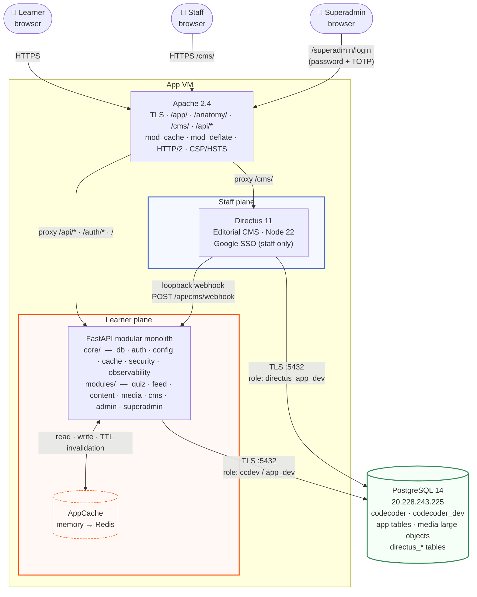

# Developer guide

This is the architect's overview of the Tenet platform — the boundaries between
the two planes, how a request flows from the SPA to the cache-backed read path,
where Directus sits over the same Postgres, and the security and observability
posture that holds it all together. From here, drop into
[Architecture](./architecture/modular-monolith),
[Components](./components/intro), the [Data model](./data-model/database-intro),
the [API reference](./apis), [Builds & local dev](./builds-and-local-dev), or the
[Quiz internals](./quiz-internals/quiz-intro).

> "Anatomy of Code" is the course content Tenet teaches; "Tenet" is the platform
> documented here.

## Scan box

- **Two planes, one database.** The *learner plane* is a FastAPI modular
  monolith with Google SSO; the *staff plane* is Directus 11. Both read and
  write the **same `codecoder` Postgres**, now a **remote shared instance**
  reached over TLS (one instance hosts the prod and dev databases, isolated by
  per-env roles). There is no S3 — media lives in Postgres large objects.
- **The backend is a modular monolith.** One FastAPI app, split internally into
  `backend/app/core/` (shared infrastructure: db, auth, config, cache,
  security, observability) and `backend/app/modules/` (`auth`, `quiz`,
  `content`, `feed`, `media`, `cms`, `admin`). One buildless ES-module SPA.
  One primary deploy unit plus the Directus service.
- **Reads are cache-backed; writes invalidate.** The SPA fetches `/api/*` from
  FastAPI through a single `AppCache` seam (memory by default, Redis-ready).
  Directus edits fire a loopback webhook that drops exactly the affected cache
  keys. The cache is the seam between the editorial plane and the runtime
  read path.
- **Authorisation is server-side and role-based.** `require_permission(perm)`
  enforces the locked permission matrix on every protected route;
  `/auth/me` exposes the same roles and permissions so the SPA can mirror — but
  never replace — the server's decision. Directus connects as a scoped
  `directus_app` Postgres role that cannot touch the runtime or audit tables.
- **v2 is sealed at phases 0–4b.** The architecture is stable and final. The
  one piece deliberately deferred is **4c** — the relational decomposition of
  the course content, which would replace the frozen JSON/HTML course with
  editable chapter tables. Until then the course renders from the frozen
  artefact.

## The shape, in one diagram

The whole system is two application planes over a single Postgres, fronted by
Apache. Media never leaves the database.

:::tip[Why This Matters]
A "modular monolith with a shared-database CMS" is a deliberate commitment, not
an interim state. Directus does not own a separate datastore that FastAPI then
syncs from — both planes read and write one Postgres, and the **cache** is the
only coupling between them. That is what keeps the editorial plane additive: a
staff edit is a row change plus a cache drop, never a data migration. The day a
module needs to leave the monolith it can, because the per-module file layout
already draws the seam — but that day is not v2.
:::

## What lives in this section

The pages below take each plane and cross-cutting concern in turn. Read them in
order for the full picture, or jump to the one you need.

1. **[Modular monolith](./architecture/modular-monolith.md)** — the `core/` + `modules/`
   shape, the per-module file convention, and the rules for how modules talk to
   each other.
2. **[Directus topology](./architecture/directus-topology.md)** — the staff plane: how
   Directus sits over the shared Postgres as a scoped role, and the
   webhook → cache-invalidation contract.
3. **[Auth planes](./architecture/auth-planes.md)** — Google SSO with PKCE for learners,
   Directus auth for staff, and the locked permission matrix that
   `require_permission` enforces.
4. **[Caching and performance](./architecture/caching-performance.md)** — the three cache
   layers, the `AppCache` seam, the TTLs, and how invalidation reaches the
   read path.
5. **[Security baseline](./architecture/security-baseline.md)** — header hardening, CSP and
   HSTS ownership, secret tiers, certificate HMAC signing, and the
   `directus_app` database isolation.
6. **[Observability](./architecture/observability.md)** — request-id correlation, structured
   logs, `/healthz` and `/readyz`, the Directus audit trail, and what to watch.

## Source contracts

Every claim on these pages is grounded in the v2 design contracts and the real
code. The contracts are the canonical reference:

- `docs/architecture/v2-plan.md` — the locked decisions and the phase plan.
- `docs/architecture/v2/01-blueprint.md` — directory tree and module
  boundaries.
- `docs/architecture/v2/03-data-model.md` — schema and the Directus DB-role
  GRANT table.
- `docs/architecture/v2/04-authz-model.md` — the two-plane authorisation model.
- `docs/architecture/v2/05-config-cms.md` — the config tiers and Directus
  collection map.
- `docs/architecture/v2/06-caching-performance.md` — the cache hierarchy.
- `docs/architecture/v2/07-security-baseline.md` — the security posture.
- The per-phase gate reports (`phase-1` … `phase-4b`) record what actually
  landed at each gate.
