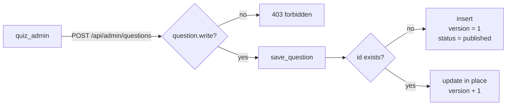
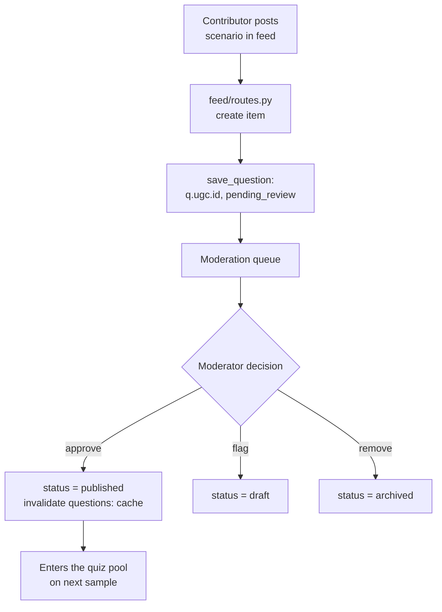

# The question bank

Every question the quiz samples comes from one Postgres table, `questions`.
This page covers its shape, how staff author and version questions, and the
one path by which a learner's contribution can reach the bank — the
user-generated-content (UGC) flow, where a feed scenario becomes a question
pending a moderator's approval.

## Scan box

- **One table, status-gated.** `questions` holds every question. Only rows
  with `status='published'` are ever sampled into a quiz; `pending_review`,
  `draft` and `archived` rows sit out.
- **Staff author through one endpoint.** `POST /api/admin/questions` writes
  the bank. It is gated by the `question.write` permission, held by
  `quiz_admin` (and the `platform_admin` bypass).
- **Versioning is in place.** Editing an existing question increments its
  `version` and updates the row — past attempts are unaffected because each
  attempt snapshots the full question text into its own payload.
- **Learners can propose, not publish.** A feed scenario fans out into a
  `q.ugc.<feedid>` question with `status='pending_review'`. It is invisible
  to the quiz until a moderator approves it.
- **Approval is a status flip.** A moderator approving a UGC question sets
  `status='published'` and invalidates the `questions:` cache prefix, so the
  quiz pool sees it on the next sample.

## The `questions` table

The shape comes from `app/core/models.py` (the `Question` model) and
`03-data-model.md`. The columns that matter operationally:

| Column | Meaning |
| --- | --- |
| `id` | String primary key. Authored questions use a curated ID; UGC uses `q.ugc.<feedid>`. |
| `topic` | Subject grouping, surfaced on the home page topic summary. |
| `difficulty` | `beginner`, `intermediate` or `advanced` — the sampling axis. |
| `question` | The prompt text. |
| `options` | JSONB list of answer strings. |
| `correct_index` | Index into `options` of the correct answer (pre-shuffle). |
| `explanation` | Shown in the post-submit review. |
| `status` | `published` / `pending_review` / `draft` / `archived`. The sampling gate. |
| `version` | Bumped on each edit. |
| `author_id` | Email of the author (staff or the contributing learner). |
| `is_user_submitted` | `True` for the UGC path, `False` for staff-authored. |

Only `status='published'` rows are visible to `service.generate` and to the
home-page topic summary. Everything else is staged or retired.

:::note[Why This Matters]
The `status` column is the single switch that decides whether a question can
appear in a live certification exam. Authoring, moderation and retirement are
all just transitions of this one field. Get the status model right and the
bank governs itself; get it wrong and a draft or an unreviewed contribution
can leak into a credential exam.
:::

## Authoring through the admin endpoint

Staff write the bank through `POST /api/admin/questions`
(`quiz/routes.py`), which takes a `QuestionPayload` and is gated by
`require_permission("question.write")`. The handler stamps `author_id` to the
caller's email and forces `is_user_submitted=False`, then calls
`storage.save_question`.



## Versioning — edit in place, attempts unharmed

When `save_question` is handed an `id` that already exists, it does not fork
a new row. It updates the existing row's fields and increments `version`
(`storage.py`). This is safe for one specific reason, documented in the code:

Each attempt copies the **full** question — prompt, options, correct index,
explanation — into its own `payload` at grading time. A learner's history and
review render from that snapshot, not from a live join back to `questions`.
So editing or even rewording a question never rewrites the past: an attempt
graded against version 2 of a question keeps showing version 2's text forever,
while new quizzes sample version 3.

:::tip[Agency Tip]
Because attempts are self-contained snapshots, a quiz admin can fix a typo,
sharpen an explanation, or correct a wrong `correct_index` on a live question
without a migration and without fear of corrupting anyone's past result.
Treat the bank as editable. The only thing to be careful about is changing a
question's *correct answer* — that affects every future sit, so it deserves a
moderation second pair of eyes the same way a new question does.
:::

## The UGC path — a feed scenario becomes a question

The platform lets contributors post "scenario" items into the feed — a small
multiple-choice prompt with options, a correct answer and a reveal. When such
an item is created, it fans out into the question bank automatically. This is
the only way content originating from outside the staff plane can reach the
quiz, and it is deliberately gated.

The fan-out lives in `feed/routes.py`. Creating a feed item of type
`scenario` builds a question record:

```text
  id              = q.ugc.<feed item id>
  difficulty      = intermediate           # default for UGC
  status          = pending_review         # NOT published
  is_user_submitted = True
  author_id       = the contributor's email
```

`status='pending_review'` is the whole point: the question exists in the
table but is excluded from every quiz sample until a moderator promotes it.
The feed item itself is also marked `pending-review` so it does not surface
in the public feed in the meantime.



## Approval — the moderator's status flip

A moderator works the queue through `GET /api/moderate/queue` and
`POST /api/moderate/action` (`feed/routes.py`). For an item of type
`question`, the action maps to a status transition:

| Action | New status | Effect |
| --- | --- | --- |
| `approve` | `published` | The question joins the quiz pool. |
| `flag` | `draft` | Held back for rework; stays out of quizzes. |
| `remove` | `archived` | Retired; never sampled. |

After the flip, the handler calls `cache.invalidate_prefix("questions:")` so
the quiz pool and the topic summary pick up the change immediately rather
than waiting for a cache entry to expire. The queue itself is built by
`storage.get_questions_queue`, which returns every question with status
`pending_review` or `draft`.

:::info[Before / After]

**Before (v1):** user-submitted scenarios and staff-authored questions were
not cleanly separated, and there was no single status gate deciding what a
quiz could sample.

**After (v2):** every question carries `status` and `is_user_submitted`. A
contributor's scenario lands as `pending_review` and cannot reach a
certification exam until a `feed_moderator` or `quiz_admin` approves it,
flipping `status` to `published` and invalidating the cache. The path from
"a learner had an idea" to "this question can decide a credential" runs
through exactly one human decision.

:::

## Permissions at a glance

| Action | Endpoint | Permission | Held by |
| --- | --- | --- | --- |
| Author / edit a question | `POST /api/admin/questions` | `question.write` | `quiz_admin` |
| View the moderation queue | `GET /api/moderate/queue` | `moderate.view` | `feed_moderator` |
| Approve / flag / remove a UGC question | `POST /api/moderate/action` | `moderate.action` | `feed_moderator`, `quiz_admin` |

`platform_admin` bypasses all of these. The full matrix and how it is
enforced are on the [RBAC and admin](./rbac-and-admin) page.
