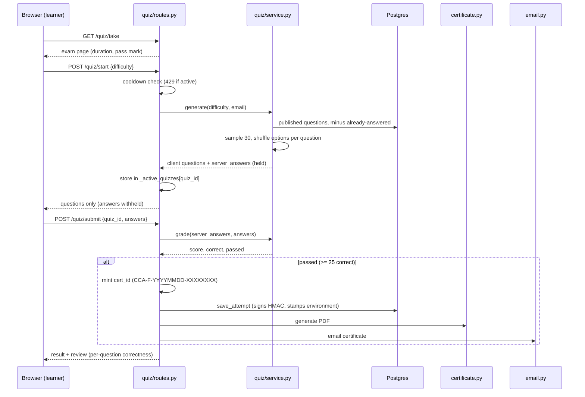
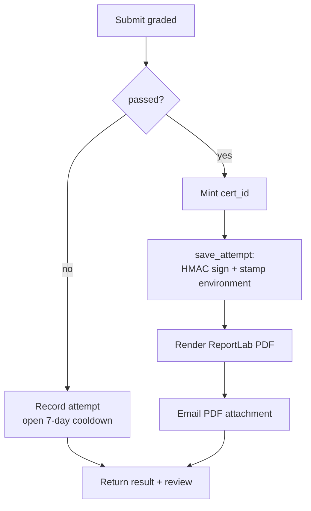

# Quiz lifecycle

A certification attempt is a short, tightly controlled conversation between
the browser and the server. The browser asks to start, the server hands back
30 questions with the answers withheld, the learner submits their choices,
and the server grades and — if the learner passes — mints a certificate. This
page walks that sequence and explains why each step lives where it does.

## Scan box

- **The server owns the exam.** `POST /quiz/start` samples 30 questions and
  keeps the correct answers in server state. The browser receives questions
  and shuffled options only — never the correct index.
- **No-repeat sampling, with graceful fallback.** Generation excludes
  questions the learner has already answered, falls back to ones they got
  wrong, then to the full published pool if the bank is thin.
- **Grading is server-side and absolute.** `POST /quiz/submit` compares the
  learner's chosen indices against the stored answers. Pass is 25 of 30
  correct (about 83%), read from `PASS_MARK_CORRECT`.
- **Passing mints a certificate inline.** On a pass, the server generates a
  `cert_id`, persists the signed attempt, renders the PDF and emails it —
  all inside the submit handler.
- **A failed attempt opens a 7-day cooldown.** The learner cannot re-sit
  until the window closes. A pass clears it.

## The shape of an attempt

Every attempt is a single browser session against four endpoints, all in
`backend/app/modules/quiz/routes.py`:

```text
  GET  /quiz/take      → renders the exam page (Jinja template)
  POST /quiz/start     → samples questions, opens server-side quiz state
  POST /quiz/submit    → grades, persists, signs, mints + emails the cert
  GET  /certificate/{cert_id}  → streams the PDF back to the owner
```

The `/quiz/start` and `/quiz/submit` payloads are encrypted on the wire
(`encrypt_response_payload` / `decrypt_request_payload` in `app.core.deps`),
so the questions and answers are not sitting in plaintext in the browser's
network log. That is transport hardening, not the security boundary — the
boundary is that the correct answers never leave the server at all.

## The request sequence



## Step 1 — Start and sample

`POST /quiz/start` does three things before it returns a single question.

First, it gates. The learner must be signed in and must have picked a persona
at onboarding; otherwise the endpoint returns `401` or `412`. Then it checks
the cooldown — if the learner failed a recent attempt and the 7-day window is
still open, it returns `429` with the remaining days.

Then it samples. `service.generate(difficulty, user_email)` is the heart of
the no-repeat behaviour:

1. Pull the learner's answered question IDs from their attempt history.
2. Select published questions of the requested difficulty, **excluding** the
   answered set.
3. If that pool is thin, fall back to questions the learner previously got
   **wrong** — re-testing a weak spot is fair.
4. If still thin, reset to the full published pool of that difficulty.
5. If even the full pool cannot fill 30 questions, raise — the bank is too
   small for that difficulty and the attempt fails cleanly.

For each of the 30 sampled questions, the options are shuffled and the new
index of the correct option is recorded **server-side** in `server_answers`.
The browser receives the shuffled options but no correct index.

:::note[Why This Matters]
The shuffle plus the withheld answer is the anti-cheat design in one move. A
learner inspecting the network payload sees four options in a random order
and no marker for which is right. The mapping from question to correct index
lives only in the server's quiz state, keyed by `quiz_id`. There is nothing
in the browser to cheat against.
:::

## Step 2 — Hold the state

When `/quiz/start` returns, the server keeps the answer key. In the v2 build
this lives in a module-level dictionary, `_active_quizzes`, keyed by
`quiz_id` (`routes.py`). Each entry holds the learner's email, the start
time, the difficulty, the `server_answers` map, and the full question records
used to build the post-submit review.

This is the one piece of the module that is **not** multi-worker safe. A
quiz started on one worker is invisible to another, so the submit would fail
to find it. The application is therefore pinned to a single worker
(`QUIZ_WORKERS=1`) until this state moves into the `quiz_sessions` table.

:::warning[Common Pitfall]
Do not scale the quiz service horizontally by raising the worker count. The
`quiz_sessions` table and its `QuizSession` model are provisioned (migration
`0003`, `app/core/models.py`), but `routes.py` still reads and writes the
in-process `_active_quizzes` dict — the route rewiring did not land in the
final v2 cut. Until it does, `QUIZ_WORKERS=1` is load-bearing, not a
suggestion. See the [RBAC and admin](./rbac-and-admin) page for the operator
note.
:::

## Step 3 — Submit and grade

`POST /quiz/submit` decrypts the payload, confirms the `quiz_id` exists in
`_active_quizzes`, and confirms the submitting user owns that quiz (a `403`
otherwise — a learner cannot submit another learner's quiz).

Grading is a comparison, nothing more. `service.grade(server_answers,
user_answers)` walks the stored answer key and counts matches:

```text
  for each question:
      is_correct = user_answer_index == correct_answer_index
  passed = correct >= PASS_MARK_CORRECT   # 25 of 30
  score  = correct / total                # a 0–1 fraction
```

The pass mark is `PASS_MARK_CORRECT = 25` over `QUESTIONS_PER_QUIZ = 30`,
which the home page renders as "Pass mark 83%". The `score` is stored as a
fraction between 0 and 1, **not** a percentage — this matters because the
HMAC seal hashes `f"{score:.6f}"`, so the stored fraction is the exact value
the signature was computed over (`03-data-model.md` §2.1).

## Step 4 — Mint, persist, deliver

If the learner passed, the submit handler does the credential work inline:

1. **Mint the cert ID** in the form `CCA-F-YYYYMMDD-XXXXXXXX` (date plus a
   short uppercased UUID fragment).
2. **Persist the attempt** via `storage.save_attempt`, which signs the HMAC,
   stamps the `environment`, and — outside production — applies the `DEV-` or
   `STG-` cert-ID prefix.
3. **Render the PDF** with `certificate.generate`.
4. **Email the certificate** as a PDF attachment (in dev mode this writes a
   `.eml` file to the outbox instead of sending).

If the certificate or email step throws, the handler logs a warning and
still returns the result — the learner's pass is recorded even if delivery
hiccups, and the certificate can be regenerated on demand from the persisted
attempt. The submit response carries the score, the pass flag, the `cert_id`,
the human-readable `test_code`, and a per-question review showing which
answers were right.



## Step 5 — Cooldown

A failed attempt opens a cooldown. `storage.cooldown_remaining_days` reads
the learner's most recent attempt; if it failed and fewer than
`COOLDOWN_DAYS` (7) have passed, the remaining days are returned and
`/quiz/start` refuses with a `429`. A pass clears the cooldown immediately —
`cooldown_remaining_days` returns 0 the moment the last attempt is a pass.

:::tip[Agency Tip]
The pass mark, question count, duration and cooldown are all configuration,
not constants buried in logic — `PASS_MARK_CORRECT`, `QUESTIONS_PER_QUIZ`,
`QUIZ_DURATION_MIN`, `COOLDOWN_DAYS` in `app/core/config.py`. If a client
engagement needs a gentler or stricter gate for a cohort, that is an
environment change, not a code change. Changing the pass mark does **not**
retroactively affect issued certificates — the score is sealed into each
attempt's HMAC at issue time.
:::

## Where to go next

- The questions that `/quiz/start` samples come from the bank — see
  [The question bank](./question-bank).
- The certificate that a pass mints is signed and rendered — see
  [Certificates](./certificates).
- The cooldown, the worker pin and the admin surfaces are covered in
  [RBAC and admin](./rbac-and-admin).
