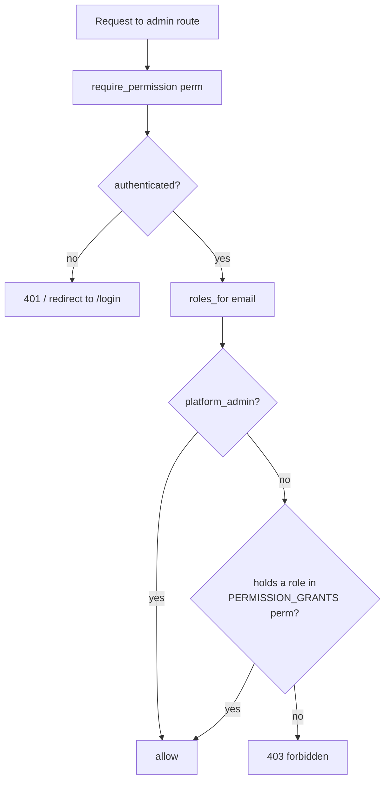

# RBAC and admin

The quiz module exposes a handful of staff surfaces — author a question,
review the moderation queue, inspect every attempt. Each one is gated by a
single permission check, and every permission resolves through one locked
matrix. This page covers who can do what, how it is enforced, and the two
operational caveats an operator must hold in their head: the single-worker
pin and the failed-attempt cooldown.

## Scan box

- **One enforcement primitive.** Every admin route is guarded by
  `require_permission(<perm>)` — a FastAPI dependency that checks the caller's
  roles against a locked matrix in `app/core/deps.py`.
- **`quiz_admin` owns the bank and the attempt log.** It holds
  `question.write`, `attempts.view_all`, and `moderate.action` for UGC
  questions.
- **`platform_admin` is the single global bypass.** It passes every check.
  No other role gets implicit access.
- **Roles are staff-plane, granted in Directus.** Learners never hold an
  admin role; the floor for any signed-in user is `learner`.
- **Two operator caveats:** the quiz service runs single-worker until the
  in-memory quiz state moves to Postgres, and a failed attempt opens a 7-day
  cooldown.

## The enforcement primitive

There is exactly one way the quiz module authorises a staff action:
`require_permission(perm)` from `app/core/deps.py`. It is a dependency factory
— you pass it a permission string, it returns a dependency that:

1. Pulls the authenticated session user (401 or redirect if absent).
2. Reads their role set via `users.roles_for(email)` — always at least
   `{learner}` for any signed-in user.
3. Lets `platform_admin` through unconditionally — the single global bypass.
4. Otherwise requires the user to hold a role in `PERMISSION_GRANTS[perm]`.

An unknown permission string is a hard error at startup, not a silent
allow — `require_permission("typo.perm")` raises, which keeps the matrix
honest.



## The locked permission matrix

`PERMISSION_GRANTS` in `app/core/deps.py` is the runtime source of truth.
The quiz-relevant entries:

| Permission | Held by | Gates |
| --- | --- | --- |
| `question.write` | `quiz_admin` | `POST /api/admin/questions` (author / edit) |
| `attempts.view_all` | `quiz_admin` | `GET /admin/attempts` (every attempt) |
| `moderate.view` | `feed_moderator` | `GET /api/moderate/queue` |
| `moderate.action` | `feed_moderator`, `quiz_admin` | `POST /api/moderate/action` (approve UGC) |

`quiz_admin` appears in `moderate.action` specifically so a quiz admin can
clear the queue of user-generated questions — the role that owns the bank can
also approve the contributions feeding it. `platform_admin` is absent from the
table because it is the implicit bypass checked before the matrix.

:::note[Why This Matters]
Keeping every grant in one dictionary, checked by one dependency, is what
makes the authorisation model auditable. There is no per-route ad-hoc check to
audit, no role string compared inline in a handler. To answer "who can edit
the question bank?" you read one line of `PERMISSION_GRANTS`. To change it, you
edit that one line. The matrix *is* the policy.
:::

## The roles, and where they come from

The staff capability roles are reference data, seeded in migration `0005`:

| Role | Plane | Responsibility |
| --- | --- | --- |
| `content_author` | staff | Authors official course content and questions via Directus. |
| `quiz_admin` | staff | Manages the quiz bank, scoring, and pass-mark configuration. |
| `feed_moderator` | staff | Reviews flagged feed items and enforces moderation policy. |
| `platform_admin` | staff | Grants and revokes roles, edits platform configuration. |

These are granted to a user through the staff plane (Directus), recorded in
`user_roles`, and read at request time by `users.roles_for`. A learner's
roles come from the same table; an ordinary learner simply holds none of the
staff roles, and the `learner` floor is implied for everyone signed in. The
full authorisation contract is `docs/architecture/v2/04-authz-model.md`.

## The admin surfaces

The quiz module's staff endpoints, all in `quiz/routes.py`:

- **`POST /api/admin/questions`** — author or edit a question. Gated by
  `question.write`. The handler forces `is_user_submitted=False` and stamps
  the author. See [The question bank](./question-bank) for versioning
  semantics.
- **`GET /admin/attempts`** — render every attempt across all learners. Gated
  by `attempts.view_all`. This is the audit view a quiz admin uses to see who
  passed, who failed, and what was issued.
- **Moderation of UGC questions** lives in the feed module
  (`GET /api/moderate/queue`, `POST /api/moderate/action`) but is quiz
  business — a `quiz_admin` can approve a `q.ugc.*` question into the pool.

## Caveat 1 — the single-worker pin

The quiz runtime holds active-exam state in an in-process dictionary,
`_active_quizzes` (`quiz/routes.py`), keyed by `quiz_id`. A quiz started on
one worker process is invisible to any other, so a submit routed to a
different worker would 404 the quiz.

The `quiz_sessions` table and its `QuizSession` model exist — the table is
created by migration `0003` and the model is defined in `app/core/models.py`
— but the route rewiring to read and write it **did not land** in the final
v2 cut. `routes.py` still uses the in-memory dict. Until that rewiring ships,
the application must run with a single worker.

```text
  Multi-worker, in-memory state — the failure mode
  ─────────────────────────────────────────────────────
   Worker 1            Worker 2
   _active_quizzes     _active_quizzes
   { quiz_id: ... }    { }            ← empty here

   start  → routed to W1 → state in W1
   submit → routed to W2 → quiz_not_found (404)
```

:::warning[Common Pitfall]
Do not raise the worker count for the quiz service. `QUIZ_WORKERS=1` is the
contract that keeps active-quiz state coherent. The fix is not a config knob —
it is moving `_active_quizzes` reads and writes into the provisioned
`quiz_sessions` table, after which the pin can be lifted. Scaling first would
turn every cross-worker submit into a lost exam. This is the single most
important operational fact about the quiz module.
:::

## Caveat 2 — the failed-attempt cooldown

A learner who fails cannot immediately re-sit. `storage.cooldown_remaining_days`
reads the most recent attempt; if it failed and fewer than `COOLDOWN_DAYS`
(7, in `app/core/config.py`) have elapsed, `POST /quiz/start` returns `429`
with the remaining days. A pass clears the cooldown at once.

There is no admin override endpoint for the cooldown in the shipped module. If
a cohort needs a different window, `COOLDOWN_DAYS` is environment
configuration — change it and reload, the same as the pass mark and question
count.

:::tip[Agency Tip]
The quiz module's whole behavioural surface — pass mark, question count,
duration, cooldown — is configuration, and the authorisation surface is one
matrix. For a client engagement, that means a cohort's exam rules and a
staff member's powers are both adjusted without touching handler logic. When
onboarding a new quiz admin, the only action is granting the `quiz_admin`
role in Directus; the matrix does the rest.
:::

## See also

- [Quiz lifecycle](./quiz-lifecycle) — where `_active_quizzes` and the
  cooldown sit in the request flow.
- [The question bank](./question-bank) — what `question.write` and
  `moderate.action` actually write.
- [Certificates](./certificates) and [Verification](./verification) — the
  credential the whole gate exists to protect.
- `docs/architecture/v2/04-authz-model.md` — the authorisation contract.
