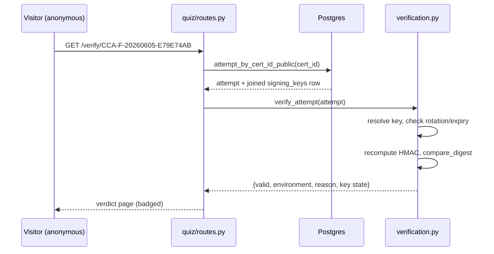
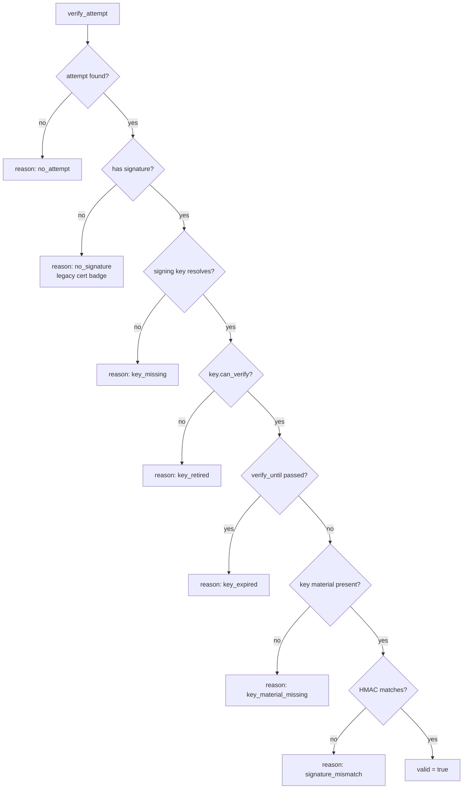

# Verification

A certificate is only worth what a stranger can confirm. The public verifier
lets anyone — a hiring manager, a client, the certificate holder — check an ID
without logging in, and get back a clear verdict: valid, a legacy cert, an
expired key, or a tamper. This page covers the verifier's logic, the rotation
and expiry rules it enforces, and what each verdict looks like to the person
checking.

## Scan box

- **Verification is public and read-only.** `GET /verify/{cert_id}` needs no
  login. It recomputes the HMAC against the stored attempt and renders a
  verdict.
- **The result is structured, not a bare boolean.** `verify_attempt` returns
  validity *plus* environment, key state and a machine-readable `reason`, so
  the page can badge each case correctly.
- **Rotation is honoured.** A rotated-out key still verifies its old certs as
  long as `can_verify` is true and `verify_until` has not passed. A retired or
  expired key refuses, with a reason.
- **Environments are isolated.** A dev cert resolves to the dev key and is
  badged as a dev artefact. It cannot verify against the production key.
- **Legacy certs are handled gracefully.** A pre-signature certificate
  verifies as "legacy" rather than failing outright.

## The public flow

The verifier has two entry points in `quiz/routes.py`: `GET /verify?cert_id=…`
(the form) and `GET /verify/{cert_id}` (a clean shareable URL, the one printed
on the PDF). Both normalise the ID to uppercase, look up the attempt via the
public read path, and render the verdict.



The read path, `storage.attempt_by_cert_id_public`, joins the `signing_keys`
row in the same query so the verifier can reason about the key's rotation
state without a second round-trip. The verdict shows whether the cert was
found, whether the signature is valid, and whether it is a legacy
(pre-signature) certificate.

## The verifier's decision tree

`verification.verify_attempt` is the brain. It returns a dict carrying
`valid`, `environment`, `key_active`, `key_can_verify`, `signing_key_name` and
a `reason` code. The reason is the important field — it tells the page exactly
which badge to render.



Each leaf is a distinct, machine-readable `reason`. The page does not have to
guess why a cert failed — `key_expired` and `signature_mismatch` are
different stories and get different badges.

## Key rotation and expiry

Rotation lets a new key take over signing while old certificates keep
verifying. Two flags on the `signing_keys` row drive it, and the verifier
enforces both:

- **`can_verify`** — whether the key is still accepted on verify. Rotating a
  key out sets the new key `is_active=true` and leaves the old key
  `can_verify=true` so its certs keep checking out. Setting `can_verify=false`
  hard-retires a key; its certs then read `key_retired`.
- **`verify_until`** — a hard deadline. If set and now past, the verifier
  rejects with `key_expired`, regardless of `can_verify`. `NULL` means
  open-ended (the `legacy-prod` row stays `NULL`, so production certs never
  age out by accident).

```text
  Rotation timeline for an environment
  ────────────────────────────────────────────────────────────────
  key A: is_active=true   ──┐
                            │  rotate
  key A: is_active=false  ──┘  can_verify=true, verify_until=+5y
  key B: is_active=true        ← new signer

  Certs signed by A keep verifying until verify_until passes,
  then read "key_expired". Certs signed by B verify normally.
```

:::tip[Agency Tip]
Rotation is a database operation plus an env-var change, not a code deploy.
Insert the new key row as `is_active=true`, set the old one
`is_active=false` (the partial unique index enforces one active key per
environment), give the old one a `verify_until` window, and provide the new
key's material in its env var. Old certificates keep verifying for the whole
window. Schedule the env-var change for a low-traffic hour — see
`07-security-baseline.md` §4 for the session-secret interaction.
:::

## Environment isolation

The verifier resolves the key by the attempt's `signing_key_id`. A
development certificate carries the dev key's FK, so it is verified against
`CERT_HMAC_DEV` and badged as a dev artefact; it can never validate against
the production key. This is what makes the [development watermark](./certificates)
trustworthy end to end — the dev cert is marked on its face *and* the verifier
independently classifies it as non-production from the signed row.

For rows that pre-date the per-environment scheme (a `NULL`
`signing_key_id`), the verifier falls back to the `legacy-prod` key. In
practice the `0005` backfill already pointed every historical row at
`legacy-prod`, so this branch is defence in depth rather than a path that
fires in normal operation.

## What a stranger sees

| Reason | Page tells the visitor | Trust |
| --- | --- | --- |
| (valid) | Found, signature valid, holder + score + date | Genuine credential |
| `no_signature` | Found, legacy certificate | Genuine but pre-dates signing |
| `key_retired` | Found, but the signing key is retired | Treat with caution |
| `key_expired` | Found, but the signing key's window has closed | Out of date |
| `signature_mismatch` | Found, but the signature does not match | **Tampered** |
| `no_attempt` | No certificate with that ID | Not ours |

:::note[Why This Matters]
A forged or altered certificate fails at `signature_mismatch`, because the
attacker cannot recompute the HMAC without the environment's secret, which
never leaves the server's environment. A genuine certificate from an honest
holder always lands on the valid path. The verifier's job is to make those two
outcomes unmistakable to someone who has never logged in and never will — that
is the entire value of the credential outside DEPT®.
:::

## The canary, restated

The verifier is exactly what the no-data-loss canary exercises. The smoke
suite calls `GET /verify/CCA-F-20260605-E79E74AB` and, in strict mode, asserts
the verdict is `valid=true`. That single assertion is the contract that this
verifier, and all the signing changes behind it, never broke a real
certificate. See [Certificates](./certificates) for the guarantee in full.
