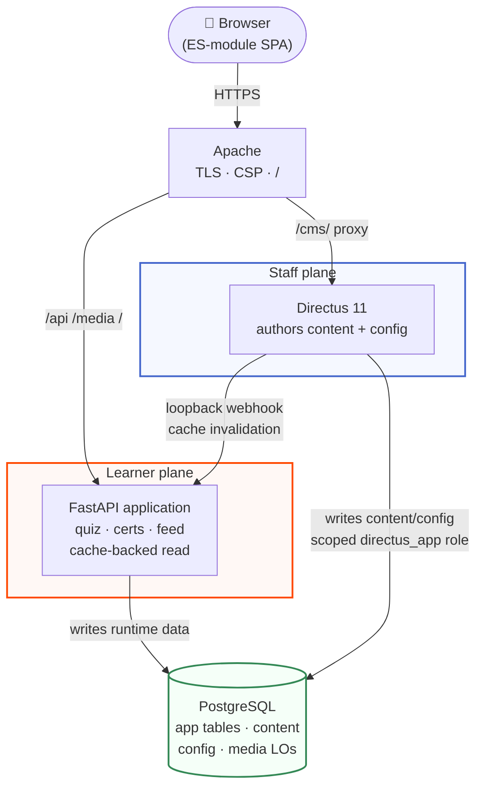

# Tenet — documentation

## Scan box

- **What this is.** The documentation for **Tenet** — DEPT®'s teaching,
  certification and reference platform for the Adobe Experience Cloud practice,
  built on the CODE-CODER framework. ("Anatomy of Code" is the *course* Tenet
  teaches; Tenet is the *platform*.)
- **Three doors.** The docs are organised by who you are: **User** (author
  content), **Admin** (operate the platform), **Developer** (build and extend
  it). Pick your door below.
- **The shape.** A modular-monolith FastAPI application (the learner plane) and
  Directus 11 (the staff write plane) over **one** Postgres, fronted by Apache,
  serving a buildless ES-module SPA. Media lives in Postgres large objects — no
  S3, no object store.
- **How to read it.** Every page leads with a scan box (~30-second read), then
  prose, with diagrams woven through and four callout types — *Why This
  Matters*, *Agency Tip*, *Common Pitfall*, *Before / After*.

Tenet teaches, certifies and references the CODE-CODER framework for DEPT®'s
Adobe Experience Cloud practice. The platform is a clean two-plane system: a
modular-monolith FastAPI application that owns the runtime read API, the quiz and
the signed certificates, and Directus 11 as the editorial write plane — both over
the same `codecoder` Postgres. The browser loads a buildless ES-module
single-page app; Apache terminates TLS and serves it.

## Pick your door

| You are… | Start here | What you'll find |
|---|---|---|
| **A content author** | [User guide](./user/intro) | How to update course content, manage FAQs, post to the feed, upload media, publish runbooks, work with checklists, and refresh the quiz. |
| **An operator / admin** | [Admin guide](./admin/intro) | Users and roles, configuration and credentials, the CMS, database operations, monitoring, quiz administration, and deployment. |
| **A developer** | [Developer guide](./developer/intro) | The two-plane architecture, the buildless SPA components, the data model and migrations, the API reference, builds and local dev, and the quiz internals. |

## The two planes, in one diagram

The FastAPI plane reads content through a cache; it never reaches into Directus
at runtime. Directus writes content and config, then fires a webhook that
invalidates the relevant cache entry. That loopback seam is the whole coexistence
story — told in full in the [Developer guide](./developer/intro) and operated
from the [Admin guide](./admin/intro).

:::tip[Why This Matters]

Tenet's hard design constraint was **no loss of content, data or functionality**:
the v2 cutover preserved every certificate, every question and every byte of
media. These docs record which decision lives where, why it was made, and what
the parity harness protects — so when something looks surprising in the code, the
answer is written down on purpose.

:::

:::note[Agency Tip]

If you are onboarding, read your section's intro end to end, then skim the other
two intros. That is roughly fifteen minutes and leaves you able to place any task
— authoring, operating or building — on the map.

:::
