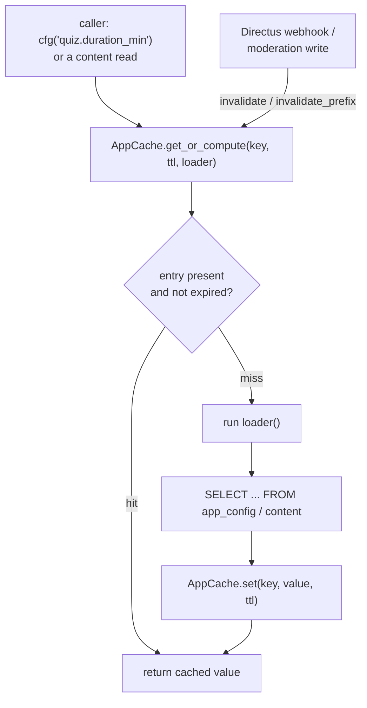

# Caching and performance

## Scan box

- **Three cache layers, distinct jobs.** Apache (`mod_cache`/`mod_deflate`/
  `mod_expires`) handles static and proxy-level caching; the in-process
  `AppCache` caches config and content reads; Postgres tuning underpins both.
- **`AppCache` is one seam, two backends.** Callers use
  `get_or_compute` / `invalidate` / `invalidate_prefix`. The backing store is
  `memory` by default (a dict + `RLock` per worker) or `redis` when
  `CACHE_BACKEND=redis` — swapped behind the facade, no caller changes.
- **Redis degrades gracefully.** If the `redis` package is missing or the server
  is unreachable, the facade logs a warning and falls back to memory. The app
  never fails to boot because Redis is absent.
- **TTLs are tuned per read type.** Framework reads cache for 900s, feed for
  30s, app-config for 60s. The TTL bounds cross-worker drift on the memory
  backend; Redis removes that bound entirely.
- **Writes invalidate precisely.** The Directus webhook and FastAPI moderation
  writes both drop type-scoped keys (`app_config:<key>`, `feed_items:`, …) so
  the next read repopulates from the database.

Caching in v2 is layered: each layer does the job it is best placed to do, and
the layers do not overlap. The design contract is `06-caching-performance.md`;
the `AppCache` seam is the part this page goes deepest on, because it is the
coupling between the editorial plane and the read path.

## The three layers

<pre className="arch-diagram">
{`
   ┌─────────────────────────────────────────────────────────┐
   │  Layer 1 — Apache                                         │
   │  mod_cache / mod_deflate / mod_expires                    │
   │  static assets, SPA bundle, compression, cache headers   │
   └───────────────────────────┬─────────────────────────────┘
                               │ proxy /api/*
                               ▼
   ┌─────────────────────────────────────────────────────────┐
   │  Layer 2 — AppCache  (in-process / Redis)                │
   │  Tier-2 config reads (app_config) + Tier-3 content reads  │
   │  TTL + explicit invalidation                              │
   └───────────────────────────┬─────────────────────────────┘
                               │ cache miss
                               ▼
   ┌─────────────────────────────────────────────────────────┐
   │  Layer 3 — PostgreSQL                                     │
   │  the source of truth; tuned for the read-heavy workload   │
   └─────────────────────────────────────────────────────────┘
`}
</pre>

- **Layer 1 — Apache** owns static and proxy-level caching: the SPA bundle, the
  frozen course artefact, compression, and the cache headers for templated
  pages. `/static/` stays FastAPI-proxied (not an Apache `Alias`) so FastAPI
  owns the cache headers for its templated pages; the standalone SPA at `/app/`
  is the Apache-aliased static surface.
- **Layer 2 — AppCache** is the in-process application cache, the focus below.
- **Layer 3 — PostgreSQL** is the source of truth, tuned for the read-heavy
  course/feed workload.

## The AppCache seam

`AppCache` is a small TTL cache with explicit invalidation, defined in
`backend/app/core/cache.py`. It is the single cache surface for both Tier-2
config reads (via `core.cms_client.cfg`) and Tier-3 content reads. The public
surface is deliberately tiny — `get_or_compute`, `invalidate`,
`invalidate_prefix`, `size`, `keys` — and is byte-for-byte identical across both
backends.

The read-path for a config value walks: cache hit → return; cache miss → run the
loader (a single `SELECT`), cache the *resolved* result, return. The resolved
result includes the compiled-in default fallback, so even a missing-row lookup
is cheap on repeat — and webhook-driven invalidation works the same whether the
value came from a DB row or a default.

### Two backends behind one facade

The backend is chosen at construction from `settings.cache_backend`:

- **`MemoryBackend`** (default) — an in-process `dict` guarded by a
  `threading.RLock`, with lazy expiry checked on read against
  `time.monotonic()`. uvicorn runs one Python process per worker, so each worker
  has its own cache. That is correct because the webhook receiver invalidates
  inside the receiving worker only; the TTL bounds cross-worker drift.
- **`RedisBackend`** (opt-in via `CACHE_BACKEND=redis`) — a shared store keyed
  under the `aoc:` namespace, with TTL enforced by Redis `SET … EX`. A shared
  cache removes the cross-worker drift bound entirely: an invalidation in one
  worker is seen by all.

:::tip[Why This Matters]
The memory backend is correct for a single-worker or low-worker deployment, and
it has zero operational footprint. The moment you scale to several workers and
need an invalidation in one worker to be visible in all of them — which is the
whole point of the Directus webhook — you set `CACHE_BACKEND=redis` and change
nothing else. The seam is the reason that swap is a one-line config change, not
a code change. Choose memory until cross-worker freshness actually matters.
:::

### Redis fails safe

The Redis backend connects *lazily*: the `redis` package is imported and the
client connected on first use, not at construction. If the import fails or the
first ping fails, the backend marks itself dead and the facade falls back to a
`MemoryBackend`, logging a warning. This is what makes a "no Redis installed"
local environment safe — importing the cache module never requires Redis, and
requesting it when it is down degrades rather than crashes.

`/readyz` is aware of this: when `CACHE_BACKEND=redis` is requested but the
active backend has degraded to memory, readiness reports `not_ready`. So a
silent degradation is visible to an operator without being fatal to the process.

## TTLs

The TTLs are tuned per read type, set in `core/config.py`:

| Read type | Setting | Default |
|---|---|---|
| Framework / course structure | `cache_ttl_framework` | 900s |
| Feed | `cache_ttl_feed` | 30s |
| App config (`app_config`) | `cache_ttl_app_config` | 60s |

The framework changes rarely, so it caches long. The feed changes constantly, so
it caches briefly. Config sits in between. On the memory backend the TTL is also
the bound on how stale a non-invalidating worker can get; on Redis the TTL is
purely a freshness window, since invalidation is shared.

## Invalidation: precise, not blunt

The cache is only useful if writes reach it. Two write surfaces invalidate, and
both are type-scoped so a change to one collection never wipes another:

- **Directus edits** fire the loopback webhook (see
  [Directus topology](./directus-topology.md)), which drops
  `app_config:<key>` or `<collection>:<id>` per affected key, or the whole
  collection prefix on a bulk operation.
- **FastAPI moderation writes** land in the FastAPI plane and bypass the Directus
  webhook entirely, so they self-invalidate: a feed action drops `feed_items:`
  and a question action drops `questions:` after the status flip commits. The
  prefixes match the Directus webhook's namespaces exactly, so feed-list, the
  moderation queue, and the quiz pool all stay fresh whichever plane wrote.

:::caution[Common Pitfall]
A write that does not invalidate is worse than no cache — it serves stale data
silently for a full TTL window. When you add a new write path to a cached
collection, the write is not done until it also invalidates the matching key or
prefix. The moderation write is the worked example: it commits the status flip
*and* drops the type-scoped prefix in the same handler. If you cache a new read,
trace every writer of that data and confirm each one invalidates.
:::

## SPA cache-busting

The buildless front-end has no bundler to fingerprint assets, so cache-busting
is handled at the Apache layer through `mod_expires` policy plus explicit cache
headers, with the SPA shell served such that a deploy is picked up without a
hard refresh. The frozen course artefact and the SPA modules are the long-lived
assets; the `/api/*` responses carry the freshness the `AppCache` TTLs decide.
The full Apache policy is the deployment section's concern; from the
architecture view the key fact is that static caching (Layer 1) and data
freshness (Layer 2) are owned separately and do not interfere.
