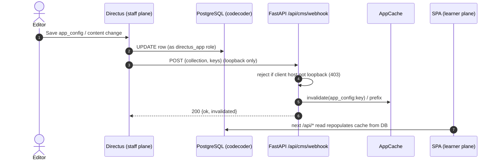

# Directus topology

## Scan box

- **Directus is the staff plane over the same Postgres.** It is a separate Node
  service (`cms/`) that introspects the existing `codecoder` tables and gives
  editors an admin UI, RBAC, asset management, and an audit trail. FastAPI stays
  the learner-facing runtime API.
- **Directus connects as a scoped `directus_app` role.** Alembic migration
  `0008` creates a dedicated Postgres login role with `GRANT`s only on the
  authoring tables and an explicit `REVOKE ALL` on the runtime and audit tables
  (`attempts`, `quiz_sessions`, `signing_keys`, `auth_audit`).
- **The two planes couple only through the cache.** A Directus write fires a
  loopback webhook to `/api/cms/webhook`; FastAPI drops exactly the affected
  cache keys. There is no second datastore and no sync job — the row is already
  shared.
- **Webhook auth is loopback reachability.** The receiver accepts only requests
  whose client host is loopback. No HMAC, no shared secret — Apache `Require ip`
  plus uvicorn binding to `127.0.0.1` is the control.
- **Media is not Directus's.** All app media lives in Postgres large objects and
  is streamed by FastAPI. Directus stores no application media.

Directus 11 is the editorial and configuration **write plane**. The locked
decision (`v2-plan.md`) is "Directus over the existing Postgres" — a separate
service that provides the staff/editor experience over the same database the
runtime API already uses. This is what makes the CMS additive: there is no
content migration, because the content was already in Postgres.

## Service layout

Directus runs as its own process, defined under `cms/` (compose + npm-run +
collections/roles/permissions as code, with a schema snapshot). Apache proxies
`/cms` to it; the learner surfaces (`/app`, `/`, `/api/*`) continue to hit
FastAPI.

<pre className="arch-diagram">
{`
   editor browser ──► Apache /cms ──► Directus (Node, cms/)
                                          │  reads/writes as
                                          │  directus_app role
                                          ▼
                            ┌──────────────────────────────┐
   learner browser ──► Apache /api/* ──► FastAPI ──────────►│  PostgreSQL       │
                                          │  reads as       │  (codecoder)      │
                                          │  app role       │                   │
                                          │                 │  app tables       │
                                          │                 │  directus_* tables│
                                          │  loopback       │  media large objs │
                                          ▼  webhook         └──────────────────┘
                                       AppCache ◄── Directus → /api/cms/webhook
`}
</pre>

Directus also creates and manages its own `directus_*` system tables inside the
same database — the `directus_app` role holds `CREATE`/`USAGE` on the public
schema precisely so it can do that. The application's Alembic `env.py` is
configured to skip the `directus_*` tables, so the two table families coexist
without either tool fighting the other.

## The scoped database role

The DB-level half of the coexistence is Alembic migration `0008`
(`0008_directus_app_role`). Its authority is the "Directus DB-role GRANT table"
in `03-data-model.md §5`. The shape:

- **Schema `public`: `CREATE` + `USAGE`** — Directus needs to manage its own
  `directus_*` system tables.
- **App tables: scoped per the GRANT table** — read-only on the identity and
  reference tables, DML on the authoring and moderation surface, and
  `INSERT`/`UPDATE`-only (no `DELETE`) where row removal must go through a
  migration.
- **Explicit `REVOKE ALL` on the denied set** — `attempts`, `quiz_sessions`,
  `signing_keys`, and `auth_audit`. These are runtime-only, HMAC-sealed, or
  append-only audit tables; they are never editor-mutable, not even `SELECT`.

The migration is additive, reversible, and moves no content. It sets no
password: `CREATE ROLE` without a password leaves the role unable to log in
until the operator configures one out of band, which is the intended posture.
On SQLite (the local smoke suite) the migration is a no-op, since SQLite has no
roles.

:::tip[Why This Matters]
The `directus_app` role is the hard boundary that lets a CMS share a database
with a security-sensitive runtime. An editor with full Directus access still
cannot read a signing key, cannot alter a quiz attempt, and cannot touch the
auth audit trail — because the role they connect as has had those grants
revoked at the database. Application-level permissions can be misconfigured;
a revoked `GRANT` cannot be talked around from inside Directus.
:::

## The webhook contract

The only runtime coupling between the planes is cache invalidation. When an
editor saves a change in Directus, a Directus Flow posts an event to the FastAPI
receiver at `/api/cms/webhook`, and FastAPI drops the affected cache keys so the
next read returns fresh data.

The receiver accepts a payload of the form:

```json
{
  "collection": "app_config" | "course_chapters" | "frameworks"
              | "questions" | "feed_items",
  "keys": ["quiz.duration_min", "..."]
}
```

Invalidation is type-scoped:

- For `app_config`, each key invalidates `app_config:<key>`.
- For the four content collections, each key invalidates `<collection>:<id>`.
- An empty `keys` array invalidates the whole collection prefix
  (`<collection>:`), since Directus may not include keys on bulk operations.
- An unknown collection (for example `directus_files`) returns `ok` and
  invalidates nothing.



## Why webhook auth is loopback, not a secret

The receiver does not verify an HMAC or a shared secret. The control is network
reachability, layered three deep:

1. uvicorn listens on `127.0.0.1`.
2. Apache `<Location "/api/cms/webhook">` is `Require ip 127.0.0.1`.
3. The handler rejects any request whose `request.client.host` is not loopback,
   returning `403` (policy, not credentials).

Because Directus runs on the same host and posts to loopback, nothing outside
the box can reach the endpoint, and there is no secret to rotate or leak. This
is a deliberate simplification appropriate to a single-host deployment.

:::caution[Common Pitfall]
The loopback-only model assumes Directus and FastAPI share a host. If a future
deployment splits them across machines, the webhook control must change — a
cross-host webhook over loopback `Require ip` simply will not arrive, and
loosening the IP check to a private subnet would weaken the control to "anyone
on the network". Treat the single-host assumption as a real constraint, not an
incidental one.
:::

## What Directus does not do

Two boundaries are worth stating explicitly because they are easy to assume
otherwise:

- **Directus is not headless-only and not the read path.** Learners never hit
  Directus. The runtime read API is FastAPI, cache-backed, and Directus's job is
  the *write* side plus the staff UI. The GraphQL/REST surface Directus exposes
  is for editors and tooling, not for the SPA.
- **Directus stores no application media.** All app media — the course video,
  feed images — lives in Postgres large objects and is streamed by FastAPI with
  HTTP Range support. There is no S3, no object store, and no filesystem media
  store. See [Security baseline](./security-baseline.md) for why media access is
  a FastAPI concern.

## Where 4c picks up

The Directus plane is in place and stable, but live course authoring is the one
deferred slice. Today the course renders from the frozen JSON/HTML artefact, so
Directus authors `app_config`, the framework, questions, and feed items — but
not course chapters. The **4c** slice would add an Alembic migration past `0008`
that decomposes the course into relational `course_chapters` tables, after which
Directus can author chapters directly and the frozen artefact retires. The
moderation and permissions contract (from 4b) and the editorial plane (from 4a)
are the substrate 4c builds on; the cache-invalidation seam is already wired.
