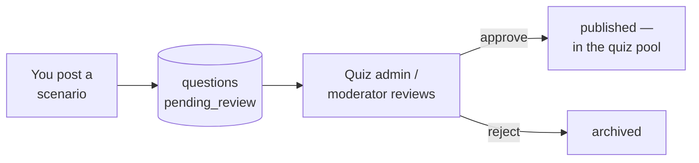

# Create feed posts

The feed is the platform's stream of short, user-generated content — notes,
videos, lists, cards, vocabulary and scenarios. Contributors post to it through
the API (and the SPA's compose surface); moderators review what gets flagged.

## Scan box

- **Posting needs `feed.create`.** That permission is held by the
  `feed_contributor` role. A plain learner can read and flag, but not post.
- **Six post types.** `post`, `video`, `list`, `card`, `vocab` and `scenario`.
  Pick the type that matches your content.
- **Scenarios feed the quiz.** A `scenario` post automatically creates a
  *pending* quiz question for a quiz admin to review — a clever way to grow the
  question bank from real teaching moments.
- **Moderation is a separate role.** `feed_moderator` works a queue of flagged
  and pending items and can approve, flag or remove them.
- **The feed cache is short (30s).** New posts surface almost immediately.

## Steps — create a post

Post to the feed API with your session credentials:

```bash
curl -X POST https://internal.in.deptagency.com/api/feed \
  -H "Content-Type: application/json" \
  --cookie "session=..." \
  -d '{
    "type": "post",
    "title": "Naming branches the DEPT way",
    "body": "A short note on branch naming...",
    "topics": ["git", "workflow"],
    "frameworkRef": "coder.d"
  }'
```

- `type` — one of `post`, `video`, `list`, `card`, `vocab`, `scenario`.
- `title`, `body` — your content.
- `topics` — tags for filtering.
- `frameworkRef` — optional CODE-CODER anchor (e.g. `coder.d`).

For a **video** post, [upload the media first](./uploading-media) and reference
the returned asset URL in the post body/payload.

## Posting a scenario (and growing the quiz)

When you post `type: "scenario"`, the platform creates a matching quiz question
with status `pending_review`. It does not go live in the quiz until a quiz admin
approves it.



## Moderation (feed_moderator)

If you hold `feed_moderator`:

1. `GET /api/moderate/queue` — see flagged and pending items.
2. `POST /api/moderate/action` with `{ item_type, item_id, action }` where
   `action` is `approve`, `flag` or `remove`.

| Action | Endpoint | Permission |
|---|---|---|
| Read the feed | `GET /api/feed` | (any signed-in user) |
| Create a post | `POST /api/feed` | `feed.create` |
| Flag a post | `POST /api/feed/flag` | `feed.flag` |
| View moderation queue | `GET /api/moderate/queue` | `moderate.view` |
| Approve / flag / remove | `POST /api/moderate/action` | `moderate.action` |

:::caution[Common Pitfall]

A scenario post does **not** appear in the quiz the moment you publish it. It is
created as `pending_review` and must be approved by a quiz admin. If you are
testing the quiz pipeline, ask an admin to approve the question — see
[Refresh the quiz](./refreshing-the-quiz).

:::

:::note[Agency Tip]

Keep posts short and anchor them to the framework with `frameworkRef`. Feed items
tagged to a CODE-CODER node are far more discoverable than untagged notes, and
they reinforce the framework learners are being certified on.

:::
