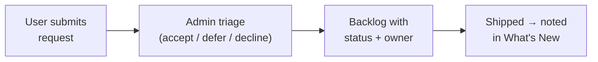

# Feature requests

:::caution[Coming soon — not yet available]

The in-platform feature-request flow is **planned and not yet shipped**. This
page documents the intent so the team knows what is coming and how to ask for
things in the meantime. There is no feature-request endpoint or collection
today — do not link to one.

:::

## Scan box

- **Status: pending.** No feature-request capability exists in the platform yet.
- **The plan.** A lightweight, in-platform way to submit, track and triage
  requests for new content types, runbook domains, quiz capabilities and SPA
  improvements.
- **For now, use your existing channel.** Raise requests through your team's
  current process (the internal tracker / your DEPT® lead) until this ships.

## What is planned

The intended flow lets any signed-in user submit a request, have it triaged by
an admin, and follow its status — without leaving the platform.

Likely shape (subject to change):

- A **request** has a title, description, category (content / runbook / quiz /
  platform) and a submitter.
- Admins triage and set a status (`new`, `accepted`, `in-progress`, `shipped`,
  `declined`).
- Shipped requests surface in the **What's New** feed.

## In the meantime

Until this lands, send feature requests through your normal channel:

- A new **runbook domain** (e.g. manufacturing, healthcare) → ask a content
  author / platform admin; runbooks are already live, so this may just need a
  spreadsheet (see [Publish runbooks](./publishing-runbooks)).
- A new **FAQ category** → a content author can add it now (see
  [Manage FAQs](./managing-faqs)).
- A genuinely **new capability** (new content type, new mode, new integration) →
  raise it with your DEPT® lead for the backlog.

:::note[Agency Tip]

A surprising number of "feature requests" are already possible today through the
existing authoring tools — a new runbook, a new FAQ category, a new feed series.
Check the relevant User-guide page first; you may not need to wait for anything.

:::
