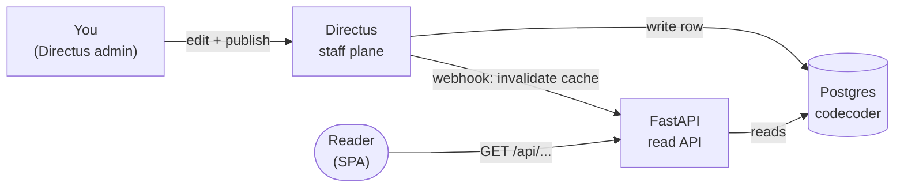

# User guide

This is the task-shaped half of the Tenet documentation — written for the
people who put content into the platform rather than the people who build or
operate it. If you author course material, curate FAQs, post to the feed,
upload media or publish a runbook, start here.

## Scan box

- **You work through Directus, not the code.** Almost every authoring task is
  a change in the Directus admin (the staff write plane). You edit a
  collection; Tenet picks the change up and serves it. You never deploy.
- **Postgres is the source of truth; Directus writes it; FastAPI reads it.**
  When you publish in Directus, a webhook clears the relevant cache and the
  change is live within seconds — no rebuild, no release.
- **Permissions decide what you can touch.** Authoring is gated by role:
  `content_author` for course/FAQ/runbook content, `feed_contributor` for the
  feed, `quiz_admin` for the question bank. Ask a platform admin if a
  collection is missing from your Directus.
- **Each guide is a recipe.** Every page leads with a scan box, then gives you
  the numbered steps, the exact collection or endpoint, and the pitfalls.
- **Two features are still on the way.** *Feature requests* and the *content
  scheduler* are planned, not yet shipped — their pages say so plainly.

## Pick your task

| I want to… | Go to |
|---|---|
| Edit a course chapter or the framework | [Update course content](./updating-course-content) |
| Add or revise an FAQ | [Manage FAQs](./managing-faqs) |
| Post to the feed (note, video, scenario) | [Create feed posts](./creating-feed-posts) |
| Upload a video or image | [Upload media](./uploading-media) |
| Publish a role/domain runbook from a spreadsheet | [Publish runbooks](./publishing-runbooks) |
| Use or update the discovery checklist | [Discovery checklists](./discovery-checklists) |
| Make the quiz reflect new content | [Refresh the quiz](./refreshing-the-quiz) |
| Ask for a new capability | [Feature requests](./feature-requests) *(coming soon)* |

## How publishing actually works

You do not push files. You edit a Directus collection and hit save. Directus
writes the row to the shared `codecoder` Postgres database and fires a
loopback webhook at the FastAPI application, which clears just the cache entry
that changed. The next reader gets the new content.

:::note[Agency Tip]

If a change does not appear, it is almost always one of three things: you saved
a **draft** instead of **published**, you edited the wrong **environment's**
Directus, or your browser cached the page. Hard-refresh first, then check the
status field.

:::

:::tip[Why This Matters]

The whole point of the write plane is that content people move at content speed.
You are not blocked on an engineer or a deployment to fix a typo, add an FAQ or
ship a new runbook. The platform is built so that the slow, risky parts
(schema, code, infrastructure) stay with the developers and admins, while the
fast, frequent parts (words, media, questions) stay with you.

:::
