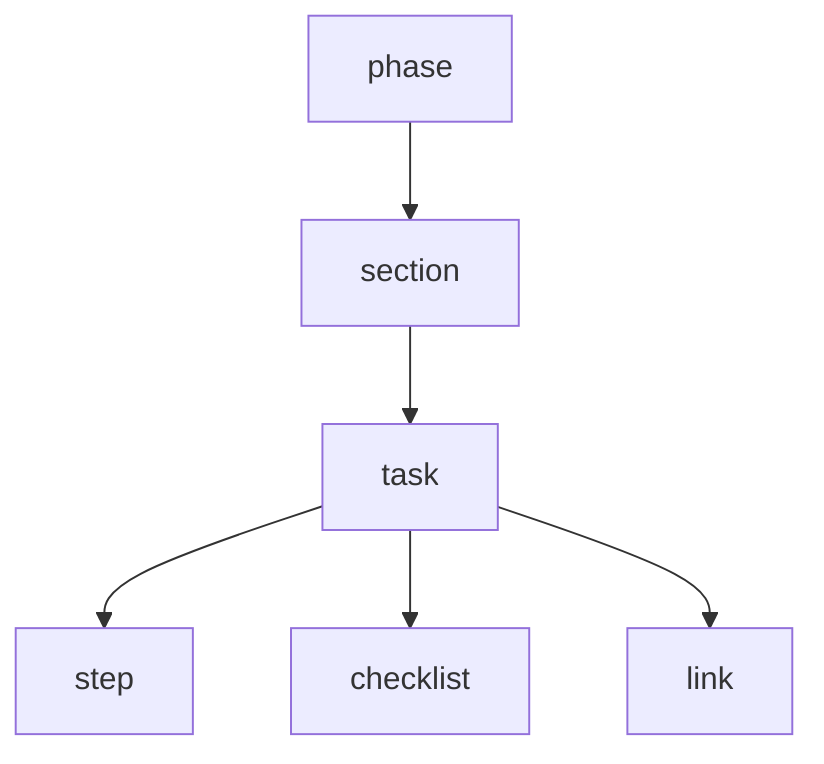

# Publish runbooks

Runbooks are role- and domain-specific playbooks — an architect's runbook, a
commerce runbook, a banking/BFSI runbook, and so on. A team fills in a
spreadsheet, uploads it, and the platform turns it into a structured runbook
with its own URL.

## Scan box

- **You author in a spreadsheet, not in code.** Download the template, fill the
  two sheets, upload the `.xlsx`. The platform parses it into a phase → section
  → task tree.
- **Two sheets.** *Runbook* holds the metadata (slug, title, role, domain, type,
  status); *Content* holds the hierarchy, one row per item, driven by a `type`
  column.
- **Upload needs `content.write`.** Held by `content_author`. Reading runbooks
  is public.
- **Upsert on slug.** Re-uploading a spreadsheet with the same `slug` updates
  the existing runbook — that is how you revise one.
- **Where it shows up.** Published runbooks are listed on the Runbooks landing
  page at `/resources/runbooks/` (the short URL `/runbook` redirects there); the
  data is also available from the API.

## Step 1 — download the template

```bash
curl -O https://internal.in.deptagency.com/api/runbooks/template
```

This gives you `runbook-template.xlsx` with three sheets: **Runbook**,
**Content** and a **Legend** that explains every `type`.

## Step 2 — fill the spreadsheet

**Runbook sheet** — metadata as key/value rows:

| Key | Example |
|---|---|
| Slug | `commerce-greenfield` |
| Title | Commerce architect runbook |
| Role | `architect` |
| Domain | `ecommerce` |
| Type | `greenfield` or `brownfield` |
| Description | One-line summary |
| Status | `draft` or `published` |

**Content sheet** — one row per item, with columns
`type | title | description | owner | tools | timing | url | notes`. The `type`
column drives the hierarchy:

| `type` | What it is |
|---|---|
| `phase` | Top-level stage |
| `section` | A group within a phase |
| `task` | A unit of work within a section |
| `step` | A step inside the current task |
| `checklist` | A checklist item on the current task |
| `link` | A reference link on the current task (put the URL in `url`) |

Rows nest under the most recent parent above them — a `step` attaches to the
task above it, a `task` to the section above it, and so on.



## Step 3 — upload

```bash
curl -X POST "https://internal.in.deptagency.com/api/runbooks/upload?publish=true" \
  --cookie "session=..." \
  -F "file=@runbook-template.xlsx"
```

- `publish=true` publishes immediately; omit or set `false` to keep it a draft.
- The parser validates the slug (lowercase, alphanumeric, hyphens), the role and
  the type, then upserts on `slug`.

## Step 4 — read it

```bash
curl -s https://internal.in.deptagency.com/api/runbooks                 # published list
curl -s https://internal.in.deptagency.com/api/runbooks/commerce-greenfield  # one runbook
```

Or open the Runbooks landing page at **`/resources/runbooks/`** (or just
`/runbook`, which redirects there) and browse from there.

## Metadata can be edited in Directus

The runbook's metadata (title, description, role, domain, status) is also
editable in Directus under **runbooks**. The `phases` tree itself is *read-only*
in Directus — it is built from the spreadsheet and changed only by re-uploading.

:::caution[Common Pitfall]

An orphan `step`, `checklist` or `link` row — one that appears before any `task`
— is silently skipped, because it has nothing to attach to. If items are missing
from your published runbook, check that every `step`/`checklist`/`link` sits
below a `task` row in the Content sheet.

:::

:::note[Agency Tip]

To revise a live runbook, edit the **same** spreadsheet and re-upload it with the
**same slug**. The upsert replaces the content in place, keeping the URL stable.
Keep the source `.xlsx` in your team drive so revisions are easy.

:::
