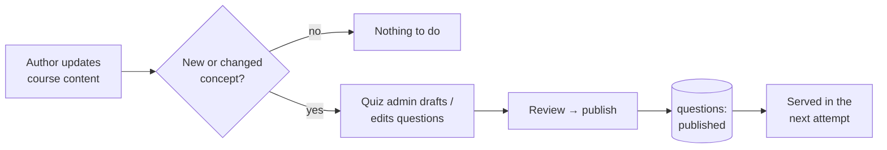

# Refresh the quiz after a content change

When you update course content, the certification quiz does **not** change by
itself. The question bank is curated separately, on purpose. This page explains
what to do after a content refresh so the quiz keeps pace with the course.

## Scan box

- **Content and questions are decoupled.** Editing a chapter does not add,
  remove or rewrite any quiz question. There is no automatic regeneration.
- **A quiz admin curates the bank.** Questions are created and edited via
  `POST /api/admin/questions` (permission `question.write`, role `quiz_admin`)
  or directly in the Directus `questions` collection.
- **Only `published` questions are served.** Questions move
  `draft`/`pending_review` → `published` before they appear in an attempt.
- **Scenarios from the feed feed the bank.** A `scenario` feed post creates a
  `pending_review` question automatically — approve it to add it to the pool.
- **The quiz samples live at attempt time.** There is nothing to "rebuild";
  once a question is `published`, the next attempt can draw it.

## The workflow



## Steps — for the content author

1. Make your content change (see [Update course content](./updating-course-content)).
2. Decide whether it introduced a **new architectural concept** or materially
   changed an existing one. Typos, formatting and copy polish do **not** need a
   quiz change.
3. If it did, flag it to a quiz admin (or draft questions yourself if you hold
   `question.write`). In this project the **q0** workflow drafts candidate
   questions when new sections or concepts land — those drafts are then reviewed
   by a human before publishing.

## Steps — for the quiz admin

1. Create or edit questions:

   ```bash
   curl -X POST https://internal.in.deptagency.com/api/admin/questions \
     --cookie "session=..." \
     -H "Content-Type: application/json" \
     -d '{ "topic": "...", "difficulty": "...", "question": "...",
           "options": ["...","...","...","..."], "correct_index": 2,
           "explanation": "...", "status": "published" }'
   ```

   …or edit the **questions** collection in Directus.
2. Approve any `pending_review` questions (including scenario-sourced ones) via
   the moderation action, then set status to `published`.
3. That's it — the next attempt samples from the updated published pool.

:::note[Agency Tip]

Keep new questions as `draft` until the matching content is itself published.
Shipping a question for a concept that isn't live yet means learners can be asked
about something they could not have read.

:::

:::caution[Common Pitfall]

There is no "regenerate quiz from content" button — and that is deliberate.
Auto-generated questions drift from what the course actually teaches and from the
difficulty calibration the bank is tuned for. Curate deliberately. For the admin
side of the bank, see [Quiz administration](../admin/quiz-administration).

:::
