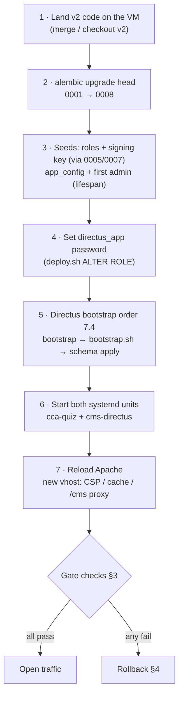

# v2 — Cutover plan (promote v2 to production)

> Status: **Cutover runbook · Phase 5.** Branch `v2`. The plan to take the
> sealed v2 state (phases 0–4b, smoke 15/15, Alembic head `0008`) onto the
> production VM and open traffic — with concrete gate checks and a fast,
> rehearsed rollback.
> Owner: cutover engineer. Audience: the on-call engineer running the promote.

This document is the **order of operations**, not a re-statement of the deploy
mechanics. The mechanics live in `deploy.sh` (the installer) and
`docs/RUNBOOK.md` (day-two operations). This plan tells you *when* to run each
of them, *what must be true first*, and *how to know it worked* — and it points
at the exact `deploy.sh` step and RUNBOOK section for the detail.

Read it once end-to-end before the window opens. There are two go/no-go gates:
one before you cut over (pre-flight), one before you open traffic (gate checks).
Either gate failing is a stop.

---

## 0 · Scan box

- **What:** the ordered runbook to promote the v2 branch — modular-monolith
  FastAPI app (`cca-quiz`) + Directus editorial plane (`cms-directus`) over one
  `codecoder` Postgres — onto the production VM, then open traffic.
- **Why:** v2 changes the database shape (Alembic `0001`→`0008`), adds a second
  writer (Directus over the scoped `directus_app` role), and moves media into
  Postgres large objects. A wrong order at cutover breaks the stand-up; a
  missed backup makes rollback slow. This plan makes both safe.
- **So what:** follow the four phases below — pre-flight, cutover, gate checks,
  rollback-or-go. Do **not** open traffic until every gate check passes. The
  cert canary `CCA-F-20260605-E79E74AB` verifying post-restore and post-cutover
  is the single load-bearing acceptance signal — it proves no learner lost a
  certificate.
- **Reversible by design:** the v2 migrations are additive (`0008` is a role +
  GRANTs; the new tables carry no destructive drops in the shipped chain), so
  rollback is an Apache vhost swap + service restart, with the `pg_dump` restore
  held in reserve only if data integrity is in doubt.

:::note[Why This Matters]
The two things that make a v2 cutover different from a routine `deploy.sh
--update` are (1) the **strict Directus bootstrap order** — Alembic `0008`
*before* `directus bootstrap` *before* `cms/bootstrap.sh` *before* `schema
apply` (RUNBOOK §7.4) — and (2) **media now lives in Postgres**, so the backup
must include large objects (`pg_dump --large-objects`) or a restore silently
drops every video and image. Get those two right and the rest is a normal
deploy.
:::

---

## 1 · Pre-cutover (pre-flight gate)

Everything in this section happens **before** you touch the running deploy.
Nothing here changes production. The gate is: all eight checks green, or stop.

### 1.1 Take a recoverable backup (large objects included)

The media bytes live in `pg_largeobject`. A plain `pg_dump` drops them. Use the
custom-format dump with `--large-objects` exactly as RUNBOOK §1.1 specifies:

```bash
sudo -u postgres pg_dump \
    --format=custom \
    --large-objects \
    --file=/var/backups/cca-precutover-$(date +%F).dump \
    codecoder
```

Verify the dump is non-trivial in size (media makes it large) and record the
path. This is your rollback restore source — see §4.3.

### 1.2 Snapshot the current production deploy

So rollback is a swap, not a rebuild, capture the *current* live state before
you change it:

- Copy the live Apache vhost aside: `cp /etc/httpd/conf.d/cca-quiz.conf
  /etc/httpd/conf.d/cca-quiz.conf.precutover` (Debian: the `apache2`
  `sites-available` equivalent). This is the file you symlink/restore back to in
  §4.1.
- Record the current `cca-quiz` code revision (`git -C /opt/dept-anatomy/backend
  rev-parse HEAD` or the deployed tag) so you know exactly what "previous" means.
- Record current `alembic current` so you know the pre-cutover schema head.

### 1.3 Record the cert canary verifying PRE-cutover

Before anything changes, confirm the canary already verifies on the live system.
This is the baseline the post-cutover gate (§3) must match:

```bash
curl -s https://<prod-host>/verify/CCA-F-20260605-E79E74AB | grep -i '"valid"'
# expect: "valid": true   (strict)
```

If the canary does **not** verify pre-cutover, stop — that is a pre-existing
data problem, not a cutover decision.

### 1.4 Freeze window

Announce a maintenance window. No content edits via Directus, no quiz submissions
expected. In-flight quizzes use the in-memory `_active_quizzes` map (single
worker, `QUIZ_WORKERS=1`) and will be lost on restart — the freeze keeps that to
zero.

### 1.5 Confirm Node 22 on the VM

Directus needs a supported Node LTS (18/20/22). **System Node 25 is broken on
the build box and is unsupported by Directus** — the VM must present Node 18/20/22
to the `cms-directus` ExecStart. Confirm:

```bash
sudo -u directus node --version    # must be 18.x / 20.x / 22.x
```

If it is not, pin one before cutover (RUNBOOK §7.2 — nodesource or an nvm
override on the service unit). Do not start Directus on an unsupported major.

### 1.6 Confirm the real secrets are present (fail-closed will refuse boot otherwise)

`validate_for_env()` (`backend/app/core/config.py`) **refuses to boot** in a
non-development env if any secret still carries a dev default or `ALLOWED_DOMAIN`
is empty. Confirm, in the production `backend/.env`:

- `SECRET_KEY` — real, not `dev-secret-CHANGE-IN-PROD-…`.
- `APP_PAYLOAD_SECRET` — real, not the dev marker.
- `CERT_HMAC_LEGACY` — set to the **existing production HMAC key** so already-issued
  certificates (the canary among them) keep verifying. This is the value `0005`'s
  `legacy-prod` signing-key row reads via its `env_var_name`.
- Google SSO: `GOOGLE_CLIENT_ID` / `GOOGLE_CLIENT_SECRET`, `ALLOWED_DOMAIN`.

And in `cms/.env`:

- `KEY` / `SECRET`, `ADMIN_EMAIL` / `ADMIN_PASSWORD` (break-glass admin),
  `DB_PASSWORD` for `directus_app`, Google SSO client id/secret with
  `AUTH_GOOGLE_ALLOW_PUBLIC_REGISTRATION=false` and `ALLOW_LIST=deptagency.com`.

:::caution[Common Pitfall]
Leaving `CERT_HMAC_LEGACY` unset (or wrong) is the one secret mistake that does
not fail the boot but **does** fail the cutover: the app starts, but the legacy
prod certificates stop verifying because the HMAC no longer matches. The §3
canary check exists precisely to catch this before traffic opens. Set it from
the existing production key, not a fresh one.
:::

### 1.7 Pre-flight gate

```
┌─ PRE-FLIGHT GATE (all must be GREEN) ───────────────────────────┐
│ [ ] pg_dump --large-objects taken, path recorded               │
│ [ ] live Apache vhost copied aside (rollback target)           │
│ [ ] previous code rev + alembic current recorded               │
│ [ ] cert canary verifies PRE-cutover (baseline)                │
│ [ ] freeze window announced                                    │
│ [ ] VM presents Node 18/20/22 to cms-directus                  │
│ [ ] real SECRET_KEY / APP_PAYLOAD_SECRET / CERT_HMAC_LEGACY    │
│     / Google / Directus secrets present                        │
└─────────────────────────────────────────────────────────────────┘
```

Any box unchecked → **do not proceed**.

---

## 2 · Cutover steps (ordered)

Run these in order. Each step names the `deploy.sh` mechanism and the RUNBOOK
section that documents it in depth; this plan owns the *sequence*, not the
internals.



### Step 1 — Land the v2 code

Merge `v2` to the deployment branch / tag, then on the VM put the code in place.
For a box already running an older build, `sudo ./deploy.sh --update` syncs code
and restarts services; for a fresh box, run the full `sudo ./deploy.sh`. The
installer is idempotent and re-runnable.

### Step 2 — Migrate the schema (`0001` → `0008`)

Schema evolution is owned by Alembic, **not** by app startup (`init_db()` only
creates missing tables as a dev convenience). Run the chain from `backend/`:

```bash
cd /opt/dept-anatomy/backend && .venv/bin/alembic upgrade head
```

This applies the full shipped chain: `0001` baseline → `0002` reconcile →
`0003` new tables (`quiz_sessions`, `roles`/`user_roles`, `signing_keys`,
`app_config`, `media_assets`) → `0004` columns → `0005` **seed roles + the
`legacy-prod` signing-key row** → `0006` large-object cleanup trigger → `0007`
**seed non-prod signing keys** → `0008` **create the scoped `directus_app`
role + GRANT/REVOKE**. End state: `alembic current` = `0008_directus_app_role
(head)`. This must run **before** any Directus step (RUNBOOK §7.4 step 1).

### Step 3 — Seeds

Most seeding is inside the migration chain from step 2: `0005` seeds the six
roles and the `legacy-prod` signing key; `0007` seeds the dev/stg signing keys.
The remaining two seed paths run when the app boots:

- **`app_config`** registry rows — seeded by the app on first boot (the config
  registry, incl. the load-bearing `pass_mark_correct`).
- **First admin** — `ensure_first_admin()` runs in the FastAPI lifespan and is
  non-fatal if it raises (startup continues), so it does not block boot.

No separate manual seed command is required beyond `alembic upgrade head` + a
clean app start.

### Step 4 — Set the `directus_app` password

The role itself is created by `0008` (step 2). `deploy.sh` only sets its
password — an idempotent `ALTER ROLE … WITH LOGIN PASSWORD …` — and persists it
into `cms/.env` as `DB_PASSWORD`. If `0008` has not run, `deploy.sh` warns and
skips; that is why step 2 precedes this.

### Step 5 — Directus bootstrap (strict order — RUNBOOK §7.4)

`deploy.sh` runs steps 2–4 of the §7.4 order for you, in this exact sequence:

1. `npx directus bootstrap` — creates the `directus_*` system tables + the
   break-glass admin from `ADMIN_EMAIL`/`ADMIN_PASSWORD`.
2. `cms/bootstrap.sh` — wires the staff roles, the per-collection permissions
   (the C/R/U/D matrices in `05 §3`), and the **loopback cache-invalidation
   webhooks** (each content table → `http://127.0.0.1:<FASTAPI_PORT>/api/cms/webhook`).
3. `npx directus schema apply ./snapshot.yaml` — applies the introspected
   collection schema (interfaces, validations, field groups) over the existing
   tables.

Re-running any of 2–4 is idempotent.

:::caution[Common Pitfall]
Running `directus bootstrap` before Alembic `0008` (or before the
`directus_app` password is set) stands Directus up against a role that cannot
write the content tables, or no role at all — the stand-up fails or comes up
read-broken. The order in step 2 → step 4 → step 5 is not advisory; it is the
dependency chain. If a hand stand-up goes wrong, the fix is almost always
"run `alembic upgrade head` first".
:::

### Step 6 — Install + start both systemd units

`deploy.sh` writes and enables two units:

- **`cca-quiz`** — the FastAPI app under uvicorn. **`QUIZ_WORKERS=1` is
  load-bearing** — the quiz session map is in-process; more than one worker
  404s `/quiz/submit` for sessions pinned to another worker. Do not raise it.
- **`cms-directus`** — Directus (systemd + npm by default; Docker Compose is the
  documented alternative, RUNBOOK §7.1).

Both units carry the hardened sandbox (NoNewPrivileges, PrivateTmp,
ProtectSystem, SystemCallFilter, nologin app user).

### Step 7 — Reload Apache (new vhost)

`deploy.sh` writes the vhost and reloads Apache. The new vhost ships: TLS
1.2/1.3 + HSTS (`max-age=31536000; includeSubDomains`), the CSP profiles
(**Report-Only by default — see §5 and the security carry-over**), the cache
matrix (`/media/` `max-age=86400, must-revalidate`), gzip/HTTP2, the `/cms/`
reverse proxy, and the webhook guard `<Location "/api/cms/webhook"> Require ip
127.0.0.1 ::1`. Confirm config validity before the reload (`httpd -t` / `apache2ctl
-t`) — `deploy.sh` does this for you.

---

## 3 · Gate checks (must pass before opening traffic)

This is the second go/no-go gate. Run every check against the **production**
host. Any failure → rollback (§4), not "push through".

```
┌─ TRAFFIC GATE (all must PASS) ──────────────────────────────────┐
│ [ ] smoke.sh against prod ............ 15/15                    │
│ [ ] cert canary CCA-F-20260605-E79E74AB verifies (strict)      │
│ [ ] check-frontend-imports.py ........ 98/98 resolve           │
│ [ ] Directus /server/health .......... ok                      │
│ [ ] directus_app isolation ........... 4 runtime tables denied │
│ [ ] /healthz + /readyz ............... 200 / db:ok             │
│ [ ] moderator flow ................... role-gated, works       │
│ [ ] SSO login flow ................... Google, domain-gated    │
└─────────────────────────────────────────────────────────────────┘
```

### 3.1 Smoke

```bash
QUIZ_BASE_URL=https://<prod-host> bash tests/baseline/smoke.sh --no-spawn
```

Expect **15/15 PASS**. Run with `SMOKE_REAL_CERT_CHECK=1` so the strict cert
canary is part of the smoke run.

### 3.2 Cert canary (the load-bearing acceptance signal)

```bash
curl -s https://<prod-host>/verify/CCA-F-20260605-E79E74AB | grep -i '"valid"'
# expect: "valid": true   (strict)
```

This must match the §1.3 pre-cutover baseline. It proves the HMAC chain
(`CERT_HMAC_LEGACY` → `legacy-prod` signing key → `attempts.signing_key_id`)
survived the cutover and **no learner lost a certificate**.

### 3.3 Front-end imports

```bash
python tests/baseline/check-frontend-imports.py    # expect 98/98 resolve
```

### 3.4 Directus health

```bash
curl -s http://127.0.0.1:8055/server/health        # or via the /cms/ proxy
# expect: {"status":"ok"}
```

### 3.5 `directus_app` isolation

Confirm the four runtime/audit tables are hard-denied to `directus_app` and the
content tables are readable. As the superuser:

```bash
# Denied (expect 'f' / permission denied) for each:
#   attempts, quiz_sessions, signing_keys, auth_audit
# Readable (expect 't') for e.g. course_chapters, app_config.
sudo -u postgres psql codecoder -c \
  "SELECT has_table_privilege('directus_app','attempts','SELECT')"      # f
sudo -u postgres psql codecoder -c \
  "SELECT has_table_privilege('directus_app','course_chapters','SELECT')"  # t
```

### 3.6 Health + readiness

```bash
curl -s https://<prod-host>/healthz   # 200 {status:ok, version:v2}
curl -s https://<prod-host>/readyz    # 200 {status:ok, checks:{db:ok,...}}
```

### 3.7 Moderator + SSO flows

- **SSO:** complete a Google login from a `@deptagency.com` account; confirm a
  non-domain account is refused (fail-closed domain enforcement).
- **Moderator:** as a `feed_moderator`, confirm the moderation view loads and an
  approve/flag/remove action succeeds; as a plain learner, confirm it is
  role-gated off (403 / hidden).

---

## 4 · Rollback (fast, rehearsed)

Rollback is **two cheap steps first** (vhost swap + service restart) and a
**restore only if data integrity is in doubt**. Because the v2 migrations are
additive — `0008` is a role + GRANTs, the new tables carry no destructive drops
in the shipped chain — you rarely need the database restore. Decide in this
order:

### 4.1 Apache vhost swap (always the first move)

Point Apache back at the pre-cutover vhost you copied aside in §1.2 and reload:

```bash
cp /etc/httpd/conf.d/cca-quiz.conf.precutover /etc/httpd/conf.d/cca-quiz.conf
httpd -t && systemctl reload httpd        # Debian: apache2ctl -t && systemctl reload apache2
```

This restores the previous routing/headers in seconds without touching data.

### 4.2 Restart services on the previous code (if the app itself is the problem)

Check out the previous code revision recorded in §1.2 and restart:

```bash
git -C /opt/dept-anatomy/backend checkout <previous-rev>
systemctl restart cca-quiz
systemctl stop cms-directus   # if Directus is the failure, take it out of the path
```

The previous build runs against the **same** Postgres — the additive v2 schema
is backward-compatible with the v1 app for the runtime tables it reads.

### 4.3 Database restore (only if data integrity is in doubt)

If — and only if — the data itself is suspect, restore the §1.1 dump into a
**scratch** database first, validate, then cut over. Never restore over the live
`codecoder` blind:

```bash
sudo -u postgres createdb codecoder_rollback
sudo -u postgres pg_restore --dbname=codecoder_rollback \
    /var/backups/cca-precutover-$(date +%F).dump
# validate, incl. the cert canary against the restored data (RUNBOOK §1.2),
# THEN promote the scratch DB per RUNBOOK §1.2.
```

The dump includes large objects (§1.1), so media restores with it. Use the cert
canary as the restore acceptance check exactly as RUNBOOK §1.2 prescribes.

:::note[Why This Matters]
The migrations being additive is what makes rollback a *vhost swap*, not a
*restore*. `0008`'s role and GRANTs can be left in place harmlessly under the
old app (the old app does not connect as `directus_app`), and the new tables are
simply unused by v1. So the default rollback path touches no data and completes
in under a minute. The `pg_dump` is the insurance you almost never cash in.
:::

---

## 5 · Post-cutover

### 5.1 Monitoring (first hours)

Watch `cca-quiz` and `cms-directus` journals, the `/healthz`/`/readyz`
endpoints, the slow-query log (RUNBOOK §2), and the request-id-correlated
structured logs. Confirm the cache is serving (the read API is cache-backed;
invalidation fires on Directus publish via the loopback webhook).

### 5.2 Pin Node 22

Record the Node major the `cms-directus` unit runs on and pin it (RUNBOOK §7.2).
**System Node 25 is broken** and unsupported by Directus — a surprise Node
upgrade on the box must not be allowed to take Directus to an unsupported major.

### 5.3 CSP Report-Only → enforce flip (release-gate item)

The vhost ships CSP **Report-Only** by default (`CSP_ENFORCE=0`). That means the
browser does **not** enforce `script-src`/`object-src` yet — XSS containment
rests on the SPA's `esc()` discipline until the flip. The timeline:

1. **Land the `/csp/report` endpoint first.** Today the `Report-To` header points
   at `/csp/report`, which has no handler — violation reports 404 and are lost,
   so the soak gathers no data. This is security finding **V2-F-02** and a
   must-fix before the soak is meaningful.
2. **Soak in Report-Only**, collect violations, prove the allow-list is clean.
3. **Flip to enforce:** re-run `deploy.sh` with `CSP_ENFORCE=1`. Treat this as a
   release-gate checklist item, not an indefinite opt-in (security finding
   V2-F-01).

### 5.4 Backups schedule

Resume the nightly `pg_dump --large-objects` (90-day retention, weekly `age`-
encrypted offsite copy), the `cms/uploads/` tar (Directus-internal files only —
app media is in Postgres), the quarterly restore drill with the cert canary as
acceptance, and the nightly `vacuumlo` large-object cleanup (RUNBOOK §1, §5,
§7.6).

:::tip[Agency Tip]
The first quarterly restore drill after cutover is worth running early — within
the first fortnight, not at the quarter boundary. It is the only check that
proves the *new* large-object-bearing backup actually round-trips media, and it
is far cheaper to discover a backup gap in week two than in a real incident.
:::

---

## 6 · References (do not duplicate — point at the source)

| Need | Source |
|---|---|
| Installer mechanics, vhost, systemd units, idempotency, `--update` | `deploy.sh` |
| Backup/restore, slow-query log, key rotation, cache switch, `vacuumlo`, Directus stand-up + bootstrap order, `directus_app` rotation | `docs/RUNBOOK.md` |
| Schema, Alembic chain, Directus coexistence, media-as-large-objects | `docs/architecture/v2/03-data-model.md` |
| Config tiers, the `app_config` registry, the webhook cache-invalidation seam | `docs/architecture/v2/05-config-cms.md` |
| Cache profiles, the `CACHE_BACKEND=redis` switch, Apache cache matrix | `docs/architecture/v2/06-caching-performance.md` |
| Security posture, CSP profiles, header ownership, fail-closed startup | `docs/architecture/v2/07-security-baseline.md` |
| Cutover readiness, the security must-fix list, parity result | `docs/architecture/v2/phase-5-report.md` |

The single rule that overrides any older text: **media lives in Postgres large
objects only — no S3, no object store, no filesystem media store.** Where an
older RUNBOOK line still mentions an "S3 flip", it is superseded by the
owner decision of 2026-06-06 (RUNBOOK §7.5 records the final state).
