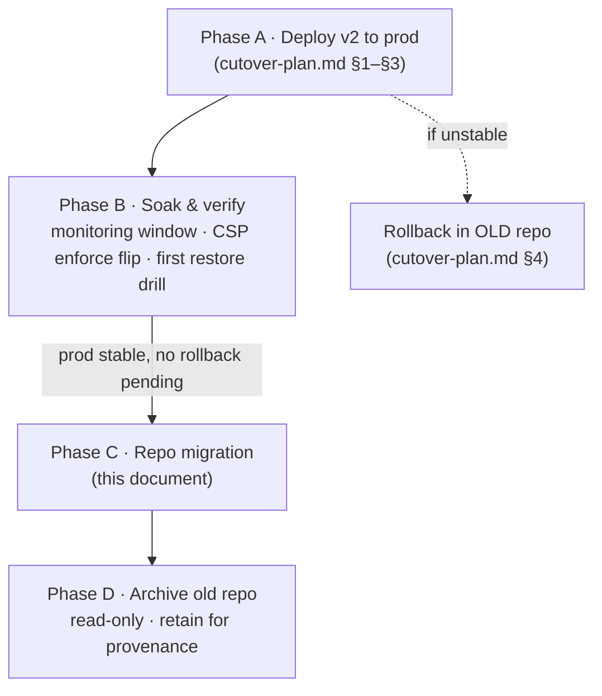

# v2 — Repository migration plan (extract v2 → fresh repo → retire old)

> Status: **Repo-migration runbook · post-cutover.** Branch `v2`. The plan to
> move the sealed, *production-live* v2 codebase into a new repository under the
> DEPT® GitHub org and archive the old personal-account repo.
> Owner: DevOps / platform engineer. Audience: whoever runs the migration.

This is a **source-control** move, not a deploy. It is sequenced to run **after**
v2 is live and stable in production (see `cutover-plan.md`), so that any
hotfix or rollback during the soak still happens in the known repo with the
team's existing access. Read it once end-to-end before you start.

---

## 0 · Scan box

- **What:** publish the current `v2` branch as `main` of a brand-new repo under
  the DEPT® org, then archive (not delete) the old repo
  `git@github.com:yashmody/code-anatomy.git`.
- **Why:** the code lives on a **personal GitHub account** today, and `v2` is a
  full re-architecture that wants a clean home. Moving it onto the org fixes
  ownership/bus-factor and gives v2 a `main` of its own.
- **So what:** this carries **zero production risk** — `deploy.sh` ships the app
  by **rsync of a bundle**, not `git clone` on the VM, and there is no CI
  pipeline wired to the repo. The running service never reads from GitHub, so
  the repo can move without touching prod.
- **The one thing that makes this easy:** git history is **clean of secrets**.
  `.env` / `cms/.env` / `deploy.env` were `.gitignore`d from commit one and
  **never** committed; no `*.key` / `*.pem` / `*.crt` / credential file appears
  anywhere in the 114-commit history. So you can carry **full history** into the
  new repo with a plain mirror push — no history rewrite, no scrub.

:::note[Why This Matters]
The default mistake here is treating a repo migration as risky to production. It
is not — *for this project* — because the deploy is bundle-based (`deploy.sh`
rsyncs `/opt/dept-anatomy`; the VM holds no git remote). The real risks are
elsewhere: (1) **publishing a secret** that was committed historically — ruled
out here by the clean-history check, but re-verify with an automated scanner
before you push; (2) **losing the v1 provenance** that backs the parity claims
("no content loss", "certs still verify") — which is why the old repo is
**archived, never deleted**; (3) **re-creating access** (branch protection,
deploy keys, collaborators) on the new repo before people need it.
:::

---

## 1 · Sequence (where this sits in the whole plan)



**Do not start Phase C until Phase B is stable.** Concretely, the green light is:
the `cutover-plan.md` traffic gate passed, the monitoring window is quiet, the
CSP Report-Only→enforce flip is done (or scheduled), the first restore drill has
run, and **no rollback is pending**. Migrating the repo mid-soak means a hotfix
would have to chase a moving target.

---

## 2 · Two decisions to make first

### 2.1 History strategy — **recommend: preserve full history (mirror)**

| Option | What you get | When to pick |
|---|---|---|
| **Mirror (preserve)** ✅ | All 114 commits, all branches, all 3 tags, blame/archaeology intact. `.git` is only ~11 MB, so it is free to carry. | Default. History is clean of secrets and tiny. |
| Squash (clean start) | One initial commit of the v2 tree; no history. | Only if you *want* to drop v1 history from the new repo entirely. You lose the parity provenance — keep the old repo archived if you do this. |
| Transfer ownership | GitHub "Transfer" moves the *existing* repo (incl. issues/PRs/stars and URL redirects) to the org. | If preserving issues/PRs matters more than a clean v2-only repo. Note this carries v1 `main` along too. |

The recommendation is **mirror**: clean history, negligible size, and you keep
the v1 `main` lineage that underwrites the "no content loss / certs still
verify" acceptance claims.

### 2.2 New repo location & branch layout

- **Location:** a new repo under the DEPT® org (e.g.
  `github.com/<dept-org>/code-anatomy` or `…/dept-anatomy`). Off the personal
  account.
- **Branch layout in the new repo:** `v2` becomes **`main`**. The old `main`
  (v1) is carried as history under the mirror, then either dropped or kept as a
  `legacy/v1` branch for reference. Decide and write it down.

---

## 3 · Pre-migration gate

```
┌─ PRE-MIGRATION GATE (all must be GREEN) ────────────────────────────┐
│ [ ] Phase B green: prod stable, no rollback pending                 │
│ [ ] new org repo created, EMPTY (no auto-README/license/.gitignore) │
│ [ ] automated secret scan of FULL history is clean                  │
│     (gitleaks/trufflehog — see §4.1; belt-and-suspenders)           │
│ [ ] team agreed: history = mirror, v2→main, v1 fate decided         │
│ [ ] who needs write access on the new repo is listed                │
│ [ ] working tree clean (`git status` — commit/stash WIP first)      │
└─────────────────────────────────────────────────────────────────────┘
```

Any box unchecked → do not push.

:::caution[Common Pitfall]
Creating the new repo **with** an auto-generated README, LICENSE, or
`.gitignore`. That puts a commit on the new `main` and a `--mirror` push will
then be **rejected** (non-fast-forward) or force-overwrite it. Create the new
repo **empty**.
:::

---

## 4 · Migration steps (ordered)

### 4.1 Final secret scan of full history (belt-and-suspenders)

The manual check was clean, but run an automated scanner over **all** history
before publishing — this is the irreversible step.

```bash
# from a fresh mirror clone so the scan sees every ref:
git clone --mirror git@github.com:yashmody/code-anatomy.git scan.git
docker run --rm -v "$PWD/scan.git":/repo zricethezav/gitleaks:latest \
    detect --source=/repo --no-git=false
#   expect: "no leaks found". If it flags anything, STOP — rotate that secret
#   and rewrite history (git filter-repo) before pushing. (Not expected here.)
```

### 4.2 Mirror-push the repo to the new org remote

```bash
# Use the mirror clone from §4.1, or make a fresh one.
cd scan.git
git remote add neworg git@github.com:<dept-org>/code-anatomy.git
git push --mirror neworg          # pushes ALL branches + tags
```

This reproduces every branch (`main`, `v2`) and all 3 tags on the new repo.

### 4.3 Set the new default branch to v2-as-main

On the new repo (GitHub → Settings → Branches, or `gh`):

```bash
# Option A — rename v2 to main on the new repo (cleanest):
gh api -X POST repos/<dept-org>/code-anatomy/branches/v2/rename \
    -f new_name=main      # then set main as default if not already
# Option B — keep v1's main as legacy and point default at v2:
gh repo edit <dept-org>/code-anatomy --default-branch v2
```

Pick one per the §2.2 decision and record it. If you renamed `v2`→`main`,
optionally keep the old v1 line as `legacy/v1`.

### 4.4 Re-create repo settings on the new repo

None of these travel with a git push — set them explicitly:

- **Branch protection** on `main`: require PR review, status checks, linear
  history if you use it.
- **Collaborators / teams:** grant the write list from the pre-migration gate.
- **Deploy keys / tokens:** if anything (a build box, a release job) had a
  read deploy key on the old repo, mint a fresh one on the new repo.
- **Secrets / variables:** there is no CI today; if you add Actions later,
  add its secrets then. Nothing to migrate now.
- **Webhooks:** the only webhook in the system is the Directus→FastAPI
  *loopback* cache-invalidation hook (`127.0.0.1`), which is app-internal — it
  is **not** a GitHub webhook and needs no action here.

### 4.5 Update in-repo references to the old repo

These are docs-only and minor (the app and `deploy.sh` carry no repo URL):

- `docs/architecture/v2/housekeeping.md` — the `git clone git@github.com:yashmody/code-anatomy.git`
  onboarding line → new org URL.
- `docs/architecture/v2/test-report.md` — the provenance note mentioning the
  `yashmody`-owned tables is a historical record; leave or annotate, don't rewrite.
- Local-only `\.claude/launch.json` paths are machine-specific (not deploy-relevant).

Do this as a normal PR **on the new repo** after the push.

---

## 5 · Verification (new repo is the real one)

```
┌─ POST-MIGRATION CHECK (all must PASS) ──────────────────────────────┐
│ [ ] fresh clone of NEW repo builds + `pytest` green (8/8)           │
│ [ ] all branches + 3 tags present on new repo                       │
│ [ ] default branch = the agreed v2-as-main                          │
│ [ ] branch protection + write access live                           │
│ [ ] secret scanner on new repo = clean                             │
│ [ ] a test bundle built from NEW repo deploys to STAGING ok        │
└─────────────────────────────────────────────────────────────────────┘
```

```bash
# Prove the new repo is self-sufficient end to end:
git clone git@github.com:<dept-org>/code-anatomy.git verify && cd verify/backend
python -m venv .venv && .venv/bin/pip install -r requirements.txt
.venv/bin/python -m pytest tests/ -q          # expect 8 passed
```

Run a staging deploy from a bundle built off the **new** repo before you trust
it for the next prod update — that closes the loop that the new repo can produce
a deployable artefact.

---

## 6 · Retire the old repo — archive, never delete

Once §5 is green and the team has cut over to the new remote:

1. **Re-point local clones.** Everyone runs:
   ```bash
   git remote set-url origin git@github.com:<dept-org>/code-anatomy.git
   git fetch origin && git remote prune origin
   ```
2. **Banner the old repo.** Edit its README top: *"Archived. v2 lives at
   `<new-url>`. This repo is read-only and kept for provenance."*
3. **Archive on GitHub** (Settings → "Archive this repository"). This makes it
   **read-only** — no pushes, no issues — without losing anything.
4. **Retain, don't delete.** The old repo holds the v1 `main` lineage that backs
   the cutover acceptance claims (content sha256 parity, the cert canary
   provenance). At 11 MB it costs nothing to keep. Agree a retention (e.g. keep
   indefinitely, or ≥ 90 days past the next quarterly restore drill) and only
   then consider deletion — as a separate, deliberate decision.

:::tip[Agency Tip]
"Discard the old repo" in practice means **archive + retain**, not **delete**.
Deletion is irreversible and throws away the v1 provenance that an auditor (or a
future "did we really lose no certificates?" question) will want. Archiving gives
you the same clean-cutover signal — nobody can push to it, it drops off the
active list — with none of the downside. Schedule the actual delete, if you ever
do it, as its own change well after the dust settles.
:::

---

## 7 · Rollback (of the migration itself)

This migration is trivially reversible **as long as you have not deleted the old
repo** (which §6 says you must not):

- If the new repo is wrong, **the old repo is still the source of truth** — it
  was archived read-only, not deleted. Un-archive it, have everyone
  `git remote set-url` back, and you have lost nothing.
- The new repo can be deleted and re-pushed from the mirror clone (§4.2) as many
  times as needed until §5 is green.
- Production is untouched throughout (bundle-based deploy), so there is no
  service rollback to coordinate — this is purely a remote/URL change.

---

## 8 · References (do not duplicate — point at the source)

| Need | Source |
|---|---|
| Deploy v2 to prod, gate checks, prod rollback | `docs/architecture/v2/cutover-plan.md` |
| Day-two ops, backups, Directus stand-up | `docs/RUNBOOK.md` |
| Installer mechanics (rsync bundle, vhost, units) | `deploy.sh` |
| Onboarding / local checkout (update clone URL here) | `docs/architecture/v2/housekeeping.md`, `LOCAL-SETUP.md` |
| Parity acceptance the old repo's history backs | `docs/architecture/v2/02-parity-method.md`, `phase-5-report.md` |
