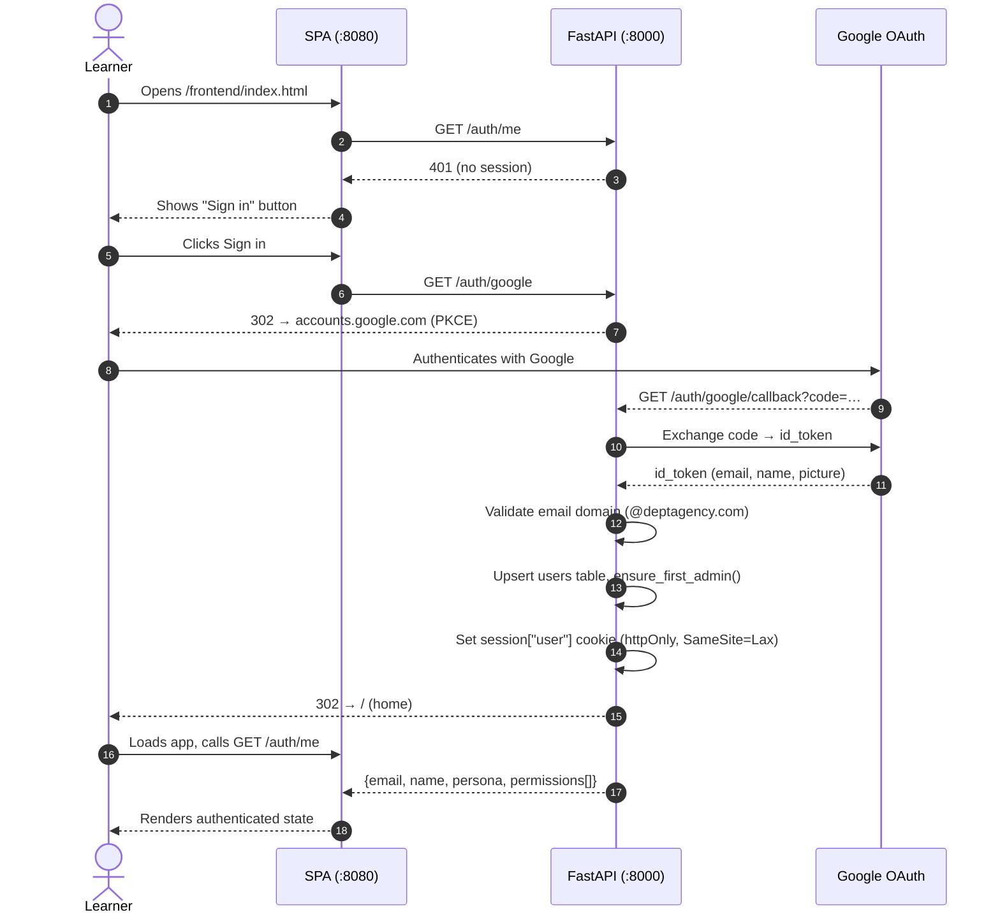
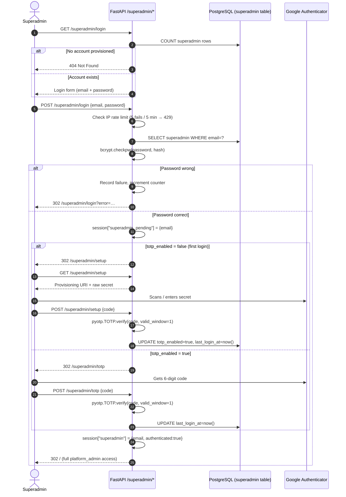
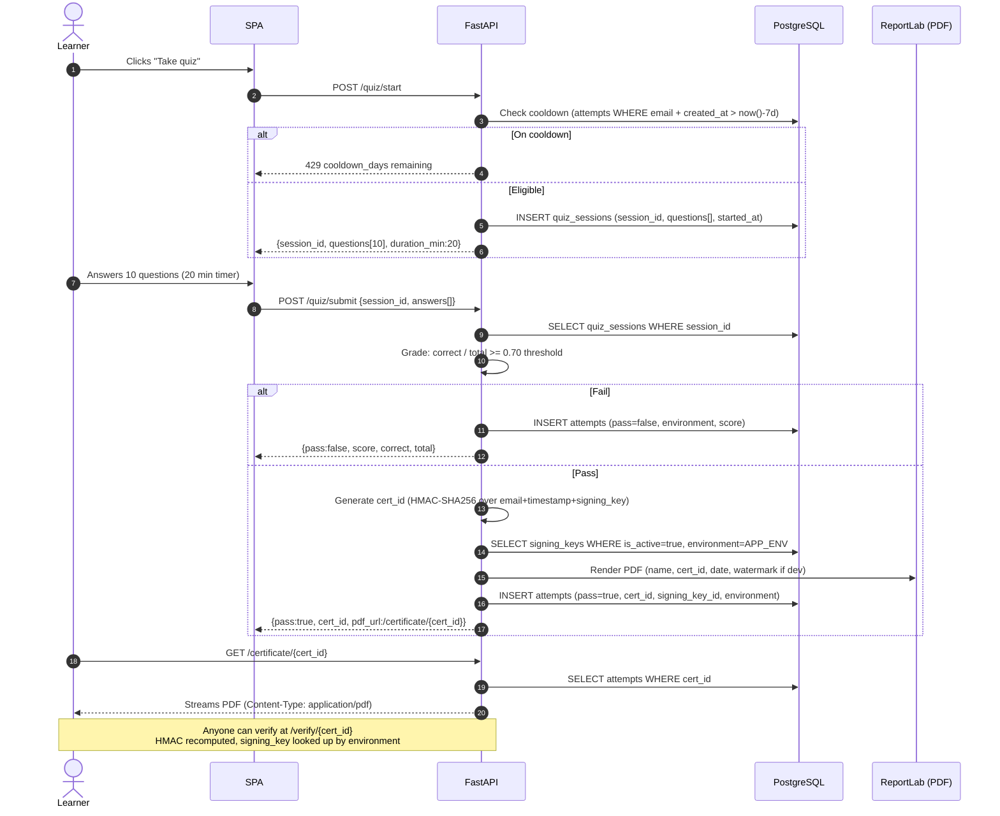
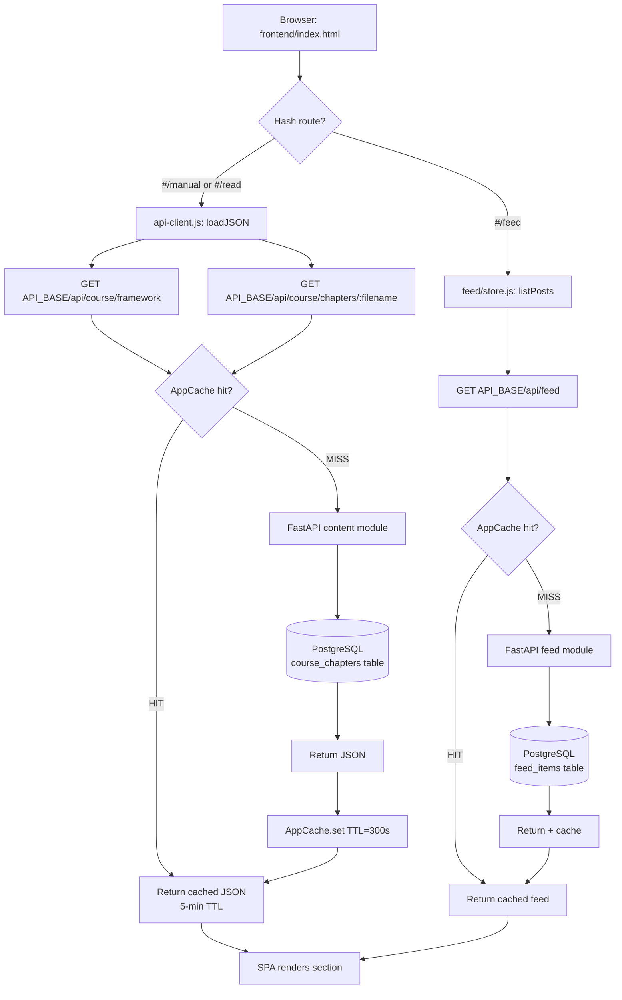

# System Overview — DEPT® Academy (v2)

> Current as of June 2026. Branch: `v2`. Remote DB: `20.228.243.225`.
> Read [`01-blueprint.md`](01-blueprint.md) for module boundaries,
> [`04-authz-model.md`](04-authz-model.md) for the permission matrix.

---

## Scan box

- **Two planes, one Postgres**: FastAPI owns the learner plane (quiz, certs, feed, auth); Directus owns the staff plane (content authoring, role management). Both share the same PostgreSQL 14 database — scoped by DB-role grants.
- **Modular monolith**: FastAPI is structured as `backend/app/{core,modules}` — one deployable process, no micro-service overhead, clear module boundaries enforced by import rules.
- **Three auth paths**: Google OAuth (learner SSO), Directus SSO (staff CMS), and a break-glass superadmin (username + password + TOTP, fully independent of OAuth).
- **Remote dev DB** at `20.228.243.225:5432/codecoder-dev` (no TLS yet — DBA to enable; flip `sslmode=disable → require` in `backend/.env` once done).
- **Local dev split-port**: static frontend on `:8080`, FastAPI on `:8000`, Directus on `:8055`. `frontend/core/config.js` auto-detects port 8080 and routes API calls to `:8000`.

---

## 1 · System architecture diagram (PlantUML)

> Render with the PlantUML VS Code extension, or paste at https://www.plantuml.com/plantuml/

```plantuml
@startuml DEPT_Academy_v2
!include https://raw.githubusercontent.com/plantuml-stdlib/C4-PlantUML/master/C4_Container.puml

LAYOUT_WITH_LEGEND()

title DEPT® Academy v2 — Container Diagram

Person(learner, "Learner", "DEPT® engineer or architect\n(deptagency.com Google account)")
Person(staff, "Staff / Quiz Admin", "Content author, quiz manager\n(Directus SSO)")
Person(superadmin, "Superadmin", "Break-glass operator\n(password + TOTP)")

System_Boundary(vhost, "Apache vhost · internal.in.deptagency.com") {
    Container(apache, "Apache 2.4", "Reverse proxy", "TLS termination, /app/ /anatomy/ /cms/ /docs/ /api/*\nmod_cache, mod_deflate, HTTP/2, CSP/HSTS headers")
}

System_Boundary(app, "FastAPI Backend · :8000") {
    Container(fastapi, "FastAPI (uvicorn)", "Python 3.12", "Modular monolith:\ncore/ — db, auth, deps, security\nmodules/ — quiz, feed, content,\nmedia, auth, cms, superadmin, admin")
    Container(sessions, "Session store", "itsdangerous cookie", "Signed, httpOnly, SameSite=Lax\n30-day max-age")
}

System_Boundary(cms_plane, "Directus CMS · :8055") {
    Container(directus, "Directus 10.x", "Node 22 / SQLite-free", "Staff content authoring\nRole: directus_app_dev (scoped grants)\nWebhook → FastAPI cache invalidation")
}

System_Boundary(db_boundary, "PostgreSQL 14 · 20.228.243.225:5432") {
    ContainerDb(postgres, "codecoder-dev", "PostgreSQL 14", "11 tables: users, user_roles, roles,\nattempts, quiz_sessions, signing_keys,\ncourse_chapters, feed_items, app_config,\nauth_audit, superadmin\n+ pg_largeobject for media blobs")
}

System_Boundary(frontend_boundary, "Static Frontend · :8080 (dev) / /app/ (prod)") {
    Container(spa, "Buildless SPA", "ES Modules (no bundler)", "frontend/index.html\nThree modes: Manual · Read · Feed\nAPI calls → API_BASE (port-aware in dev)")
    Container(frozen, "Frozen course HTML", "Static HTML", "content/frozen/anatomy-of-code-course.html\nFAQs · Checklist · Runbook\nServed via Apache Alias /anatomy/")
}

Rel(learner, apache, "HTTPS", "browser")
Rel(staff, directus, "HTTPS /cms/", "browser")
Rel(superadmin, fastapi, "HTTPS /superadmin/login", "browser (password+TOTP)")

Rel(apache, fastapi, "HTTP proxy", "ProxyPass /api/ ProxyPass /auth/ etc.")
Rel(apache, spa, "static files", "Alias /app/")
Rel(apache, frozen, "static files", "Alias /anatomy/")
Rel(apache, directus, "HTTP proxy", "ProxyPass /cms/")

Rel(fastapi, postgres, "SQLAlchemy 2.0\npsycopg2-binary", "TCP :5432")
Rel(directus, postgres, "directus_app_dev role\nscoped GRANT/REVOKE", "TCP :5432")
Rel(directus, fastapi, "webhook POST /api/cms/invalidate", "HTTP internal")

Rel(spa, apache, "fetch /api/* /auth/* /logout", "HTTPS same-origin (prod)\nCORS :8000 (local dev)")

@enduml
```

---

## 2 · Workflows (Mermaid)

### 2.1 Learner authentication — Google OAuth flow



---

### 2.2 Break-glass superadmin login (password + TOTP)



---

### 2.3 Quiz lifecycle — start to certificate



---

### 2.4 Content delivery — course chapter load



---

### 2.5 Deployment workflow

```mermaid
flowchart LR
    subgraph dev["Local dev (macOS)"]
        D1[git push origin v2]
    end

    subgraph ci["Manual deploy (no CI yet)"]
        D2[SSH to server]
        D3[git pull origin v2]
        D4[./deploy.sh]
    end

    subgraph server["Server — Rocky Linux 8"]
        S1[rsync backend/ → /var/www/...]
        S2[rsync frontend/ → /app/]
        S3[rsync content/frozen/ → /anatomy/]
        S4[alembic upgrade head]
        S5[systemctl restart dept-academy]
        S6[systemctl reload apache2]
        S7[/healthz → 200 smoke]
    end

    D1 --> D2 --> D3 --> D4
    D4 --> S1 --> S2 --> S3 --> S4 --> S5 --> S6 --> S7
```

---

## 3 · Runtime topology — ports and processes

| Port | Process | Owner | Notes |
|------|---------|-------|-------|
| `:80` / `:443` | Apache 2.4 | `apache` user | TLS termination, reverse proxy, static aliasing |
| `:8000` | uvicorn (FastAPI) | `dept-academy` systemd unit | 2 workers in prod; `--reload` in local dev |
| `:8055` | Directus 10 (Node 22) | `directus` systemd unit | CMS + webhook emitter |
| `:5432` | PostgreSQL 14 | `postgres` | Remote: `20.228.243.225`; local clone on `localhost` |

**Local dev only** (via `start_local.sh`):

| Port | Process |
|------|---------|
| `:8000` | FastAPI (uvicorn, `--reload`) |
| `:8080` | Python `http.server` (static frontend + content) |
| `:8055` | Directus (if Postgres reachable) |

---

## 4 · Database summary — 11 tables as of migration 0009

| Table | Owner | Purpose |
|-------|-------|---------|
| `users` | FastAPI | Google OAuth identities; learner plane only |
| `user_roles` | FastAPI | Many-to-many: users ↔ roles |
| `roles` | FastAPI | `learner`, `feed_contributor`, `quiz_admin`, `platform_admin`, … |
| `attempts` | FastAPI | Every quiz attempt; cert_id + signing_key_id on pass |
| `quiz_sessions` | FastAPI | In-progress quiz state (shuffled questions, started_at) |
| `signing_keys` | FastAPI | Per-environment HMAC secrets; `is_active` flag; rotation target |
| `course_chapters` | FastAPI + Directus | JSON blobs seeded from `content/source/*.json` |
| `feed_items` | FastAPI + Directus | Community feed posts |
| `app_config` | FastAPI | Key/value runtime config (feature flags, allowed domain) |
| `auth_audit` | FastAPI | Login / role-change audit trail |
| `superadmin` | FastAPI | Break-glass account (bcrypt password + TOTP secret) |

**DB roles** (Postgres-level isolation):

| Role | Grants |
|------|--------|
| `ccdev` | Owner of `codecoder-dev`; runs migrations |
| `directus_app` / `directus_app_dev` | SELECT on users/roles/user_roles; SELECT+INSERT+UPDATE+DELETE on course_chapters, feed_items; REVOKE ALL on attempts, signing_keys, superadmin |

---

## 5 · Security posture (current state)

| Layer | Status |
|-------|--------|
| TLS (production) | Apache terminates; HSTS `max-age=63072000; includeSubDomains` |
| TLS (remote dev DB) | ❌ Not yet — server doesn't support SSL. DBA to enable; flip `sslmode=disable → require` in `backend/.env` |
| Session cookies | `httpOnly; Secure; SameSite=Lax`; signed with `SECRET_KEY` |
| Superadmin 2FA | TOTP (RFC 6238) via pyotp; provisioned with `scripts/create_superadmin.py` |
| CORS (local dev) | `CORS_ORIGINS=http://127.0.0.1:8080,http://localhost:8080` in `backend/.env` (gitignored); unset in prod |
| CSP | `default-src 'self'`; `Report-To` header → `/csp/report` sink |
| ADMIN_EMAILS | `yash.mody@deptagency.com` → seeded as `platform_admin` on every boot |
| Signing keys | Per-environment; `CERT_HMAC_LEGACY` preserves all issued certs |

---

## 6 · Pending / open items

| Item | Priority | Notes |
|------|----------|-------|
| TLS on remote dev DB | High | DBA to restart Postgres with `ssl=on`; flip `sslmode=disable → require` |
| Google OAuth wiring | High | `GOOGLE_CLIENT_ID` + `GOOGLE_CLIENT_SECRET` blank in `backend/.env` |
| Directus on remote DB | Medium | `cms/.env` still points at localhost; wire to `20.228.243.225` |
| Disk cleanup on dev machine | Urgent | 900/932 GB used — Bash I/O failing |
| CI for docs/tests | Low | No pipeline yet; all deploys are manual |
| Algolia / Docusaurus site | Built | docs-site/ (Docusaurus) |
