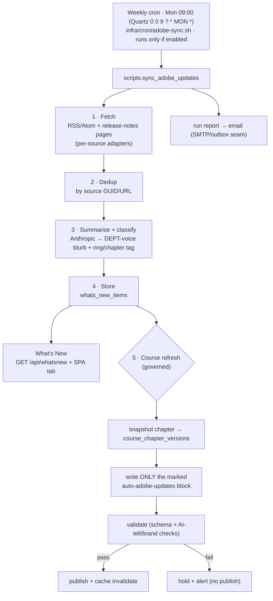

# Plan — Weekly Adobe-updates sync → "What's New" + course refresh

> Status: **Design plan (pre-build).** A backend utility, run by a weekly cron
> (Monday 09:00, config-gated), that pulls the latest Adobe product updates, surfaces them in a new
> **What's New** section, and refreshes the course with the latest information.
> Owner: backend/platform. Audience: whoever builds and operates it.

This is a plan to be approved before implementation, not a built feature. It
records the chosen options, the architecture, the data model, and — most
importantly — the **governance guardrails** for touching course content
automatically.

---

## 0 · Scan box

- **What:** a config-gated **Monday 09:00** cron job → `scripts/sync_adobe_updates.py` that fetches
  Adobe release notes/blogs for **Adobe Commerce, AEM/AEMaaCS, AJO & CJA,
  Target/A-B/Campaign**, summarises each new item with **Anthropic (Claude)**,
  stores them, shows them in a **What's New** SPA section, and refreshes a
  **dedicated, machine-owned region** of the relevant course chapters.
- **Why:** the Adobe Experience Cloud moves fast; the course and the team need a
  standing, low-effort way to stay current without a manual trawl each week.
- **So what:** built on seams that already exist — the `infra/cron/*` pattern,
  the `config.llm_provider` LLM seam (today `none`), the module/table/SPA-section
  patterns used by media/Techflix, and the SMTP/outbox email seam — so this is
  mostly assembly, not greenfield.
- **The load-bearing constraint:** "fully automatic course refresh" is
  implemented **scoped and reversible** — the job only writes a marked
  `auto-adobe-updates` block per chapter and snapshots every change for
  one-command rollback. It never rewrites curated prose in place. See §4.

:::caution[Why This Matters]
The course is the product, and `CLAUDE.md` makes content-quality review
mandatory for every course-content change (brand, voice, structural integrity,
accessibility, AI-tell discipline). An *unrestricted* weekly LLM rewrite of
chapter prose would violate that rule and risk voice drift, hallucinated facts
in authoritative material, and silent destruction of hand-written content. This
plan delivers genuine weekly freshness **without** that exposure by bounding
what the automation may write and making every write revertible. The choice of
"fully automatic" is honoured — there is no manual step in the happy path — but
the blast radius is bounded by design.
:::

---

## 1 · Chosen options (from the requirements call)

| Decision | Choice |
|---|---|
| Enablement | **Config-gated** — `content_refresh_enabled` (default off); nothing runs until switched on |
| Schedule | Weekly, **Monday 09:00**, as a **Quartz cron** `0 0 9 ? * MON *` (tz `Asia/Kolkata`); Unix-cron equivalent `0 9 * * 1` |
| Sources | **Adobe Commerce, AEM / AEMaaCS, AJO & CJA, Target / A-B / Campaign** |
| Summariser | **Anthropic (Claude)** via the `llm_provider` seam |
| What's New surface | New `GET /api/whatsnew` + a new SPA tab (Techflix pattern) |
| Course refresh | **Automatic**, bounded to a marked region + snapshot/rollback (§4) |
| Access | Any signed-in user (the `learner` floor), like Techflix |

---

## 2 · Architecture



**Scheduler — cron, not in-app.** Matches `infra/cron/vacuumlo.sh`; survives the
`QUIZ_WORKERS=1` single-worker restart model; no APScheduler thread to babysit.
The script is idempotent and safe to re-run by hand.

**Module layout** (mirrors media/faq):
```
backend/app/modules/whatsnew/
  ├── routes.py     # GET /api/whatsnew  (require_authenticated)
  ├── service.py    # fetch + summarise + refresh orchestration
  ├── sources.py    # per-source adapters (Commerce, AEM, AJO/CJA, Target/Campaign)
  └── storage.py    # whats_new_items + course_chapter_versions reads/writes
backend/scripts/sync_adobe_updates.py   # cron entrypoint (thin: calls service)
infra/cron/adobe-sync.sh                 # cron wrapper (venv + logging + lock)
frontend/modules/whatsnew/whatsnew.js    # SPA section
frontend/styles/whatsnew.css
```

---

## 3 · Fetch + summarise

- **Per-source adapters** (`sources.py`): each chosen area is one adapter that
  knows its feed/page shape. **Prefer RSS/Atom** where Adobe publishes it
  (structured, robust); fall back to a release-notes HTML parser only where no
  feed exists. Exact feed URLs are confirmed during build, kept in config/DB so
  ops can re-point them without a code change.
- **Dedup**: by source GUID (or canonical URL) in `whats_new_items.source_url`
  (unique). A weekly re-run only ingests genuinely new items.
- **Summarise + classify (Anthropic)**: for each new item, one Claude call
  returns (a) a short DEPT-voice summary and (b) the course ring/chapter it
  relates to (constrained to the known chapter list, or "none"). Prompt-cached
  system prompt; bounded output; cost is a few calls/week.
- **Robustness**: a source that 404s / changes shape / times out is logged and
  skipped — one bad source never fails the run. LLM failure → store the item
  without a summary (title + link still useful), flag for the next run.

:::tip[Agency Tip]
Ship **What's New first** (Phase 1) with title + source + date, summaries
behind the Anthropic seam. It's independently useful and lets you validate the
sources and the cadence before wiring the course-refresh engine (Phase 2),
which is the part with real blast radius.
:::

---

## 4 · Course refresh — automatic, bounded, reversible

This is the sensitive part. "Fully automatic" is honoured, but constrained so it
cannot damage curated content:

1. **Marked region only.** Each chapter that opts in gets one machine-owned
   section — id `auto-adobe-updates` (a normal section block in the
   `content/source` JSON, rendered like any other). The weekly job writes **only
   this block** ("Latest from Adobe — as of <date>", a short dated list with
   source links). Curated prose sections are never read-modified-written.
2. **Snapshot before every write.** The prior chapter content JSON is copied to
   a new `course_chapter_versions` row (chapter, content, captured_at, reason).
   Rollback is `restore <chapter> <version>` — one command, no data loss.
3. **Validation gate.** Before publish, the new block passes schema validation
   and the mechanisable slice of the content-quality checks (brand tokens, AI-tell
   phrases, link integrity, basic accessibility). Output that fails is **held,
   not published**, and flagged in the run report.
4. **Publish + invalidate.** On pass, write `course_chapters` and fire the
   existing Directus→FastAPI cache-invalidation path so the change is live.
5. **Audit + notify.** Every run emails a report (via the SMTP/outbox seam in
   `modules/quiz/email.py`) — what was fetched, summarised, written, held, and
   the rollback pointers.

:::note[If you want full-prose overwrite anyway]
The unrestricted variant — Claude rewriting whole curated chapters weekly — is
buildable on the same machinery, but it drops guardrails (1) and the curated-
prose protection, and it conflicts with the `CLAUDE.md` content-quality mandate.
If that's genuinely wanted, the safe form is: route the rewrite through the
existing **c0 → content-quality** review queue (drafts auto-generated, a human
approves), which keeps "automatic generation" while preserving the gate. Flag
this and we widen scope deliberately, not by default.
:::

---

## 5 · Data model (new — one Alembic migration, `0012`)

```
whats_new_items
  id              text PK (uuid)
  source          text         -- 'commerce' | 'aem' | 'ajo' | 'cja' | 'target' | 'campaign'
  source_url      text UNIQUE  -- dedup key
  product         text
  title           text
  summary         text NULL    -- Claude; null until summarised
  related_chapter text NULL    -- FK-ish to course_chapters.filename, nullable
  published_at    timestamptz NULL
  fetched_at      timestamptz
  status          text         -- 'new' | 'published' | 'archived' | 'held'

course_chapter_versions          -- rollback safety net for §4
  id           bigserial PK
  filename     text             -- course_chapters.filename
  content      jsonb            -- the snapshot taken BEFORE a write
  captured_at  timestamptz
  reason       text             -- 'adobe-sync 2026-06-07'
```

Additive only (same posture as `0010`/`0011`). App-owned; no Directus grant
unless What's New is to be CMS-editable.

---

## 6 · Security & ops

- **Egress / SSRF**: the fetcher only talks to an **allow-list** of Adobe hosts;
  no user-supplied URLs are ever fetched. Network timeouts + size caps on every
  request.
- **Secrets**: the Anthropic key rides the existing `llm_api_key` config seam
  (Tier-1, fail-closed); never logged. `llm_provider=anthropic` enables it.
- **Locking**: the cron wrapper takes a lockfile so a long run can't overlap the
  next week's trigger.
- **Idempotency**: re-running the script mid-week is safe (dedup + snapshot).
- **Cost**: a handful of Claude calls per week; negligible. Bounded by the
  number of *new* items, not total.

---

## 7 · Phasing

| Phase | Deliverable | Blast radius |
|---|---|---|
| **1** | Fetch + dedup + store + **What's New** API/SPA (summaries via Anthropic) | none on course |
| **2** | Course refresh — marked `auto-adobe-updates` block + snapshot/rollback + validation gate + notify | bounded, reversible |
| **3** (opt) | If wanted: review-queue path for broader curated-prose updates (c0 + content-quality) | human-gated |

Recommend shipping Phase 1, watching one or two Sunday runs, then Phase 2.

---

## 8 · Open items to confirm at build time

- Exact RSS/release-notes URLs per source (verified live; some Adobe products
  lack a feed and need an HTML adapter).
- Which chapters opt into an `auto-adobe-updates` block, and where it renders.
- Notification recipients for the weekly run report.
- Cron time/timezone (default Sunday 02:00 server-time; audience is India — IST
  may be preferred).

---

## 9 · References

| Need | Source |
|---|---|
| Cron-job pattern (wrapper, venv, logging) | `infra/cron/vacuumlo.sh` |
| LLM seam (`llm_provider`, `llm_api_key`) | `backend/app/core/config.py` |
| Email/notify seam (SMTP + dev outbox) | `backend/app/modules/quiz/email.py` |
| Module + Alembic + SPA-section patterns | `backend/app/modules/media/`, `migrations/versions/0011_techflix_episodes.py`, `frontend/modules/techflix/` |
| Content governance (why §4 is bounded) | `CLAUDE.md`, `docs/architecture/v2/05-config-cms.md` |
